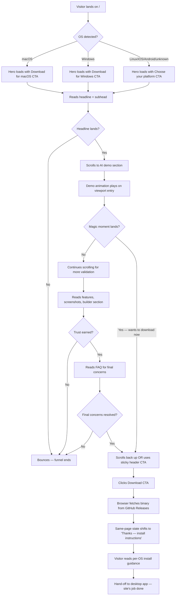
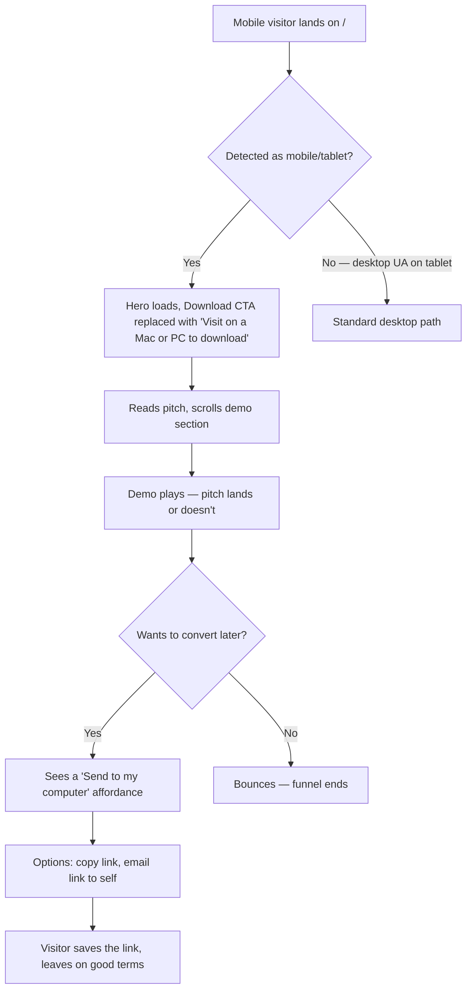
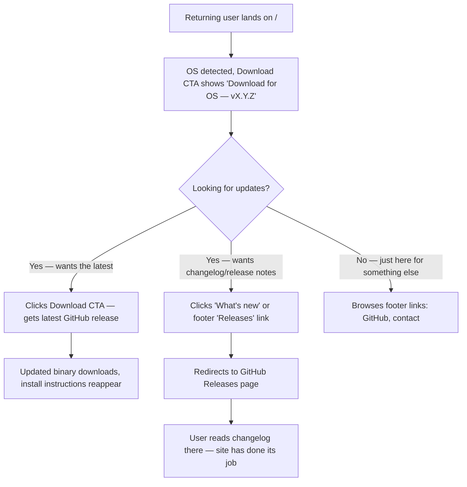
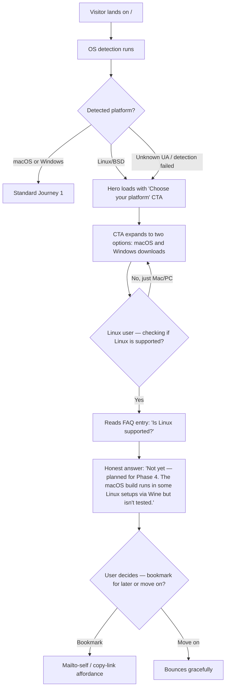

# UX Design Specification nixus-marketing-site

**Author:** Nbazinet
**Date:** 2026-04-25

---

<!-- UX design content will be appended sequentially through collaborative workflow steps -->

## Executive Summary

### Project Vision

The Nixus marketing site is the public surface that turns cold visitors into Nixus users. Its UX thesis: a polished, honest, calm landing experience that communicates the product's automation-first promise within seconds, demonstrates the AI CC-import "magic moment" without demanding effort, and routes the visitor to the correct binary in one click. Visual language inherits from the desktop app (shadcn-aligned, breathing room, calm-confidence aesthetic) so the install-and-launch transition feels seamless — no aesthetic whiplash between the site and the app the user just downloaded. Built to ship fast, but architected so /pricing, /account, /releases, and /docs can be layered in later without redesign.

### Target Users

**Primary: The Frustrated Tracker**
A Canadian professional with a multi-pillar financial life (chequing, CC, TFSA/RRSP, crypto, real estate, business equity) who has cycled through Google Sheets, Mint, Monarch, YNAB without finding a fit. Tech-comfortable on Mac or Windows, can install a desktop binary, but arrives at the site cold and skeptical. Needs to trust the brand and understand the pitch in under a minute before clicking Download.

**Secondary: The AI-Curious Visitor**
Arrived from a Twitter/Reddit/HN post about the AI CC-parsing angle. Here for the magic. May not be a deep finance user — needs the demo to land emotionally before they care about budgeting features.

**Secondary: The Returning User**
Existing Nixus user back for a new build, changelog (later), or paid upgrade (later). Low-priority for v1 chrome, but information architecture must leave room for /releases, /account, /pricing later.

**Editorial Constraint: The Builder (You)**
Solo publisher updating release notes and screenshots. The site has to be cheap to maintain — no CMS overhead.

### Key Design Challenges

1. **Trust in seconds** — A cold visitor from search has ~5 seconds to decide whether to keep scrolling. The hero must communicate the pitch, the visual quality must feel legitimate, and the brand must feel honest (not templated). One weak signal — generic stock photo, marketing-speak headline, slow loading — and the funnel collapses.
2. **The AI demo is the conversion lever** — The "watch a CC screenshot become categorized expenses" moment is the single biggest reason a visitor downloads. It has to render fast (no heavy video on first paint), feel credible (real-looking transactions, not lorem ipsum), and convey the magic emotionally — without being precious.
3. **Two-OS download with grace for the rest** — Detect macOS/Windows and serve the right binary as the primary CTA. Visitors on Linux, Android, iOS, or unknown UA need a clear "not yet, here's why" without feeling shamed or sent to a dead end.
4. **Visual continuity with the desktop app** — When the user downloads, installs, and launches Nixus, the aesthetic transition should feel seamless. The site borrows the desktop app's design tokens (colors, typography, spacing, shadcn lineage) but adapted for marketing — more emotional storytelling, less utility-density.
5. **Future-ready IA without overbuilding** — The site ships with one primary page, but its routing, layout primitives, and component system must extend to /pricing, /account, /releases, /docs later without rework. Design the chrome (header, footer) for v2 nav even if v1 only uses one slot.

### Design Opportunities

1. **AI parse animation as a hero centerpiece** — A purpose-built, lightweight animation showing a CC screenshot → extracted transactions → categorized into budget categories. Looped, no audio, frame-perfect. This single asset is the difference between "another finance app" and "I need this." It's worth disproportionate craft investment.
2. **Honest brand voice as differentiation** — Most SaaS sites read the same: "Powerful. Simple. Loved by thousands." Nixus' voice is the opposite — direct, builder-first, slightly understated. "Built because I was tired of my Google Sheet" beats "The future of personal finance" every time.
3. **Design tokens carry the brand across surfaces** — Defining color/typography/spacing tokens once and using them on the site, in the desktop app, and on future paid-module pages means brand consistency comes for free. This is also infrastructure for the eventual shared component library between web and desktop.
4. **Progressive disclosure for two visitor depths** — The 5-second scanner gets the pitch + Download CTA above the fold. The 30-second evaluator gets the AI demo, features, screenshots, FAQ on scroll. Same page, two satisfying experiences.
5. **Calm-confidence aesthetic as a competitive signal** — Most personal-finance sites lean either too "fintech bro" (gradient, crypto, hype) or too "boring bank" (stock photos of smiling couples). Nixus' calm-clarity language stands out by being neither.

## Core User Experience

### Defining Experience

The marketing site has one core flow that defines its value: **land → understand → trust → download → install**. Everything else (FAQ, secondary screenshots, footer links) is supporting infrastructure for that flow. The experience is essentially a one-page narrative arc, with the Download CTA as the resolution.

The defining moment is the **AI parse demo**: a visitor scrolls past the hero, hits the demo section, and watches a CC screenshot transform into categorized expenses. If that moment lands, conversion follows. If it doesn't, no amount of feature-list copy will save the visit.

### Platform Strategy

- **Web — desktop-first, mobile-responsive** — The primary visitor lands on desktop or laptop because they're evaluating a desktop app. Mobile/tablet visitors still need the full pitch (the desktop app supports macOS + Windows; they can't install on phone, but they should leave understanding what Nixus is and bookmark it for later).
- **Mouse/keyboard primary** — Hover affordances, keyboard navigation for accessibility, no mobile-tap-only patterns.
- **Static-first** — Site is statically rendered/exported wherever possible. Fast first paint, cheap to host, easy to cache. Dynamic behavior limited to OS detection and analytics.
- **No login, no app shell** — V1 is content + a single CTA. No app-like navigation, no logged-in state, no client-heavy framework overhead.
- **Component foundation aligned with desktop** — Same shadcn/ui lineage, same design tokens, so the visual handoff to the installed app feels continuous. Web framework choice (Next.js / Astro / Remix / Vite-React — TBD in architecture) optimizes for fast static delivery + future room for SSR'd authed pages.
- **Modern browser support** — Last 2 versions of Chrome/Edge/Firefox/Safari. No IE, no legacy mobile WebView.

### Effortless Interactions

1. **Download in one click** — OS detection on page load. The Download button is pre-targeted to the right binary the moment the visitor sees it. No "choose your platform" intermediate page. Click → browser starts the download.
2. **AI demo plays without permission** — The hero parse animation is a self-contained, autoplaying loop (silent). No play button, no consent dialog, no waiting. Visible by the time the visitor scrolls past the hero.
3. **Scroll-as-disclosure** — The visitor controls depth by scrolling. No expand/collapse, no tabs, no accordion (except FAQ). What's visible is what they see.
4. **No forms, no gates** — V1 has no email capture, no signup, no "get notified," no cookie banner beyond the legally required minimum. Friction is removed by removing the surfaces that create it.
5. **Copy a download link without clicking it** — Right-click on the Download CTA gives a clean URL to the binary (not a tracking redirect). Power users and people sharing the link with friends should not get a broken experience.

### Critical Success Moments

1. **Hero comprehension (≤ 5 seconds)** — Visitor reads the headline, sees the Download CTA, and forms a quick "yes I'm interested" or "no I'm out." If the headline doesn't land, they leave. Make-or-break.
2. **The AI parse demo (≤ 30 seconds)** — Visitor scrolls into the demo and watches the AI work. The "I've been needing this" feeling has to fire here. Without this moment, downloads stay flat.
3. **Trust validation (≤ 60 seconds)** — Screenshots, "built by a real person" section, FAQ — collectively the trust spine. The visitor needs to believe the app is real, the builder is real, and installing won't compromise their machine.
4. **The Download click** — The conversion event. If detection misses the OS, if the link 404s, if GitHub is down, the entire funnel breaks here. This single interaction has to be bulletproof.
5. **First-impression on mobile** — A mobile visitor can't install, but they should leave with the pitch landed and a bookmark/email-self link to come back from desktop. If the mobile experience is broken, the share-this-link-with-a-friend pathway is broken too.

### Experience Principles

1. **One page, one job** — V1 is a landing page that drives downloads. Anything that doesn't serve that job (blog, docs, accounts, pricing) is deferred. Resist the urge to add surfaces.
2. **Show, don't tell** — Real screenshots, real animations, real numbers in the demo. No abstract "AI-powered" copy without the demo to back it up. The product carries the pitch — the copy supports it.
3. **Calm, honest, builder-voice** — The opposite of fintech-bro and SaaS-template. Direct sentences, real reasons, slight understatement. The voice should match the desktop app's emotional tone: calm clarity, earned confidence.
4. **Download is sacred** — The Download CTA is the highest-priority element on every viewport, every scroll position. It never becomes hard to reach.
5. **Carry the design language across surfaces** — Visual continuity with the desktop app is a feature, not a coincidence. Same tokens, same component library, same emotional pitch. The site is the desktop app's first room.
6. **Ship what's there, plan for what's next** — V1 is small. The IA, components, and routing are sized for v2 (pricing, account, releases) so growth doesn't require a redesign.

## Desired Emotional Response

### Primary Emotional Goals

The marketing site is designed to evoke three emotions in sequence:

1. **Recognition** — "This is for me." The hero and AI demo make the visitor see their own pain reflected back. The Frustrated Tracker reads the headline and thinks "yes, that's exactly the problem I have." This is the entry-level emotion that earns the next scroll.
2. **Trust** — "This is real." Builder voice, real screenshots, an honest "why I built this" section, and honest FAQs build the confidence required to install a binary from a stranger. Trust is the bridge between interest and action.
3. **Quiet excitement** — "I want to try this now." Not hype, not FOMO — the calm, specific excitement of finding a tool that sounds like it actually solves the problem. The Download click is the resolution of this feeling.

### Emotional Journey Mapping

| Stage | Desired Emotion | Design Implication |
|-------|----------------|-------------------|
| First paint | Calm legitimacy | Fast load, no layout shift, no spinner. Hero appears whole. The site looks expensive even though it's simple. |
| Reading the hero | Recognition | Headline names the problem in the visitor's own words ("tired of your spreadsheet?" not "revolutionizing finance"). Subhead reinforces. CTA is right there but unobtrusive. |
| Hitting the AI demo | Quiet awe | Animation runs without permission. Real-looking transactions parse and snap into categories. The visitor leans in. |
| Reading features | Confirmed | Each feature is a "yes, of course" — they see budgeting, multi-account, net worth, AI chat and feel "all the things I needed are here." No surprises, no missing pieces. |
| The "built by a real person" section | Warmth | Honest, human voice. The visitor relaxes — this isn't a faceless company, it's a builder solving a real problem they share. |
| FAQ | Reassured | Questions they were already asking (privacy? bank linking? install safety? supported OS?) get plain answers. No defensive dodging. |
| Hovering the Download CTA | Quiet excitement | The button feels confident, not pushy. The OS is already detected. No "fill out this form first." |
| Click → download starts | Reward | The browser shows the download. The site optionally shifts to a "thanks — here's how to install" state without disrupting the flow. |
| Reading install instructions | Calm pragmatism | Per-OS guidance is short, honest, and acknowledges the friction (Gatekeeper / SmartScreen). The visitor feels guided, not abandoned. |
| Mobile visit | Curiosity, not frustration | Pitch lands. Site explains "you'll need a Mac or PC to install — bookmark this or send to yourself." No 404, no broken layout, no scolding. |
| Returning visit (post-install user) | Recognition + ease | They come back for an updated version or changelog. The Download CTA still works, latest version is obvious. |

### Micro-Emotions

- **Recognition over generic "delight"** — Critical. The visitor must feel the headline was written for them specifically. Targeted specificity beats broad delight every time on a marketing site.
- **Trust over hype** — A cold visitor's default is skepticism. Earn trust through specificity, honesty, and craft — not testimonials, badges, or social proof inflation. (You don't have testimonials yet, and that's fine — don't fake them.)
- **Calm over urgency** — No "Join thousands of users!" no "Sign up before…" no countdown timers. The visitor decides on their own time. The download is there when they're ready.
- **Specificity over abstraction** — Real Canadian banks named (Wealthsimple, Tangerine, Desjardins). Real account types (TFSA, RRSP). Real numbers in the demo. Generic "$XX in account" is fake and the visitor smells it.
- **Builder warmth over corporate distance** — A small "hi, I'm [name], I built this because…" goes further than any "About Us" boilerplate. Lean into being a solo builder.

### Design Implications

1. **Recognition → Targeted, specific copy** — Headlines and section intros use the visitor's vocabulary ("spreadsheet," "TFSA," "credit card statement") not industry jargon ("personal financial management platform"). Specificity is the design device.
2. **Trust → Visual quality + honest defaults** — High-craft visual execution (typography, spacing, screenshot quality, animation polish) signals "real product." Defensive copy patterns ("don't worry, we…" "we promise…") are avoided — they create the doubt they try to suppress.
3. **Quiet excitement → AI demo as centerpiece** — The single highest-craft asset on the entire site. Animation timing, transaction realism, transition smoothness all matter. This is the emotional moment.
4. **Calm pragmatism → Honest install copy** — Acknowledge macOS Gatekeeper / Windows SmartScreen plainly. "On macOS, you'll see an 'unidentified developer' warning the first time. Here's why and how to bypass it." Honesty disarms anxiety.
5. **No urgency → No friction surfaces** — No "limited time," no "join now," no email gate. The Download CTA is always accessible, never gated, never modal-popped. Friction creates anxiety, not action.
6. **Mobile graceful → Responsive without apology** — Mobile gets the full pitch. Download section explains the constraint with a "save for later" affordance (mailto self, copy link). No "please use desktop" lockout.

### Emotional Design Principles

1. **Specificity earns recognition** — Generic copy fails. Use the visitor's words, their banks, their account types, their actual frustrations. Specificity is the most efficient path to "this is for me."
2. **Honesty earns trust** — Every defensive flourish is a confession of doubt. Real screenshots, real builder voice, plain answers in the FAQ. Don't apologize, don't oversell.
3. **Craft signals legitimacy** — A solo project has no testimonials, no logos, no "as seen on." Craft (typography, spacing, animation, copy) is the only available trust signal. Spend it carefully and well.
4. **Calm is the baseline** — The same baseline as the desktop app. The site shouldn't feel hyped, urgent, or aggressive. The visitor should feel respected, not pressured.
5. **No false intimacy** — Don't write "Hey friend!" or "We love that you're here!" The visitor is a stranger. Be warm but not saccharine.
6. **The download is a gift, not a sale** — Frame the download as "here it is, take it" rather than "convert now." V1 is free; the emotional posture matches.

## UX Pattern Analysis & Inspiration

### Inspiring Products Analysis

**1. Linear (linear.app — marketing site)**
- **What they nail:** A landing page that feels like the product — same typography, same precision, same calm. The hero is short, the demo is product-real (not abstract illustrations), the CTA is always reachable. Sticky download/sign-up button on scroll. Uses motion sparingly but well — animations only where they earn their weight.
- **Why it matters for us:** Linear's marketing site is the gold standard for "the site looks and feels like the app it sells." That visual continuity is exactly what we want between Nixus.com and the Nixus desktop app. Their restraint with motion is a model for our AI-demo animation.
- **Key takeaway:** When the marketing site shares the product's design language, the install feels like turning a page, not jumping to a different brand.

**2. Raycast (raycast.com)**
- **What they nail:** A desktop-app marketing site done properly. Hero with a real product screenshot (no abstract illustrations), prominent platform-specific download CTA, OS detection. They do an excellent job conveying "this is a desktop tool, here's what it looks like" without ever feeling like a generic SaaS pitch. Honest copy, builder voice, beautiful typography.
- **Why it matters for us:** Direct analog. Same product category (desktop app distributed via download), same need to communicate visual quality, same need for OS-aware download. Their feature-showcase scroll pattern (full-bleed screenshots paired with short copy) is a lifted-as-is candidate for our features section.
- **Key takeaway:** Real product screenshots > illustrations. Always. Especially for a tool the visitor is about to install.

**3. Stripe (stripe.com — historical reference)**
- **What they nail:** Hero animations that feel like the product without showing the product literally. Beautiful typography. Long-scroll narrative that respects depth — the 5-second visitor and the 5-minute evaluator both leave satisfied. Information density without overwhelm.
- **Why it matters for us:** The animation craft is best-in-class. We don't need their fanciness, but their *restraint* is a model — every animated element earns its weight by communicating something specific. Their long-scroll information architecture is a useful template for our progressive-disclosure strategy.
- **Key takeaway:** Animation is communication, not decoration. If removing it loses meaning, keep it. If not, cut it.

**4. Wealthsimple (wealthsimple.com — for visual continuity)**
- **What they nail:** Personal-finance branding done with calm and warmth. Generous whitespace, soft color palette, real product UI in hero. They prove that finance content can feel approachable without going either fintech-bro or boring-bank.
- **Why it matters for us:** Closest analog in vibe to the desktop app's existing design language. The desktop UX spec already cites Wealthsimple as inspiration; the marketing site should reinforce that lineage rather than diverge.
- **Key takeaway:** Personal finance can look approachable, calm, and trustworthy without sacrificing sophistication. Whitespace and typography do the heavy lifting.

**5. Tailwind UI / shadcn marketing examples**
- **What they nail:** Component-level execution of marketing patterns — hero sections, feature grids, FAQ accordions, footers — that match the design lineage we're already using in the desktop app.
- **Why it matters for us:** Practical scaffolding. The desktop app uses shadcn/ui; the marketing site should use the same component family so the design tokens carry over for free. Tailwind UI is a reference catalog of proven marketing-page patterns at the same level of craft.
- **Key takeaway:** Use the component vocabulary we already have. No reason to invent a second design language for the web side.

### Transferable UX Patterns

**Hero Patterns:**
- **Linear's "headline + subhead + dual CTA"** — Tight headline, one-sentence subhead, primary CTA (Download) + secondary CTA (e.g., "See features") side by side. Adapts directly to our hero.
- **Raycast's hero with embedded product screenshot/animation** — The hero shows the actual product, not an abstract graphic. This is the pattern for our AI-demo placement: above the fold or immediately below it.

**Navigation Patterns:**
- **Linear's minimal top nav** — Logo left, 3-4 nav items, primary CTA right. Sticky on scroll. v1 has very few destinations (just the page itself), but the chrome should reserve room for /pricing, /releases, /docs without redesign.
- **Raycast's "Download for [OS]" CTA with subtle alt-OS link below** — OS-detected primary, with a small "Or download for [other OS]" affordance for visitors whose detection was wrong.

**Interaction Patterns:**
- **Stripe's scroll-tied hero animation** — Animation tied to scroll position, frame-perfect. Heavy lift in execution but the model is right. Our AI-parse demo could autoplay loop OR scroll-tie — we'll decide based on engineering cost.
- **Linear's keyboard shortcuts on the marketing site** — `?` for shortcuts, `/` for search. Probably overkill for v1, but a fingerprint of "made by people who care."
- **Tailwind UI's FAQ accordion pattern** — Single-open accordion, questions phrased in user voice. Standard, works, ship.

**Visual Patterns:**
- **Wealthsimple's card-based feature highlights** — Each feature gets a card with a short headline, a sentence, and an icon or small visual. Aligns perfectly with the desktop app's card lineage.
- **Linear's section transitions via subtle color shifts** — Each major section gets a slightly different background tone (off-white → soft gray → off-white) to mark scroll progress without screaming.
- **Raycast's screenshot-as-art** — Real product screenshots framed with subtle drop shadows or gradient backdrops. Looks editorial, not screenshot-y.

### Anti-Patterns to Avoid

1. **Hero illustration of "abstract finance" (most fintech sites)** — Generic graphics of charts, coins, glowing data. Says nothing, inspires nothing, signals "templated." We use real product screenshots/animations exclusively.
2. **Carousel hero / autoplay video with audio** — Carousels hide information; auto-play audio is hostile. Our hero is static or silently-animated, not a slideshow.
3. **Email-gate / "request access" pattern** — V1 is free and public. Gating downloads behind an email field is hostile to the "no friction" goal. Defer email capture until there's a paid product to nurture toward.
4. **Excessive social proof inflation ("trusted by 10,000+ users")** — You don't have those users yet. Faking it is worse than skipping it. Lean into the small-builder positioning instead.
5. **Cookie-banner overload** — A massive consent modal on first visit destroys the calm-first-paint goal. Use privacy-friendly analytics that don't require a banner if possible.
6. **Newsletter / "join our community" popups** — Modal interruptions on a marketing site are friction surfaces. V1 has none.
7. **Live chat widget in the corner** — Implies a sales team that doesn't exist. Email contact in the footer is honest.
8. **"AI" overuse in copy** — The AI feature is real and specific (CC parsing). Saying "AI-powered" five times on the page dilutes the real claim. Use it once, demo it once, move on.
9. **Stock photos of smiling people** — Death of trust. Nixus is a solo project; pretending otherwise breaks the builder-voice strategy.
10. **Comparison tables vs. competitors in v1** — Premature. Build the audience first; comparison content comes later when the funnel needs sharpening.

### Design Inspiration Strategy

**What to Adopt:**
- Linear's tight hero structure (headline + subhead + dual CTA) and minimal top nav
- Raycast's OS-detected primary download CTA with secondary OS link
- Raycast's full-bleed product screenshot pattern in the features section
- Tailwind UI's standard FAQ accordion
- Wealthsimple's card-based feature highlights
- shadcn/ui as the underlying component vocabulary (mandatory — must match the desktop app)

**What to Adapt:**
- Stripe's scroll-tied animation pattern → adapt for the AI parse demo, but smaller in scope (no need for 60fps multi-stage scroll choreography; a polished autoplay loop is enough)
- Linear's design-tokens-as-marketing → carry the desktop app's tokens directly into the site so brand consistency is structural, not aspirational
- Raycast's "for [OS]" download CTA → add a clear, non-shaming "macOS-only / Windows-only" message for unsupported platforms (Linux, mobile)

**What to Avoid:**
- All ten anti-patterns above
- Fintech-bro aesthetics (gradients, neon, hype copy) — conflicts with calm-confidence emotional goal
- Boring-bank aesthetics (corporate stock photos, jargon copy) — conflicts with builder-voice principle
- Anything that introduces friction surfaces (gates, modals, popups) — conflicts with "download is sacred" experience principle

**Inspiration boundary:** Reference these patterns for *structure* and *craft*, not for *visual style*. Nixus' visual identity is its own — inheriting from the desktop app — not a Linear or Raycast clone.

## Design System Foundation

### Design System Choice

**shadcn/ui + Tailwind CSS** — same foundation as the Nixus desktop app, applied to the marketing site context.

The marketing site adopts the desktop app's existing design system wholesale rather than introducing a parallel one. Components are copied into the project (per shadcn/ui convention), giving the site full ownership and customization control while inheriting the desktop app's visual lineage.

### Rationale for Selection

1. **Visual continuity is the brand strategy** — The single most important design decision for this site is that it looks like the product it sells. Using a different design system (Material, MUI, Chakra, custom) would create an aesthetic discontinuity between site and app — exactly the opposite of the goal. Sharing shadcn/ui makes brand consistency structural, not aspirational.
2. **Solo-builder velocity** — No new design system to learn, no new component library to master. The builder can borrow components directly from the desktop app codebase as starting points (Card, Button, Accordion, Dialog) and extend them for marketing-specific patterns (Hero, FeatureGrid, CTA).
3. **Marketing patterns are already covered** — shadcn/ui + Tailwind UI provide reference implementations for every marketing page primitive we need: hero sections, feature grids, FAQ accordions, pricing tables (for v2), footers. Nothing has to be invented from scratch.
4. **Tailwind tokens carry across surfaces** — A shared `tailwind.config` with shared design tokens (colors, spacing, typography scale, radius, shadows) means the desktop app and the marketing site share the same foundation by reference, not by manual sync.
5. **Accessibility comes free** — Radix UI primitives (under shadcn/ui) handle keyboard nav, focus management, ARIA, and screen reader support out of the box. WCAG 2.1 AA compliance for free on standard components.
6. **Future-ready for authed surfaces** — When v2 ships /pricing, /account, and /checkout, the same component library scales without architectural rework. shadcn/ui has primitives for forms, data tables, dialogs — everything authed pages need.

### Implementation Approach

**Shared foundation strategy (within the pnpm monorepo):**

- A shared package — e.g., `packages/ui` — holds the design tokens (Tailwind config), shared primitive components (Button, Card, Accordion, etc.), and brand assets (logo, fonts).
- Both `apps/web/` (marketing site) and the existing desktop app consume the shared package. Tokens defined once, used everywhere.
- The marketing site adds web-specific components in `apps/web/` that don't belong in the shared library — Hero, FeatureGrid, DownloadCTA, FAQ, ScreenshotShowcase, Footer.

**Core components for the marketing site:**

| Component | Source | Purpose |
|-----------|--------|---------|
| `Button` | shared `packages/ui` | Primary/secondary CTAs, including the Download button |
| `Card` | shared `packages/ui` | Feature highlight tiles |
| `Accordion` | shadcn/ui | FAQ section |
| `Sheet` | shadcn/ui | Mobile nav drawer |
| `Hero` | new — `apps/web/` | Marketing-specific hero composition |
| `FeatureGrid` | new — `apps/web/` | 2x3 or 3x2 grid of feature cards |
| `DownloadCTA` | new — `apps/web/` | OS-detected button + alt-OS link |
| `ScreenshotShowcase` | new — `apps/web/` | Full-bleed product screenshots with subtle framing |
| `AIDemo` | new — `apps/web/` | The hero animation showing CC parse → categorized expenses |
| `FAQ` | new — `apps/web/` | Accordion-driven FAQ block |
| `Footer` | new — `apps/web/` | Links, contact, copyright |
| `Header` | new — `apps/web/` | Sticky top nav with logo + (eventually) nav items + Download CTA |

**Component customization rules:**

- Use shared package components as-is; don't fork them for site-only variants. If a marketing context needs a different visual treatment, add a variant prop in the shared package, not a parallel component.
- Avoid wrapping shared components in marketing-side abstraction layers. Keep imports flat: `import { Button } from '@nixus/ui'`.
- Marketing-only compositions (Hero, AIDemo, etc.) live in `apps/web/` because they have no use in the desktop app.

### Customization Strategy

**Design tokens (defined once in shared `tailwind.config`):**

Inherited from the desktop app's existing design language. The marketing site does **not** redefine these — it consumes them.

- **Colors** — Inherit the desktop app's neutral foundation + accent colors (the desktop UX spec already defined this; the marketing site uses the same palette without alteration). If the desktop palette evolves, the site evolves with it.
- **Typography** — Same type scale and font family as the desktop app. Marketing context adds two scale points (a larger display size for the hero headline, and a smaller eyebrow size for section intros), defined as extensions, not replacements.
- **Spacing** — Same Tailwind spacing scale. Marketing context tends to use larger spacing values (sections separated by 96–128px on desktop) — these are existing scale values, just used at the larger end.
- **Radius / shadows / borders** — All inherited unchanged.

**Marketing-specific token extensions (where needed):**

- A subtle gradient or backdrop blur token for hero/section backdrops if the existing palette doesn't already provide one. Defined as a named token (`--bg-hero`) so it's reusable, not ad-hoc.
- A "screenshot frame" treatment (drop shadow + border) defined as a utility class so all product screenshots get the same editorial framing.

**Light/dark mode:**

- Inherit the desktop app's dark mode strategy. If the desktop app has dark mode, the site does too — defaulting to system preference, same color logic. If dark mode is deferred in the desktop app, the site is light-mode-only for v1 to maintain parity.

**Brand asset alignment:**

- Logo, wordmark, and any brand marks come from the shared package. The site doesn't create its own.
- Open Graph / social card images use the same brand language.

## 2. Core User Experience

### 2.1 Defining Experience

**The defining experience is the AI parse demo → Download flow.**

A visitor scrolls to the demo section, watches a CC screenshot get parsed into categorized expenses in real time, and feels the "I've been needing this" recognition. Within seconds of that feeling landing, the Download CTA — already pre-targeted to their OS — is right there. They click, the binary downloads, and the marketing site has done its job.

Everything else on the page (hero copy, feature grid, FAQ, footer) exists to support this one micro-flow. If this single interaction fails to land, no amount of feature-list polish will save the visit. If it lands, conversions follow.

In product-pitch terms, the defining experience is:

> "Watch a credit card statement become a categorized budget — in three seconds, with no setup. Then download it."

### 2.2 User Mental Model

**How visitors arrive:**

Visitors come with one of two mental models:

1. **The "I'm tired of my spreadsheet" model** — They've been doing manual finance tracking and have hit the wall. They're hoping something exists that does the data-entry part for them. Their skepticism: "Has this actually been done well, or is it another tool that promises automation and delivers a setup wizard?"
2. **The "I heard there's an AI thing for finance" model** — They came from a Twitter/Reddit/HN mention of AI auto-categorizing CC statements. Their skepticism: "Is this real or is it a wrapper around ChatGPT that you have to copy-paste into?"

Both models converge on the same question: **does the AI parsing actually work, in a real-looking way, on real-looking data?**

**Existing mental anchors visitors bring:**

- They've used Mint (now defunct in Canada) — expectation that finance tools should be visual and consolidated, not spreadsheety.
- They've used ChatGPT — expectation that AI features show their work and respond conversationally.
- They've downloaded apps from GitHub before (or not) — varying comfort with binaries from non-App-Store sources.
- They've installed apps on macOS and seen Gatekeeper prompts — expectation of friction at first launch.

**Where they're likely to get confused or hesitate:**

- "Does this connect to my bank?" — needs a clear *no, by design* answer in the FAQ.
- "Is this safe to install?" — needs honest, brief reassurance, not legalistic deflection.
- "Is this only for Canada?" — needs clarity on who it works for.
- "Is this paid? Free? Trial?" — needs immediate clarity (free, with paid modules eventually).

**The mental model the site needs to build:**

> "This is a serious, well-crafted desktop app made by a real person who got tired of spreadsheets. The AI feature actually works — I can see it. It's free now, will have paid modules later, and I can install it in a few clicks."

### 2.3 Success Criteria

**The core experience succeeds when:**

1. **Demo comprehension is instant** — Within 3 seconds of the demo entering view, the visitor understands what they're watching: a real CC statement becoming categorized expenses. No labels, voice-over, or tooltips required.
2. **The animation reads as real** — Transactions look like real transactions (real merchants, real amounts, real dates). The categorization feels accurate (Costco → Groceries, Tim Hortons → Dining Out). Anything synthetic-looking destroys the magic.
3. **The Download CTA never feels far** — At the moment the demo's payoff hits, the visitor can act on it without scrolling anywhere. Either the CTA is in the same viewport as the demo conclusion, or a sticky download button makes the action one-click from any scroll position.
4. **OS detection is correct** — The visitor sees "Download for macOS" or "Download for Windows" matched to their actual platform, not a wrong default they have to override.
5. **The download starts within ~500ms of click** — No interstitial page, no "preparing your download" spinner, no auth check. Click → browser download starts.
6. **Right-click works** — The Download CTA exposes a clean URL to the actual binary. Power users who want to share a direct link, `wget` it, or pre-download for someone else aren't blocked by tracking redirects.

**Success indicators (v1, lightweight):**

- Click-through rate from demo viewport to Download CTA click (proxy: % of visitors who scroll past demo and then click)
- Download CTA → actual GitHub release fetch latency (technical health, not user metric)
- No 404s, no broken OS-detection edge cases, no broken right-click behavior

### 2.4 Novel UX Patterns

**Mostly established patterns, used well.**

The site is intentionally *not* novel. A marketing site is not the right place to teach visitors a new interaction model — every deviation from convention is a friction point that costs trust.

**Established patterns the site uses as-is:**

- Long-scroll landing page (Linear, Stripe, Raycast — universal)
- Sticky top header with logo + Download CTA (Raycast)
- Hero with headline + subhead + dual CTA (Linear, Stripe)
- Full-bleed product screenshots with subtle framing (Raycast, Linear)
- FAQ accordion (Tailwind UI standard)
- Footer with links and contact (universal)
- OS detection on Download CTA (Raycast, VS Code, Cleanshot)

**The one place craft matters disproportionately: the AI demo animation.**

The animation itself isn't a *novel* pattern — product demos exist. What makes it the defining experience is **the combination of**:

- **Realism** — Real-looking transactions, not lorem ipsum
- **Speed** — The parse → categorize → render flow happens in 2-4 seconds, fast enough to feel magical
- **Loop** — Self-resetting and replayable; visitors who arrive late catch the next loop in seconds
- **Silent autoplay** — No play button, no audio, no permission request
- **Restraint** — The animation does one thing. It doesn't pan/zoom/parallax/rotate; it's a focused render.

This isn't novel — it's just *crafted well*. Most fintech sites do worse versions of the same idea.

### 2.5 Experience Mechanics

**Step-by-step flow of the defining experience:**

**1. Initiation — Visitor arrives at the page**

- Page loads with hero visible. Hero contains headline + subhead + primary Download CTA + secondary "See how it works" anchor link.
- Hero ALSO contains a smaller, idle preview of the AI demo (paused on the first frame, with a subtle "watch it work" cue), OR places the full demo immediately below the hero. Decision is a high-fidelity-design call (step 8+).
- OS is detected on page load. Download CTA renders pre-targeted for that OS.
- Sticky header initializes; collapses to a compact version on scroll.

**2. Interaction — Visitor scrolls into the demo**

- Demo enters viewport (intersection observer).
- On entry: animation starts from frame 1, runs through the full parse-categorize-render sequence (~3-4 seconds), then loops with a brief pause between loops.
- No play button, no audio, no consent.
- Animation respects `prefers-reduced-motion` — falls back to a static "before/after" composition for visitors who've opted out.

**3. Feedback — The demo runs**

- Visitor watches: a CC screenshot (left side) is "scanned" by a subtle visual cue (highlighted lines, progress sweep). Extracted transactions appear on the right side as a list. Each transaction gets categorized — a small badge or color cue snaps in. Total budget impact (e.g., "+$420 in Groceries this month") appears briefly. Then it loops.
- Mid-animation: the visitor sees real merchant names (Costco, Tim Hortons, Wealthsimple, Tangerine) and real-looking amounts in CAD. Specificity is the trust signal.
- Animation duration target: 3-4 seconds per loop, with a 1-2 second pause between loops.
- Whatever rendering tech we use (CSS, Lottie, Canvas, video) must hit ~60fps and not block first paint.

**4. Completion — Visitor decides**

- Two paths from the demo:
  - **The interested visitor scrolls back up to click Download** — Sticky header has the CTA. One click, OS-detected, download starts.
  - **The interested visitor scrolls down to validate further** — Feature grid, screenshots, "built by a real person," FAQ. Each section reinforces the trust spine. Sticky download stays available. They convert when ready.
- The "fail case": the visitor doesn't click Download. They leave. V1 has no email capture or remarketing — that's a v2 problem.

**5. Post-click — The download starts**

- Click triggers a navigation to the binary URL (GitHub Release asset for the detected OS).
- Browser starts the download.
- Page can optionally update to show "Thanks — here's how to install" with per-OS instructions (Gatekeeper / SmartScreen guidance). Decision: do this as a same-page reveal (anchor link or inline state change), NOT a separate /thank-you page, to keep navigation simple.
- No tracking redirect, no interstitial. Right-click the Download CTA → "Copy Link" returns the actual binary URL.

## Visual Design Foundation

**Inheritance principle:** The marketing site adopts the desktop app's visual foundation as-is, then extends it for marketing-specific needs (larger hero typography, hero backdrop treatment, screenshot framing). Nothing in the desktop's existing token system is overridden.

### Color System

The site uses the same semantic color map defined in the desktop UX spec, consumed via the shared `packages/ui` Tailwind config. Colors serve meaning, not decoration.

**Inherited semantic tokens (unchanged from desktop):**

| Role | Token | Value | Marketing Site Usage |
|------|-------|-------|---------------------|
| Background | `--background` | White (#FFFFFF) | Page canvas |
| Card | `--card` | White (#FFFFFF) | Feature card surfaces |
| Border | `--border` | Slate 200 (#E2E8F0) | Card edges, hairline dividers between sections |
| Foreground | `--foreground` | Slate 900 (#0F172A) | Headlines, body copy |
| Muted | `--muted` | Slate 100 (#F1F5F9) | Section backdrop tone (alternating sections) |
| Muted foreground | `--muted-foreground` | Slate 500 (#64748B) | Subhead copy, captions, footer text |
| Primary | `--primary` | Teal 600 (#0D9488) | Download CTA, primary buttons, active link state |
| Accent | `--accent` | Teal 50 (#F0FDFA) | Subtle highlight backgrounds, hover states |
| Positive | `--positive` | Emerald 600 (#059669) | Green check marks in feature lists, "free" badge color |
| Warning | `--warning` | Amber 500 (#F59E0B) | Reserved — minimal marketing usage |
| Destructive | `--destructive` | Rose 500 (#F43F5E) | Reserved — minimal marketing usage (errors only) |

**Marketing-specific extensions (additive, not overrides):**

| Token | Value | Usage |
|-------|-------|-------|
| `--bg-hero` | Linear gradient: from `slate-50` to `white`, very subtle | Hero section background — gives the hero a soft lift without breaking the calm-baseline rule |
| `--bg-section-alt` | Slate 50 (#F8FAFC) | Alternating section backgrounds for scroll rhythm |
| `--ring-screenshot` | Slate 200 1px + slate-900/5 shadow | Screenshot framing — gives product images editorial polish |

**Color usage rules (marketing context):**

- **Slate dominates 90% of the surface** — same as the desktop app. Calm baseline is non-negotiable.
- **Teal primary is the Download CTA color**. Used sparingly elsewhere (one or two accent moments per scroll). Repetition would dilute the conversion signal.
- **Positive (emerald) is the "free" / "yes, included" color** — feature checkmarks, the "free for now" badge, success states.
- **No new accent colors introduced for marketing**. If we need an accent, we use existing semantic tokens. New colors require a shared-package update so the desktop app stays in sync.
- **Dark mode** — inherits desktop strategy. If desktop has dark mode, site has dark mode (system-preference default). If desktop is light-only in v1, site matches.

### Typography System

**Font stack (inherited):**

- **Primary:** `Inter, -apple-system, BlinkMacSystemFont, "Segoe UI", sans-serif`
- **Monospace (for the AI demo's transaction amounts):** `"JetBrains Mono", "Fira Code", ui-monospace, monospace`

**Inherited type scale (unchanged):**

| Level | Size | Weight | Line Height | Marketing Usage |
|-------|------|--------|-------------|-----------------|
| H1 | 1.5rem (24px) | 600 | 1.3 | Section headers ("Features", "FAQ", "How it works") |
| H2 | 1.25rem (20px) | 600 | 1.4 | Sub-section headers |
| H3 | 1.125rem (18px) | 500 | 1.4 | Feature card titles, FAQ question text |
| Body | 1rem (16px) | 400 | 1.5 | Body copy, FAQ answers, footer text |
| Small | 0.875rem (14px) | 400 | 1.5 | Captions, secondary labels, metadata |
| Caption | 0.75rem (12px) | 500 | 1.5 | OS-detection helper text, eyebrow labels |

**Marketing-specific type extensions (additive):**

| Level | Size | Weight | Line Height | Usage |
|-------|------|--------|-------------|-------|
| Display XL | 4rem (64px) | 700 | 1.05 | Hero headline (desktop viewport) |
| Display L | 3rem (48px) | 700 | 1.1 | Hero headline (smaller viewports), section openers |
| Display | 2rem (32px) | 700 | 1.2 | Inherited from desktop — used for emphasized stats |
| Eyebrow | 0.75rem (12px) | 600, uppercase, tracking-wide | 1.4 | Section eyebrow labels ("THE PITCH", "WHAT'S INSIDE") |
| Lead | 1.25rem (20px) | 400 | 1.5 | Hero subhead, section intro paragraphs |

**Typography rules (marketing context):**

- **Headlines are tight** — Display XL hero uses line-height 1.05 to feel composed and confident, not airy. Tracking slightly negative (-0.02em) on display sizes to match Linear/Raycast finish.
- **Body copy stays at 16px** — Resist the temptation to size body copy up for marketing. 16px is correct for comfortable reading and matches the desktop app.
- **Monospace appears only in the AI demo** — Real transaction amounts use JetBrains Mono so they line up cleanly. Headlines and copy stay in Inter.
- **Eyebrow labels are optional** — Use to mark major sections only, never on every heading. Overuse breaks the calm rhythm.

### Spacing & Layout Foundation

**Base unit (inherited):** 4px (Tailwind default)

**Inherited spacing scale (unchanged):**

| Token | Value | Marketing Usage |
|-------|-------|----------------|
| `space-1`–`space-2` | 4–8px | Inline element gaps (icon + label, badge padding) |
| `space-3`–`space-4` | 12–16px | Component-internal spacing (card content gaps) |
| `space-6` | 24px | Standard padding inside feature cards |
| `space-8` | 32px | Gaps between cards in the feature grid |
| `space-12` | 48px | Sub-section spacing |
| `space-16` | 64px | Section padding (mobile) |
| `space-24` | 96px | Section padding (desktop, between major sections) |
| `space-32` | 128px | Hero top/bottom padding (desktop) |

**Marketing-specific spacing rules (using existing scale values, just at the larger end):**

- **Sections separated by 96–128px on desktop** — Generous breathing room. Each section gets time to land before the next begins.
- **Sections separated by 48–64px on mobile** — Tighter to respect smaller viewports while preserving rhythm.
- **Hero gets the most space of any section** — `pt-32 pb-24` on desktop. The hero needs room to feel composed.
- **Footer gets `pt-24 pb-12`** — Plenty of room above, less below.

**Layout structure:**

| Surface | Behavior |
|---------|----------|
| Page canvas | Fluid, full-bleed background where alternating section colors apply |
| Content container | Max-width 1280px, centered with `mx-auto`, horizontal padding `px-6` (24px) on mobile, `px-8` (32px) on tablet+ |
| Hero container | Same 1280px max-width but content can be narrower (~960px) for headline focus |
| Feature grid | 2 columns on tablet, 3 columns on desktop, 1 column on mobile |
| FAQ container | Narrower (~720px) for readability — one-column layout |
| Footer | Full-width band with 1280px content container |

**Layout principles (marketing context):**

1. **Sections own their backdrop** — Each major section sets its own background color (white / slate-50 / hero gradient). Alternating tones provide scroll rhythm without heavy dividers.
2. **Vertical rhythm is the chrome** — There are no horizontal lines between sections. Whitespace + subtle background tone shifts do the work.
3. **Sticky header is mandatory** — Once the user scrolls past the hero, the sticky header re-introduces the Download CTA so it's always one click away.
4. **Mobile spacing scales down ~40%** — `space-32` → `space-16`, `space-24` → `space-12`, etc. Maintains rhythm proportional to viewport.

### Accessibility Considerations

The marketing site inherits the desktop app's accessibility baseline and adds marketing-context-specific concerns.

**Inherited (from desktop UX spec, unchanged):**

- **Color contrast** — All text meets WCAG 2.1 AA (4.5:1 normal, 3:1 large). Same palette → same contrast guarantees.
- **Typography accessibility** — Body text ≥ 16px, line-height ≥ 1.5.
- **Focus rings** — All interactive elements get visible focus rings (shadcn/Radix defaults).
- **Keyboard navigation** — Tab through all interactive elements, Enter/Space to activate.

**Marketing-specific accessibility:**

- **`prefers-reduced-motion`** — The AI demo animation respects this user preference. When set, the animation is replaced with a static before/after composition (still informative, not motion-driven). This is mandatory, not nice-to-have.
- **Hero animation does not block first paint** — The hero text and Download CTA must render before the animation. Animation loads asynchronously and is non-blocking. Site must be usable on slow connections without waiting for the demo.
- **OS-detection fallback** — If OS detection fails or is ambiguous (Linux, BSD, unknown UA), the Download CTA falls back to "Choose your platform" with both options visible. No visitor sees a broken CTA.
- **Screen reader semantics** — Every section uses semantic HTML (`<header>`, `<main>`, `<section>`, `<footer>`). Headings follow proper hierarchy (one `<h1>` per page, sequential nesting). Non-text content (AI demo) has descriptive `aria-label` text.
- **Alt text on screenshots** — Every product screenshot has meaningful alt text describing what's shown ("Nixus dashboard showing budget bars, account balances, and net worth trend"). No decorative-only screenshots without alt.
- **Touch targets ≥ 44px** — Download CTA, nav links, FAQ accordion triggers all hit the 44px minimum. Mobile-first tap behavior.
- **Zoom support** — Page works correctly at 200% browser zoom. Layout reflows; no horizontal scrolling on text content.
- **High contrast mode** — Site renders correctly in Windows high-contrast mode and macOS Increase Contrast. Borders and focus rings remain visible.
- **No autoplay audio** — The AI demo has no audio track. (Even if a future video version exists, audio is muted by default and never autoplays with sound.)
- **Language declaration** — `<html lang="en">` set explicitly. When French localization ships in v3+, language switching is handled per-page.

## Design Direction Decision

### Design Directions Explored

Three hero treatments were prototyped in `ux-design-directions-nixus-marketing-site.html`, each using the locked tokens (slate + teal palette, Inter typography, JetBrains Mono for amounts) so the comparison was purely about composition, not visual identity.

| Variant | Hero composition | Bias |
|---------|------------------|------|
| **A — Linear-style split** | Headline left, AI demo preview right | Copy-forward, balanced; demo visible above the fold but small |
| **B — Raycast-style centered** | Centered headline + single CTA, full demo in its own section directly below | Emotional arc; demo gets full real estate when it appears |
| **C — Demo-as-hero (dark)** | Demo IS the hero on a dark backdrop, headline overlaid | Maximum craft signal; strongest first impression but diverges from the desktop app's calm-white aesthetic |

### Chosen Direction

**Variant B — Raycast-style centered hero with full demo in its own section directly below.**

### Design Rationale

- **Best emotional arc.** The hero earns the scroll with copy and a confident, single CTA; the demo then gets full real estate and full attention when it appears. Each beat lands without competing with the next.
- **Hero feels composed, not busy.** A centered headline + single primary CTA + small alt-OS link reads calm and confident — matching the "calm is the baseline" emotional principle from step 4.
- **Single-CTA clarity.** A single primary "Download for [OS]" CTA in the hero (no secondary CTA) reduces decision friction. The visitor doesn't have to weigh "Download" vs. "See features" — they either commit or they scroll.
- **Demo gets the moment it deserves.** Variant A's smaller in-hero demo preview muted the magic; Variant C's dark backdrop pushed too hard and broke continuity with the desktop app's light-first aesthetic. B's approach lets the demo render at full size on the standard light canvas, which is also how the desktop app renders.
- **Visual continuity with desktop is preserved.** B uses the same calm white/slate canvas the desktop app uses — the install-and-launch transition feels seamless.
- **Lower first-paint cost than C.** B's hero is text + CTA; the demo loads in the next viewport. The hero is fast to render even on slow connections.

### Implementation Approach

**Page structure (top-to-bottom):**

1. **Sticky header** — Logo + minimal nav (Features, FAQ) + primary "Download for [OS]" CTA. Sticky from initial paint, with a subtle backdrop blur on scroll.
2. **Hero section** (centered, generous vertical spacing)
   - Display XL headline (64px desktop / 48px mobile), tracking -0.02em, line-height 1.05
   - Lead-size subhead (20px), max-width ~600px, muted-foreground color
   - **Single** primary Download CTA, OS-detected
   - Small alt-OS link below ("Or download for [other OS]")
   - Hero backdrop uses the `--bg-hero` gradient token (subtle slate-50 → white)
   - No secondary CTA in hero (decision: simplicity > optionality at this stage)
3. **Full AI demo section** (white background, generous padding)
   - Demo container max-width ~1024px, centered
   - Light card with subtle drop shadow (the inherited `--ring-screenshot` token)
   - Real Canadian merchant names in the animation (Costco, Tim Hortons, Petro-Canada, Tangerine, Wealthsimple)
   - Animation autoplays silently on viewport entry; loops with a 1-2 second pause; respects `prefers-reduced-motion`
4. **Features section** (alternating slate-50 background for scroll rhythm)
   - 3-column feature grid on desktop, 2 on tablet, 1 on mobile
   - Cards use the inherited shadcn Card component + feature icons in `--accent`
5. **Screenshots / "see it in action" section** (white background)
   - Full-bleed product screenshots framed with `--ring-screenshot`
   - Brief copy alongside each screenshot
6. **"Built by a real person" section** (slate-50 background)
   - Builder voice: short, honest, first-person
   - Photo / avatar optional; the words do the work
7. **FAQ section** (white background, narrow ~720px container)
   - Accordion (single-open). Standard shadcn Accordion.
   - Questions in user voice: "Does this connect to my bank?", "Is it safe to install?", "Is it free?", "What about Windows?", etc.
8. **Footer** (slate-50 background, centered)
   - GitHub link, email contact, copyright. No aspirational footer-mega-menu.

**Specific commitments locked by this decision:**

- Hero is **single-CTA** (Download). No "See features" secondary CTA.
- Demo section is **immediately below the hero** — first scroll lands here, not after a feature grid.
- Hero backdrop is the subtle slate-50 → white gradient (`--bg-hero` token), not flat white.
- Demo card uses the `--ring-screenshot` framing for editorial polish.
- Page rhythm uses **alternating white / slate-50** section backgrounds (no horizontal divider lines).

**Open hi-fi decisions (deferred to implementation):**

- Exact AI demo rendering technology (CSS animation vs. Lottie vs. video) — architecture-step decision
- Logo treatment / wordmark — needs design pass; placeholder used in mockup
- Hero copy refinement — placeholder is "Your spreadsheet's replacement, finally." but final copy worth iterating on
- Screenshot selection — which 3-4 desktop app views best support the pitch
- "Built by a real person" section's exact format — needs builder input

## User Journey Flows

### Journey 1: The Conversion Path (Primary)

A cold visitor arrives from search or a campaign click, evaluates Nixus, and downloads the binary. This is the journey the entire site optimizes for.

**Entry points:** Google search result, paid campaign click, shared link, organic share (Twitter/Reddit/HN post).

**Success state:** Binary download starts; visitor is shown per-OS install instructions on the same page.

**Key flow notes:**

- **Two routes from "magic moment lands"** — the eager visitor uses the sticky-header CTA immediately; the cautious visitor scrolls down to validate further before converting. Both paths are valid; the sticky CTA ensures the eager path stays one click away at all scroll positions.
- **Bounce points are honest** — visitors who don't connect with the headline or don't earn trust simply leave. V1 has no recovery mechanism (no email capture, no remarketing). That's a v2 problem.
- **Same-page "Thanks" state** — clicking Download fires the binary fetch *and* updates the page state inline (no `/thank-you` route). Install instructions appear in place.

---

### Journey 2: The Mobile Visitor (Can't Install, But Shouldn't Bounce Bitterly)

A mobile visitor lands on the site — they physically cannot install a desktop app from their phone, but they can still understand the pitch and bookmark/share for later.

**Entry points:** Same as Journey 1, but on mobile (phone/tablet). Common path: someone shares the link in a chat, the recipient taps it on their phone.

**Success state:** Visitor leaves with the pitch landed and a way to return (bookmark, mailto-self link, or remembers the URL).

**Key flow notes:**

- **No platform-shaming** — the message is "visit on a Mac or PC to download," not "your platform isn't supported, sorry." Tone matters.
- **"Send to my computer" affordance** — a small, optional link block near the would-be Download CTA that exposes copy-link and mailto-self actions. Lightweight; not a form, not a gate.
- **Mobile must NOT lose the pitch** — the AI demo, features, and FAQ all render correctly on mobile. The only thing that changes is the Download CTA and the "send to my computer" affordance.

---

### Journey 3: The Returning User (Update / Changelog)

An existing Nixus user comes back to download an updated build or check what's new. Lower priority for v1 polish but the IA must not break.

**Entry points:** Bookmark, in-app "Check for updates" link (future), "Nixus released a new version" tweet, manual URL entry.

**Success state:** User sees the latest version is current, downloads if applicable.

**Key flow notes:**

- **Version visibility on the Download CTA** — the CTA shows the current version number ("Download for macOS — v0.2.1") so returning users can tell at a glance whether they're current.
- **Changelog deferred to GitHub Releases for v1** — no first-party /changelog page in v1. Footer link redirects to the GitHub Releases page. (Adding a first-party changelog is a Phase 3 future-vision item per the product brief.)
- **Account / billing path is dormant** — no logged-in surface in v1, but the header chrome reserves space for an "Account" nav item that appears in v2 once auth ships.

---

### Journey 4: Unsupported Platform / Failed Detection (Linux, BSD, Unknown UA)

A visitor on Linux, BSD, or with a UA that doesn't match macOS/Windows patterns lands on the site. Detection fails or returns "unknown."

**Entry points:** Same as Journey 1, but on a non-supported or non-detectable platform.

**Success state:** Visitor isn't shamed, isn't sent to a 404, leaves with the pitch landed and clear platform info.

**Key flow notes:**

- **Detection failure is graceful** — when detection fails, the CTA shows both OS options instead of a wrong default. No "we don't know what you're using" error state.
- **Linux is honest, not dismissive** — the FAQ acknowledges that Linux isn't supported in v1 and that it's a Phase 4 future-vision item. No "coming soon!" lies.
- **Bookmark affordance applies here too** — Linux users who want to remember to come back when Linux ships should have a way to do so.

---

### Journey Patterns

Across these four flows, several reusable patterns emerge:

**Detection patterns:**
- OS detection runs on initial page load (client-side, fast). Result drives the Download CTA's variant (macOS / Windows / Choose Your Platform).
- Detection failure always falls back to "Choose your platform" with both options visible — never a wrong default, never a broken CTA.

**Decision patterns:**
- **Single primary action per viewport** — the visitor always has one obvious next action (Download, in most cases). Secondary actions (See features, Read FAQ, Send to computer) are visually subordinate.
- **No forms in the v1 critical path** — every flow above completes without the visitor entering data. Email capture, signup, etc., are deferred.
- **Bounces are honest exits** — flows that don't end in conversion are not retargeted, gated, or interrupted with modals. The visitor leaves; that's a valid outcome.

**Feedback patterns:**
- **Demo entry triggers animation** — IntersectionObserver-driven, not scroll-position-tied (cheaper, more reliable).
- **Sticky header re-confirms the CTA** — once past the hero, the Download CTA stays visible at the top of the viewport.
- **Same-page state changes** for the post-download "Thanks + install instructions" reveal — no route navigation, no flash of new content.

**Error / edge-case patterns:**
- **Detection failure → explicit choice** (no wrong-default trap)
- **Mobile visit → pitch + send-to-computer** (no shame, no lockout)
- **Unsupported platform → honest FAQ + bookmark affordance** (no lies about "coming soon")
- **Slow connection → hero text + CTA render before demo loads** (animation is non-blocking)

---

### Flow Optimization Principles

1. **One click to the binary, always** — From any scroll position on any platform-supported visit, the Download is one click away. The sticky header is the structural commitment to this principle.
2. **No friction surfaces** — No email gates, no signup walls, no cookie modals beyond legal minimums, no live-chat widgets. Every surface that could intercept the conversion is removed.
3. **Honest over hopeful** — Linux not supported? Say so. Mobile can't install? Say so. The site doesn't pretend constraints don't exist. Honesty earns trust faster than aspirational copy.
4. **Same-page state over routing** — Post-click "Thanks" reveals, detection-driven CTA changes, FAQ accordion expansion all happen in-place. Routing is reserved for genuinely different surfaces (in v1, there's only one).
5. **Detection is best-effort, not authoritative** — UA-based OS detection is unreliable at the margins. The fallback (Choose Your Platform) is always available; the alt-OS link is always present even on a successful detection.
6. **Mobile is a first-class read, not a download** — mobile visits are valid; they just have a different success state (pitch landed, bookmark saved). Treating mobile as second-class is the most common mistake in this category.

## Component Strategy

### Design System Components

The marketing site consumes **shadcn/ui primitives** via the shared `packages/ui` package (per the design system decision in step 6). These components ship as-is, with no marketing-specific modifications.

**Foundation components used as-is:**

| Component | From | Marketing Site Usage |
|-----------|------|---------------------|
| `Button` | `@nixus/ui` | All CTAs (Download, See features, Choose platform), FAQ accordion triggers |
| `Card` | `@nixus/ui` | Feature highlight tiles |
| `Accordion` | shadcn/ui | FAQ section (single-open variant) |
| `Sheet` | shadcn/ui | Mobile nav drawer (when nav grows beyond 1 item) |
| `Separator` | shadcn/ui | Footer link group dividers |
| `Badge` | shadcn/ui | "Free" / "v0.2.1" / category badges in the AI demo |
| `DropdownMenu` | shadcn/ui | Reserved for v2 (account menu) |
| `Tooltip` | shadcn/ui | Optional helper text on the OS-detected CTA |

**Coverage gap analysis:**

shadcn/ui covers roughly 60% of what the marketing site needs. The remaining 40% is marketing-page composition primitives — Hero, FeatureGrid, AIDemo, etc. — which are **not shadcn's domain** and need to be custom. This is expected; shadcn is a component primitive library, not a marketing-page template.

---

### Custom Components

Custom components live in `apps/web/components/` and use the shared foundation tokens + primitives. Each is sized for its v1 purpose with explicit room for v2 extension.

#### `<SiteHeader />`

**Purpose:** Top navigation that introduces the brand and keeps the Download CTA always reachable.

**Anatomy:** Logo + wordmark (left) · nav links (center, optional in v1) · Download CTA (right).

**States:**
- **Initial** — transparent or subtle background, sits over the hero gradient
- **Scrolled** — solid white/95% with backdrop blur, subtle bottom border appears
- **Mobile** — collapses nav into a `Sheet` drawer (only relevant once v2 nav items exist; v1 has no nav links to collapse)

**Variants:** None for v1. v2 adds nav items (Pricing, Account).

**Accessibility:** `<header role="banner">`, semantic `<nav>` for links, focus rings on logo and CTA, no skipped headings.

**Content guidelines:** Logo never longer than 6 characters ("Nixus"). Nav items max 4. Download CTA always shows OS variant ("Download for macOS").

**Interaction:** Sticky from initial paint; appearance shifts on scroll via IntersectionObserver on hero. Mobile menu trigger appears only when collapsed nav items exist.

---

#### `<Hero />`

**Purpose:** First impression. Communicates what Nixus is and offers the primary download action.

**Anatomy:** Eyebrow label (optional) → Display XL headline → Lead subhead → `<DownloadCTA size="lg" />` → alt-OS link.

**States:**
- **Default** — content rendered, CTA active
- **CTA loading** — brief disabled state if release URL is fetching (rare; mitigated by build-time release pinning)

**Variants:** None. v1 has one hero composition (Variant B from step 9).

**Accessibility:** `<section aria-label="Introduction">`, `<h1>` contains the headline, alt-OS link is a clear text link, not a button.

**Content guidelines:** Headline ≤ 60 characters, ≤ 2 lines on desktop. Subhead ≤ 160 characters. Eyebrow is optional and used sparingly.

**Interaction:** Hero is static (no animation). Download CTA inherits all `<DownloadCTA />` interactions.

---

#### `<DownloadCTA />`

**Purpose:** The conversion event. OS-detected, version-aware, right-clickable.

**Anatomy:** Primary button with OS label ("Download for macOS") + optional version suffix ("v0.2.1") + small alt-OS link below.

**Props:**
- `size`: "lg" (hero), "sm" (sticky header), "default" (mid-page CTAs)
- `showVersion`: boolean — shows version next to OS label
- `showAltOS`: boolean — shows the alt-OS link below

**States:**
- **macOS detected** — primary button reads "Download for macOS"
- **Windows detected** — primary button reads "Download for Windows"
- **Detection failed / unsupported** — button reads "Choose your platform" and opens an inline expanded state showing both options
- **Mobile detected** — primary button replaced with "Visit on a Mac or PC to download" + send-to-computer affordance
- **Hover** — standard primary button hover (slight darken)
- **Pressed** — standard primary button pressed
- **Loading** — brief loading state if release URL fetch is in flight (rare)
- **Post-click** — after click, parent component (page or section) may switch to "Thanks + install instructions" state. CTA itself doesn't manage this — it just fires the navigation.

**Accessibility:** Real `<a href="binary-url">` element wrapped in button styling so right-click works natively. `aria-label` includes OS and version. The alt-OS link is keyboard-reachable.

**Content guidelines:** OS label is mandatory. Version suffix optional but recommended in the sticky header for returning users.

**Interaction:**
- **Click** — navigates browser to binary URL, browser starts download
- **Right-click** — native "Copy Link" returns the actual binary URL (no tracking redirect)
- **Detection** — runs once on page mount (client-side UA parse), result drives initial render. No re-detection on resize.

---

#### `<AIDemo />`

**Purpose:** The defining experience. Shows the CC-statement → categorized-expenses transformation. The single highest-craft asset on the site.

**Anatomy:** Outer card with `--ring-screenshot` styling → title bar (mac-style traffic lights, "Nixus — AI Import" label) → two-column body (statement on left, output on right) → summary banner.

**Props:**
- `autoplay`: boolean (default true) — starts loop on viewport entry
- `loop`: boolean (default true) — restarts after each completion
- `pauseOnHover`: boolean (default false) — left as future option

**States:**
- **Idle** (before viewport entry) — first frame shown statically
- **Playing** — animation runs through extract → categorize → summary
- **Looping** — completes, brief 1-2s pause, restarts
- **Reduced-motion** — static "before/after" composition with no animation. The visitor still sees the value (statement → categories) but no motion. Mandatory per accessibility.
- **Lazy-load shell** — light skeleton until animation asset is loaded

**Variants:** None for v1. The animation tech (CSS, Lottie, video, canvas) is an architecture-step decision, not a component-API one. The component's external contract stays the same regardless.

**Accessibility:**
- `<figure aria-label="AI parsing demo: a credit card statement becomes categorized expenses in seconds">` wraps the component
- Animation respects `prefers-reduced-motion: reduce`
- No autoplay audio (component contract: no audio at all)
- Keyboard users can `Tab` past it without getting stuck

**Content guidelines:** Real Canadian merchant names (Costco, Tim Hortons, Petro-Canada, Tangerine, Wealthsimple). Real-looking CAD amounts. Real budget categories matching the desktop app's defaults. Specificity is the trust signal.

**Interaction:** Pure presentation in v1. No click handlers, no expand-to-fullscreen, no scrubbing. The animation runs; the visitor watches.

---

#### `<FeatureGrid />`

**Purpose:** Showcases what's inside Nixus. Each feature gets a short pitch and a small visual.

**Anatomy:** Grid container → repeating `<FeatureCard />` items → optional CTA below grid.

**Props:**
- `columns`: 3 (desktop default), 2 (tablet), 1 (mobile) — handled via responsive Tailwind utility classes, not props

**FeatureCard internal anatomy:** Icon (in `--accent` background) → title (H3) → description (Body, 1-2 sentences).

**States:** Default. Hover state is subtle (no transform, just a border tone shift) — calm baseline.

**Variants:** None for v1.

**Accessibility:** `<section aria-labelledby="features-heading">`, each card uses `<article>`. Heading hierarchy preserved (H2 section header, H3 card titles).

**Content guidelines:** 5-6 features for v1: AI import, Budget builder, Multi-account tracking, Net worth + assets, AI chat, Income tracking. Each card title ≤ 4 words, description ≤ 100 characters.

**Interaction:** Static. No click handlers — feature cards are descriptive, not interactive. (This is a deliberate restraint — clickable cards imply the visitor should drill in, but there's nowhere to drill to in v1.)

---

#### `<ScreenshotShowcase />`

**Purpose:** Real product screenshots in editorial framing. Builds trust by showing the actual product.

**Anatomy:** Container → `` (or `<picture>`) framed with `--ring-screenshot` token → optional caption below.

**Props:**
- `src`, `alt` (required) — image source and meaningful alt text
- `caption`: optional caption below the screenshot
- `align`: "center" (default) | "left" | "right" (for asymmetric side-by-side compositions)

**States:**
- **Loaded** — image visible, framed
- **Loading** — light skeleton matching aspect ratio (no layout shift)

**Variants:** None for v1.

**Accessibility:** `<figure>` semantics with `<figcaption>` when a caption exists. `alt` text is required and meaningful (not "Nixus screenshot" — describe what's shown).

**Content guidelines:** Real screenshots only. No mockups, no illustrations dressed as screenshots. Recommended views: dashboard, AI import review, net worth history, AI chat.

**Interaction:** Static. No lightbox, no zoom in v1 (could add in v2 if conversion data justifies).

---

#### `<FAQ />`

**Purpose:** Resolves the predictable concerns visitors have before installing.

**Anatomy:** Section header (eyebrow + H2) → Accordion (single-open variant from shadcn/ui) → contact prompt below.

**Props:** None — questions and answers are passed as children or data prop.

**States:** Inherits accordion states (collapsed, expanded, hover, focus).

**Variants:** None.

**Accessibility:** Inherits shadcn Accordion accessibility (proper ARIA, keyboard support).

**Content guidelines (v1 FAQ entries):**

1. "Does this connect to my bank?" — No, by design. CC statement upload only.
2. "Is this safe to install?" — Honest answer about Gatekeeper / SmartScreen, link to GitHub source.
3. "Is it free?" — Yes, currently. Paid modules (AI import) planned for later phases. No surprise charges.
4. "Where is my data stored?" — Locally on your machine. The AI feature sends statements to AWS Bedrock for parsing only.
5. "Is Linux supported?" — Not in v1; planned for Phase 4.
6. "What about mobile?" — Desktop-only (macOS/Windows). No mobile app planned for v1.
7. "Who built this?" — One person. Linked to GitHub profile.
8. "How do I update?" — Re-download the latest from this site. In-app update flow planned for later.

**Interaction:** Single-open accordion (clicking a new item closes the previous). Standard shadcn behavior.

---

#### `<BuilderSection />`

**Purpose:** "Built by a real person" — humanizes the project, earns trust through honesty.

**Anatomy:** Container → optional avatar/photo → first-person narrative copy → links (GitHub, contact).

**States:** Default only.

**Variants:** None.

**Accessibility:** `<section aria-labelledby="builder-heading">`, photo has meaningful `alt`. Links are keyboard-reachable.

**Content guidelines:** First-person voice. ≤ 150 words. Mentions the spreadsheet origin story, why automation-first, who it's for. Avatar/photo optional but recommended.

**Interaction:** Static content, plus link interactions.

---

#### `<SiteFooter />`

**Purpose:** Wrap-up navigation, contact, copyright.

**Anatomy:** Container → link groups (Product, Resources, Legal — v1 only has Resources) → contact email → copyright + builder attribution.

**States:** Default only.

**Variants:** None.

**Accessibility:** `<footer role="contentinfo">`, semantic `<nav>` for link groups, contact email is a real `mailto:` link.

**Content guidelines (v1):**
- Resources: GitHub repo, GitHub Releases (changelog proxy), Email contact
- Copyright + "Built in Canada by [name]"
- v1 explicitly does NOT include: blog, careers, press, social links, "follow us"

**Interaction:** Pure links.

---

#### `<InstallInstructions />` *(post-click reveal)*

**Purpose:** After the visitor clicks Download, this same-page state appears with per-OS install guidance.

**Anatomy:** Container → eyebrow ("Almost there") → headline ("Your Nixus download has started") → tabbed instructions (macOS / Windows) → "Need help?" contact link.

**Props:**
- `os`: "macOS" | "Windows" | "auto" (default — uses detected OS)

**States:**
- **Hidden** (default) — not rendered until Download is clicked
- **Visible** — rendered after Download click, scrolls into view smoothly
- **OS tab switching** — visitor can switch between macOS and Windows instructions

**Variants:** None.

**Accessibility:** Tab navigation between OS sections (using the shadcn `Tabs` primitive). Focus moves to the headline when revealed so screen readers announce the state change.

**Content guidelines:** Brief, honest, per-OS instructions:
- **macOS:** Open Downloads, double-click, accept Gatekeeper warning (System Settings → Privacy & Security → "Open Anyway")
- **Windows:** Open Downloads, accept SmartScreen warning ("More info" → "Run anyway")
- Each ≤ 50 words. Acknowledge the friction; don't apologize.

**Interaction:** Revealed via parent state change after Download click. OS tabs allow switching for the curious.

---

### Component Implementation Strategy

**Foundation rules:**

1. **Shared primitives stay in `packages/ui`** — `Button`, `Card`, `Accordion`, `Badge`, etc. live in the shared package. Both the desktop app and the marketing site consume them.
2. **Marketing compositions stay in `apps/web/components/`** — Hero, AIDemo, FeatureGrid, etc. live in the web app and are not shared with the desktop. They have no use there.
3. **No site-specific forks of shared primitives** — if the marketing site needs a button variant the desktop doesn't, add a variant prop in the shared `Button`, not a parallel component.
4. **Tokens, not magic numbers** — every spacing, color, radius value comes from the shared Tailwind config. No hardcoded `#0d9488` or `padding: 24px` in marketing components.

**Implementation order:**

The build order should match the user journey priority — components on the conversion path ship first.

**Phase 1 (must-ship for v1):**
- `SiteHeader` — needed on every viewport
- `Hero` — first impression
- `DownloadCTA` — conversion event
- `AIDemo` — defining experience
- `FeatureGrid` (with `FeatureCard`) — supports the pitch
- `FAQ` — handles predictable objections
- `SiteFooter` — page completion
- `InstallInstructions` — post-click reveal

**Phase 1.5 (recommended for launch but not blocking):**
- `ScreenshotShowcase` — supports trust spine
- `BuilderSection` — supports honest voice positioning

**Phase 2 (post-v1, when monetization or content lands):**
- `PricingTable` — for /pricing when paid modules ship
- `AccountMenu` — for /account when auth ships
- `BlogCard` / `BlogList` — for /blog when content marketing starts
- `ChangelogEntry` — for /changelog if first-party changelog ships

---

### Implementation Roadmap

**Sprint 1 — Foundation (week 1):**
- Wire up `apps/web/` Tailwind config to consume shared `packages/ui` tokens
- Build `Button`, `Card`, `Accordion`, `Badge` in shared package (or copy from desktop app if they already exist there)
- Build `SiteHeader` and `SiteFooter` (page chrome)
- Stub all page sections with placeholder content

**Sprint 2 — Conversion path (week 2):**
- Build `Hero` composition
- Build `DownloadCTA` with OS detection logic
- Build `AIDemo` skeleton (animation tech TBD by architect; component contract is stable)
- Wire up GitHub Releases fetching for Download URLs (or pin a version flag)

**Sprint 3 — Trust spine (week 3):**
- Build `FeatureGrid` and content
- Build `FAQ` and content
- Build `BuilderSection` and content
- Build `ScreenshotShowcase` and capture screenshots from desktop app

**Sprint 4 — Polish + ship (week 4):**
- Build `InstallInstructions` post-click reveal
- Mobile / unsupported-platform variants of `DownloadCTA`
- Reduced-motion fallback for `AIDemo`
- Accessibility pass (screen reader, keyboard, contrast)
- Domain + hosting hookup
- Privacy-friendly analytics on Download clicks

This roadmap is a *suggestion*, not a contract — the actual sprint breakdown is the architect / dev team's call. Order assumes a solo builder shipping incrementally.

## UX Consistency Patterns

A marketing site has fewer interaction surfaces than an app, so patterns here are intentionally narrow. The few that apply are well-defined.

### Button Hierarchy

The site has exactly **three button levels**, no more.

| Level | Use case | Visual treatment |
|-------|----------|------------------|
| **Primary** | Download CTA (only) | Solid teal (`--primary`), white text, full radius. Larger sizing in hero (`size="lg"`), default size in sticky header and post-click reveal |
| **Secondary** | Reserved — not used in v1 (single-CTA hero per direction B). Available for future use ("See pricing", "View account") | White background, slate border (`--border`), foreground text |
| **Ghost / link** | Tertiary actions: alt-OS link, "see how it works" anchors, footer links | No background, no border, primary color or muted-foreground |

**Rules:**
- **One primary button per viewport.** The Download CTA is sacred — no other primary buttons compete with it on screen at the same time.
- **Buttons that *navigate* are real `<a>` tags styled as buttons.** This preserves right-click "Copy Link" and middle-click "Open in new tab" behavior — critical for the Download CTA.
- **Buttons that *trigger state* are real `<button>` tags.** FAQ accordion triggers, OS-tab switches in post-click reveal.
- **No icon-only buttons in v1** — every button has a text label. Marketing visitors don't have time to decode iconography.

### Feedback Patterns

The site has minimal feedback because it has minimal interactions, but the few that exist matter.

**Download click feedback:**
- Click the Download CTA → browser begins fetching the binary (immediate native browser feedback)
- Same-page state shifts: install instructions section appears below the hero, scrolling into view smoothly
- Focus moves to the install instructions headline (so screen readers announce the state change)
- The Download CTA itself does NOT change to a "downloading…" or "thanks!" state — it stays as-is so a returning visitor can re-click

**Detection feedback:**
- OS detection runs on page mount. The Download CTA renders pre-populated for the detected OS. No "detecting your OS…" loading state — if detection takes any non-trivial time, we've made the wrong choice.

**FAQ accordion feedback:**
- Clicking an FAQ question expands it and collapses any other open FAQ (single-open variant)
- Inherits shadcn Accordion's animation (~200ms ease)

**Form feedback:**
- N/A. The site has no forms in v1.

**Error states:**
- No client-side error states in v1 (no forms, no API calls beyond static asset fetches)
- If the GitHub Releases fetch fails (rare), the Download CTA falls back to a hardcoded pinned version — visitor never sees an error
- 404 page exists but is intentionally simple: "This page doesn't exist. Try the homepage."

### Form Patterns

**v1 has no forms.** This is a deliberate design constraint:
- No email capture
- No "request access"
- No contact form (email link in footer is sufficient)
- No newsletter signup
- No login/signup (deferred to v2)

**Future form patterns (deferred to v2 spec when auth/payments arrive):**
- Single-column forms, labels above inputs, inline validation
- Submit button is the only primary action
- Errors appear below the offending field, not in a top banner
- Standards inherited from desktop UX spec (or shadcn Form primitives)

### Navigation Patterns

**Sticky top header:**
- Always visible from initial paint
- Logo (left) — links to homepage
- Nav links (center) — v1 has very few or none; reserved space for v2
- Download CTA (right) — sticky, always reachable

**Scroll-as-disclosure:**
- The page's primary navigation IS the scroll. There are no internal page sections users navigate via tabs or side menus.
- Anchor links (e.g., "see how it works" jumping to the AI demo section) use smooth scroll, not hash navigation that disrupts back-button behavior

**External navigation:**
- All external links (GitHub, contact mailto, eventual social links) open in the same tab unless the visitor explicitly middle-clicks. The convention "open external in new tab" is bad UX — it bypasses user intent.
- Exception: the GitHub Releases changelog link in the footer opens in new tab (common convention for "leaving for support material, returning later")

**Mobile navigation:**
- v1 has no nav items to collapse, so no hamburger menu in v1
- When v2 adds nav items, mobile uses the shadcn `Sheet` component for a side-drawer pattern
- Mobile sticky header still shows the (replaced) Download CTA — "Visit on a Mac or PC" message

**Anchor navigation:**
- Sections have stable `id` attributes (`#features`, `#faq`) so deep-links from external sources work
- Anchor links from the hero (e.g., "see how it works" → `#how-it-works`) use `scrollIntoView({ behavior: 'smooth' })`

### Modal and Overlay Patterns

**v1 has zero modals.** Deliberate design constraint to preserve the "no friction surfaces" emotional principle.

**Specifically NOT used in v1:**
- Welcome / onboarding modals
- Cookie consent modals (use a privacy-friendly analytics solution that doesn't require one)
- Email capture modals
- Newsletter popups
- Exit-intent overlays
- "Request demo" modals
- Live chat overlays

**Permitted overlays:**
- Native browser tooltips (`title` attribute) for the alt-OS link as a low-cost helper
- shadcn `Tooltip` for the version label on the Download CTA (optional)
- shadcn `Sheet` for mobile nav drawer (when nav items exist in v2)

**Not permitted in v1:**
- shadcn `Dialog` — no destructive actions to confirm
- shadcn `Popover` — no detail panels needed

### Empty and Loading States

**Empty states:**
- N/A in v1. The marketing site has no user-generated content to be empty of.

**Loading states:**
- **First paint** — page should be usable (hero text + Download CTA visible) within ~1 second. No loading spinner blocking the page.
- **AI demo** — lazy-loaded with a static skeleton matching the demo's aspect ratio. No layout shift when the animation asset arrives.
- **Screenshot section** — `` tags use native lazy loading (`loading="lazy"`). Skeleton matches aspect ratio.
- **No global "loading…" overlay.** Each section handles its own loading state; the overall page is always interactive.
- **No skeleton screens for text content.** Text renders instantly with the page; only image and animation assets get skeletons.

### Search and Filtering Patterns

**N/A in v1.** No search, no filtering, no sorting. The site is a single page.

If v2 adds /docs or /releases pages with content volume, search becomes relevant — at which point shadcn's Command palette pattern (already used in the desktop app for AI chat) is the obvious choice.

### Edge State Patterns

These are marketing-site-specific edge states worth standardizing.

**Detection edge cases:**
- **Linux UA** → CTA shows "Choose your platform" with both options expanded
- **iOS / Android UA** → CTA shows "Visit on a Mac or PC to download" + send-to-computer affordance
- **Detection failed entirely** → CTA shows "Choose your platform" (same as Linux)
- **JavaScript disabled** → CTA shows both options as plain links (no detection, but still functional)

**GitHub Releases edge cases:**
- **Latest release fetch fails** → Falls back to a build-time pinned version
- **No releases exist yet** → CTA links to GitHub Releases page (visitor can see "no releases yet" themselves; honest)
- **GitHub is down** → Falls back to pinned version

**Animation edge cases:**
- **`prefers-reduced-motion: reduce`** → Static before/after composition replaces the animation
- **Slow connection** → Hero renders without waiting for animation; animation lazy-loads after first paint
- **Animation asset fails to load** → Static composition shown as fallback

**Mobile edge cases:**
- **Small viewport (< 360px)** → Layout still works; Download section uses single-column stack
- **Landscape on phone** → Hero is shorter but still legible; demo scales appropriately

### Pattern Integration with shadcn/ui

All patterns above use shadcn primitives where applicable:
- Buttons → shadcn `Button` with size + variant props
- Accordion → shadcn `Accordion` (single-open mode)
- Mobile drawer → shadcn `Sheet` (when relevant in v2)
- Tooltip → shadcn `Tooltip`
- Tabs (post-click install instructions) → shadcn `Tabs`

**Custom-pattern rules:**
1. **Never wrap shadcn components in marketing-only abstractions** — keep imports flat (`import { Button } from '@nixus/ui'`)
2. **Variants live in the shared package, not the site** — if marketing needs a button size shadcn doesn't provide, add it in `packages/ui`, don't fork
3. **Accessibility wins are kept** — shadcn's keyboard nav, focus management, and ARIA attributes are inherited as-is. Don't strip them for visual reasons.

## Responsive Design & Accessibility

### Responsive Strategy

The site is **desktop-first** by audience reality (visitors evaluating a desktop app) but **fully responsive across all viewports** by necessity (campaign clicks land on mobile too; "send me a link" and shared chat links open on phones).

**Per-viewport intent:**

| Viewport | Audience | Goal | Key adaptation |
|----------|----------|------|----------------|
| **Desktop (1024px+)** | Primary audience: prospects evaluating Nixus from their workstation | Convert via Download | Full hero (Display XL headline, generous spacing), full-size AI demo, 3-col feature grid, sticky header with full nav + CTA |
| **Tablet (768–1023px)** | Secondary: shared link opened on iPad, casual evaluation | Communicate the pitch, support eventual desktop visit | Slightly smaller hero (Display L), AI demo at constrained width, 2-col feature grid, simplified spacing |
| **Mobile (320–767px)** | Tertiary: shared link in chat / Twitter / SMS, on-the-go scan | Land the pitch, save-for-later | Single-column stack, smaller hero (still Display L for impact), AI demo scales to viewport with touch-friendly tap targets, 1-col feature grid, "Visit on a Mac or PC" replaces Download CTA |

**Desktop-specific opportunities:**
- Larger hero typography (Display XL at 64px) — desktop has the canvas for it
- Full-bleed AI demo with breathing room around it
- 3-column feature grid (more content visible at once)
- Sticky header with all elements at full size

**Tablet-specific:**
- Touch targets enforced at ≥ 44px (iPad users use mouse OR touch)
- 2-column feature grid keeps content scannable without becoming a long list
- AI demo scales to ~90% of viewport width

**Mobile-specific:**
- Hero copy slightly tighter (subhead may shorten)
- AI demo: still two-column internally (statement → output) but at viewport width with monospace amounts staying legible at small sizes
- Download CTA adapts to "Visit on a Mac or PC" message + "Send to my computer" affordance (mailto-self / copy link)
- All interactive surfaces hit 44px minimum
- No hover-only states (all hover content reachable via tap or default state)

### Breakpoint Strategy

**Tailwind defaults, extended where needed:**

| Token | Range | Tailwind class | Marketing usage |
|-------|-------|----------------|-----------------|
| Mobile | < 640px | (default, no prefix) | Single-column everything, mobile-first base styles |
| `sm` | 640px+ | `sm:` | Small tablets, large phones in landscape — minor adjustments |
| `md` | 768px+ | `md:` | Tablets — switch to 2-col feature grid, restore hero spacing |
| `lg` | 1024px+ | `lg:` | Desktop — full hero, 3-col feature grid, sticky header expands |
| `xl` | 1280px+ | `xl:` | Wide desktop — content max-width caps here (`max-w-[1280px]`) |

**Strategy:**
- **Mobile-first.** Base styles target mobile; breakpoint utilities scale up. Aligns with Tailwind's default convention.
- **Three primary breakpoints matter** for layout: mobile (default), tablet (`md`), desktop (`lg`). The `sm` and `xl` breakpoints handle edge tuning.
- **No custom breakpoints in v1** — sticking to Tailwind defaults reduces complexity and matches the desktop app's existing approach.
- **Content max-width is 1280px** — beyond that, the page centers with auto margins. Even on a 4K display, content stays readable.

### Accessibility Strategy

**Target compliance: WCAG 2.1 Level AA.**

This is the right level for a public-facing marketing site:
- Level A is too low — leaves out core requirements (color contrast, focus indicators, etc.)
- Level AA is the industry standard for public sites — meets legal expectations in most jurisdictions and reflects good craft
- Level AAA is overkill for a marketing site and would constrain visual design unnecessarily (e.g., 7:1 contrast requirements)

**Inherited from the desktop UX spec / shared `packages/ui`:**
- Color contrast meets AA across the entire palette
- Focus rings on all interactive elements (Radix defaults)
- Keyboard navigation across all components
- Semantic HTML defaults in shadcn primitives

**Marketing-site-specific accessibility commitments:**

| Concern | Commitment |
|---------|-----------|
| **Reduced motion** | `prefers-reduced-motion: reduce` replaces the AI demo animation with a static before/after composition. Mandatory, not optional. |
| **Screen reader** | Full screen-reader compatibility on macOS (VoiceOver) and Windows (NVDA). Every section uses semantic HTML. AI demo has descriptive `aria-label`. |
| **Keyboard-only** | The entire site is operable with keyboard alone. Tab order is logical (header → hero → demo → features → FAQ → footer). No keyboard traps. |
| **Touch targets** | All interactive elements ≥ 44×44px on mobile (Apple HIG / WCAG 2.5.5). FAQ accordion triggers, CTAs, nav links, footer links all comply. |
| **Color independence** | No information conveyed by color alone. The "free" badge has both a color (emerald) and the word "Free." Category badges in the demo have text labels, not just color. |
| **Zoom** | Site works at 200% browser zoom without horizontal scrolling on text content. Tested at 200% as part of release checklist. |
| **High-contrast mode** | Renders correctly in Windows high-contrast mode and macOS Increase Contrast. Borders and focus indicators remain visible. |
| **Language** | `<html lang="en">` set. Each page declares its language explicitly. |
| **Skip link** | "Skip to main content" link visible on Tab focus, hidden by default — lets keyboard users bypass the header on every visit. |
| **Heading hierarchy** | One `<h1>` per page (the hero headline). H2s mark major sections. H3s mark subsections within. No skipped levels. |
| **Image alt text** | Every product screenshot has meaningful alt text. Decorative images have `alt=""`. |
| **Forms (when v2 ships)** | Label every input. Errors associated via `aria-describedby`. Submit feedback announced via live region. (Deferred — no forms in v1.) |

### Testing Strategy

**Pre-launch (v1):**

| Test | Tool / Method | Frequency |
|------|--------------|-----------|
| **Automated a11y scan** | axe-core (via @axe-core/cli or Playwright integration) | On every CI build |
| **Lighthouse** | Lighthouse CI (a11y + performance + best practices + SEO) | On every CI build, target score ≥ 90 in all categories |
| **Keyboard navigation** | Manual — Tab through entire site | Pre-launch, then on major changes |
| **Screen reader** | VoiceOver (macOS) — primary; NVDA (Windows) — secondary | Pre-launch, then on major changes |
| **Reduced motion** | macOS System Settings → Accessibility → Display → Reduce motion | Pre-launch verification of demo fallback |
| **Browser matrix** | Chrome, Firefox, Safari, Edge (last 2 versions each) | Pre-launch + spot-checks |
| **Mobile devices** | Real iPhone + real Android phone (or BrowserStack/responsively.app) | Pre-launch — test the actual mobile flow |
| **Color contrast** | Stark / WebAIM contrast checker on every text/background combination | One-time during design review |
| **OS detection** | Test from macOS, Windows, Linux, iOS, Android | Pre-launch + after each release URL change |
| **Right-click on Download CTA** | Manual — verify "Copy Link" returns the binary URL | Pre-launch |
| **404 page** | Visit `/does-not-exist` | Pre-launch |
| **JavaScript disabled** | Browser dev tools — disable JS, verify CTA still works | Pre-launch |

**Post-launch:**
- Lighthouse CI runs on every deploy; regressions block merge
- Manual a11y / browser sweep on quarterly cadence or before major changes

**Not testing in v1:**
- AAA-level accessibility (overkill)
- IE11 (out of scope)
- Mobile WebView edge cases (out of scope)
- Internationalization / RTL (deferred — site is English-only in v1)

### Implementation Guidelines

**Responsive development:**
- Use Tailwind's responsive utility prefixes (`sm:`, `md:`, `lg:`, `xl:`) — no custom media queries unless absolutely necessary
- Use relative units in custom CSS (`rem`, `em`, `%`, `vw/vh`) — avoid hardcoded `px` for typography and spacing
- Spacing values come from the Tailwind scale, not custom values
- Images use `<picture>` or `srcset` for responsive variants where it matters (screenshots especially — serve a smaller version on mobile)
- Use `aspect-ratio` CSS where supported to prevent layout shift on image/video load
- Test breakpoints with browser dev tools AND real devices (browser dev tools lie about touch targets and font rendering)

**Accessibility development:**
- Start with semantic HTML (`<header>`, `<main>`, `<nav>`, `<section>`, `<footer>`, `<article>`). Reach for ARIA only when semantics aren't enough.
- Heading hierarchy: one `<h1>` per page, sequential H2/H3 nesting
- Every `` has meaningful `alt` (or `alt=""` if purely decorative)
- Every interactive element is reachable via keyboard
- Focus is visible on every interactive element (Radix defaults; don't strip)
- Run axe-core in dev (browser extension or CI) — fix issues as they appear, not in batch
- Test with VoiceOver (Cmd+F5 on macOS) at least once per release
- Color is never the only indicator (always pair with text or icon)
- Don't autoplay audio. Don't use motion that flashes more than 3 times per second.
- Respect `prefers-reduced-motion`. Make this a first-class media query, not an afterthought.

**Performance (related):**
- Lazy-load below-the-fold images (`loading="lazy"`)
- AI demo is non-blocking (loaded async, doesn't gate first paint)
- Total page weight target: ≤ 500 KB on first paint (excluding AI demo asset)
- Lighthouse Performance score ≥ 90 on mobile and desktop

**SEO basics (overlap with accessibility):**
- Meaningful `<title>` and `<meta name="description">`
- OG / Twitter card tags for shared link previews
- Sitemap.xml + robots.txt
- Semantic HTML (also helps SEO)
- Real text content (not text in images) — assists both screen readers and search bots
