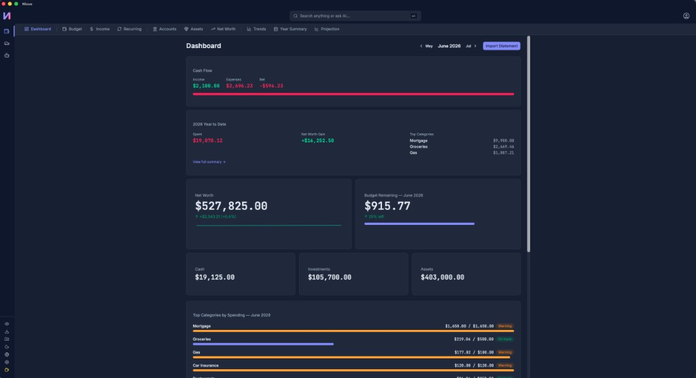
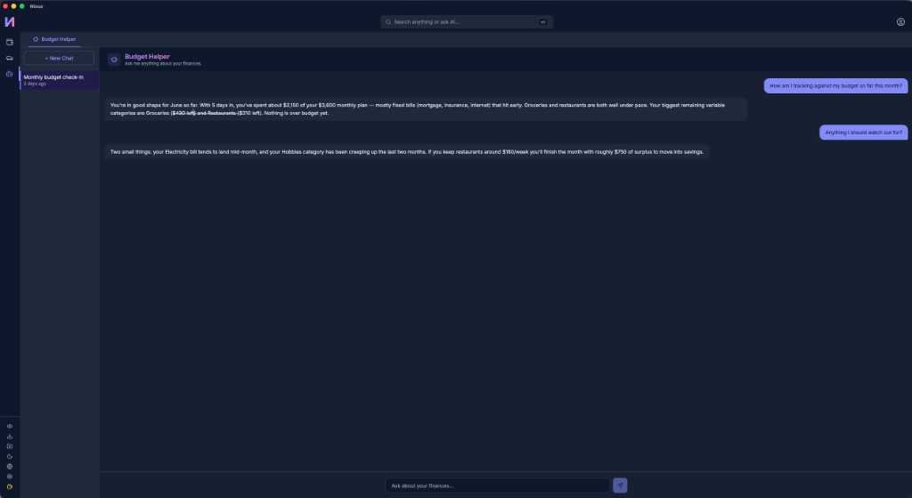
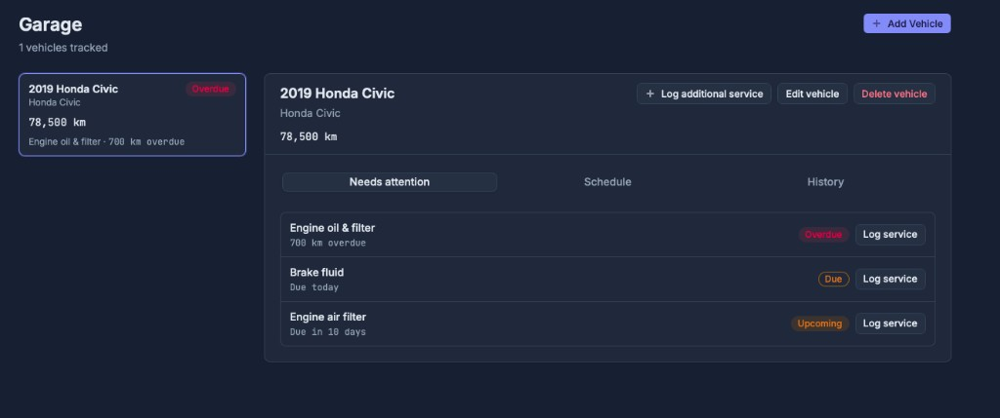

  

  

<strong>Automate and track your life — from one place, on your own machine.</strong>

Nixus is a **local-first desktop app** for **lifestyle automation and tracking**. It uses technology to take the tedious upkeep out of the things you should be staying on top of — money, your car, and more over time — so you actually keep doing them. Each area of life is a module in one shared app, and your data never leaves your machine.

**Finance** is the first module: upload a credit card statement, let AI categorize the transactions, and see your full picture — budget, accounts, assets, net worth — without touching a spreadsheet.

> **Pre-alpha** — core features work, but the product is still maturing. [See limitations](#what-nixus-is--and-isnt) before you download.

**[Download for macOS or Windows →](https://nixus.nicolasbazinet.net)** · **[Beta testing](#help-shape-nixus)** · **[Contributing](CONTRIBUTING.md)**

  

---

## What is Nixus?

Most tracking tools die the moment they demand effort. Spreadsheets, maintenance logs, habit trackers — they all work until the upkeep becomes a chore and you quietly stop. **Nixus is built to remove that upkeep**, using automation and AI to handle the tedious parts (data entry, categorization, reminders) so staying organized doesn't depend on your willpower.

It's a **modular platform**: each area of your life is its own module in a shared shell (sidebar, consistent design, one install). **Finance** and **Car** are available today, and the shell is designed so new lifestyle modules can plug in over time.

Built by one person because my own spreadsheet stopped scaling. Not a startup pitch — a tool I use every week, opened to a small group of beta testers for honest feedback.

---

## Who it's for

- You still track personal finances in a **spreadsheet** (or gave up because it was too much work)
- You want **budget, expenses, accounts, and net worth** in one desktop app
- You prefer **local storage** over cloud sync and bank connections
- You're okay uploading **credit card statements manually** (screenshot or PDF) instead of linking your bank
- You use **macOS or Windows**

## Who it's not for (yet)

- People who need **automatic bank sync** or Plaid-style connections
- **Mobile-first** users — desktop only, no mobile app (for now)
- **Multi-user / household** setups — one person's finances per install
- Anyone expecting **tax, legal, or investment advice** — this is a tracking tool (for now)
- People who need a **finished, stable product** — see [limitations](#what-nixus-is--and-isnt) below

---

## What's in the Finance module today

| Feature | What you get |
| ------- | ------------ |
| **AI statement import** | Upload a CC screenshot or PDF; transactions are extracted and categorized |
| **Budget builder** | Monthly budgets with category groups; see where you stand at a glance |
| **Expense tracking** | Review, correct, and manually add transactions; recurring templates |
| **Multi-account tracking** | Banks, credit cards, investment accounts (CAD and USD) in one view |
| **Passive assets** | Real estate, vehicles, business equity — the full picture |
| **Net worth history** | Track cash, TFSA, RRSP, crypto, housing, and more over time |
| **AI chat** | Ask questions about your data in natural language |
| **Income tracking** | Record monthly income alongside expenses for cash-flow visibility |

English and French UI · Light/dark/system theme · Auto-updates · Database backup/restore

---

## Modules

| Module | Status | What it covers |
| ------ | ------ | -------------- |
| **Finance** | Available | Budgeting, expenses, accounts, income, net worth, AI chat, CC import |
| **Car** | Available | Multi-vehicle garage, maintenance schedules, service history, odometer tracking, due-date alerts |

The app shell is designed so new modules plug in without reinventing the desktop experience each time.

---

## What Nixus is — and isn't

Before you download: an honest list so you know if this is worth your time.

- **No bank connection** — you upload credit card statements manually (screenshot or PDF).
- **Desktop only** — macOS and Windows. No mobile app.
- **Single user** — one person's finances per install.
- **AI import requires your own API credentials** (stored in your OS keychain). The app works without AI; other features are unaffected.
- **Pre-alpha** — features change and things break between releases.
- **Not tax, legal, or investment advice** — a tracking tool, not a professional service.

More detail on the marketing site: [nixus.nicolasbazinet.net/#beta](https://nixus.nicolasbazinet.net/#beta)

---

## Screenshots

  
   <em>Finance dashboard — budget, cash flow, and net worth at a glance</em>

<table>
  <tr>
    <td width="50%" align="center">
      
       <em>AI budget assistant</em>
    </td>
    <td width="50%" align="center">
      
       <em>Car maintenance tracking</em>
    </td>
  </tr>
</table>

More product visuals and an AI import demo: **[nixus.nicolasbazinet.net](https://nixus.nicolasbazinet.net)**. Additional screenshots live in [`docs/images/`](docs/images/).

---

## Help shape Nixus

I'm looking for a handful of people who still track personal finances in a spreadsheet and are willing to use Nixus for a few weeks and tell me what's confusing or broken. I built this for myself — I'm not asking you to promote it, just honest friction reports.

**[Email me about beta testing](mailto:support@nixus.nicolasbazinet.net?subject=Nixus%20beta%20tester%20interest)**

Or read the full beta section on the site: [nixus.nicolasbazinet.net/#beta](https://nixus.nicolasbazinet.net/#beta)

---

## Tech at a glance

| | |
| --- | --- |
| **Stack** | Tauri 2, React 19, Rust, SQLite |
| **Platforms** | macOS, Windows |
| **Data** | Local SQLite on your machine — no cloud account required |
| **Repo** | pnpm monorepo: desktop app, marketing site, shared UI package |

Open source — inspect the code on GitHub. First-launch warnings (macOS Gatekeeper, Windows SmartScreen) are normal for apps not yet signed by Apple or trusted by Microsoft's reputation system.

---

## Links

| Resource | Description |
| -------- | ----------- |
| [nixus.nicolasbazinet.net](https://nixus.nicolasbazinet.net) | Download, features, FAQ, beta info |
| [Contributing](CONTRIBUTING.md) | Clone, run locally, tests, architecture |
| [Beta validation roadmap (June 2026)](docs/beta-validation-roadmap-june-2026.html) | How this pre-alpha is being validated |
| [Project context for AI agents](docs/project-context.md) | Implementation rules for contributors |

---

## Status

Nixus is in **pre-alpha**. The north star for June 2026: learn whether anyone besides the builder would actually use it — not growth, not revenue. If you try it, the most useful feedback is: *"What almost made you close it in the first 10 minutes?"*
