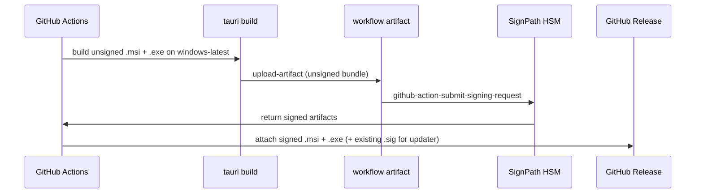

# Desktop Release Signing — Architecture Decision Document

_Scoped addendum to [architecture-desktop.md](architecture-desktop.md). Covers OS-level code signing for desktop installers, Tauri updater signing, CI integration, and marketing-site install-trust copy. Created after the GitHub repository became public._

---

## Project Context Analysis

### Requirements Overview

**Problem:** Windows SmartScreen and macOS Gatekeeper show first-run warnings for unsigned desktop binaries. Users see prompts like “Windows protected your PC” / “unidentified developer,” which erodes trust at the exact moment the marketing funnel converts a download click into an install.

**User-facing requirements (from marketing site FR-W7 and install copy):**

| ID | Requirement | Current state |
|----|-------------|---------------|
| RS-1 | Windows installer should eventually show a recognized publisher | Unsigned; SmartScreen bypass documented |
| RS-2 | macOS installer should eventually pass Gatekeeper without “Open Anyway” | Unsigned; Gatekeeper bypass documented |
| RS-3 | Auto-update artifacts must be integrity-verified | Tauri minisign via `TAURI_SIGNING_*` secrets |
| RS-4 | Install instructions remain honest until trust warnings disappear | Live in `apps/web/src/locales/{en,fr}.json` |
| RS-5 | Signing must not store private keys in the public repository | Partially met (updater key in GitHub Secrets only) |

**Non-Functional Requirements:**

| NFR | Implication |
|-----|-------------|
| Cost | Prefer **free** signing for OSS; avoid paid EV/OV certs unless product revenue justifies it |
| Public repo eligibility | Signing provider must accept `github.com/nickbazinet/nixus` as the source of truth |
| CI-only signing for releases | OSS SignPath tier signs artifacts built on GitHub-hosted runners — local dev builds stay unsigned |
| Reputation lag | Even valid Authenticode signatures may trigger SmartScreen until download volume builds reputation |
| Separation of concerns | Updater signing ≠ OS code signing — agents must not conflate the two |

### Technical Constraints & Dependencies

- **Release pipeline:** `.github/workflows/release.yml` uses `tauri-apps/tauri-action@v0.6` on `macos-latest` and `windows-latest` for tag pushes `v*`.
- **Updater:** `tauri.conf.json` configures `tauri-plugin-updater` with a minisign public key and GitHub `latest.json` endpoint.
- **Bundles:** Tauri produces macOS `.dmg` / `.app` and Windows `.msi` + `.exe` (NSIS).
- **Marketing site:** FAQ and download banner explain SmartScreen / Gatekeeper friction; copy assumes unsigned builds today.

### Cross-Cutting Concerns

1. **Two signing layers** — Tauri updater minisign (update channel integrity) vs Authenticode / Apple notarization (OS install trust).
2. **CI workflow shape** — SignPath requires unsigned artifacts uploaded as GitHub Actions artifacts before submission; may require splitting the Windows release job from monolithic `tauri-action` upload.
3. **Marketing copy drift** — User-facing strings must update when the first signed Windows release ships.
4. **Application lead time** — SignPath Foundation approval is a prerequisite; SmartScreen UX copy remains until signed releases are live.

---

## Core Architectural Decisions

### Decision Priority Analysis

**Critical (block Windows trust improvements):**

| ID | Decision | Choice |
|----|----------|--------|
| D1 | Windows Authenticode provider | **[SignPath Foundation](https://signpath.org/)** — free OSS program tied to public GitHub repo |
| D2 | Do not use self-signed Windows certs | **Rejected** — SmartScreen treats them poorly; no user trust benefit |
| D3 | Keep Tauri updater minisign separate | **Retain** existing `TAURI_SIGNING_PRIVATE_KEY` / `TAURI_SIGNING_PRIVATE_KEY_PASSWORD` secrets |

**Important (shape implementation):**

| ID | Decision | Choice |
|----|----------|--------|
| D4 | macOS code signing (v1) | **Deferred** — Apple Developer Program (~$99/yr); Gatekeeper workaround remains |
| D5 | Windows CI signing flow | Build on `windows-latest` → upload unsigned installers → SignPath submit → attach signed artifacts to GitHub Release |
| D6 | SignPath trusted build policy | Tag pattern `refs/tags/v*`, workflow `.github/workflows/release.yml`, GitHub-hosted runners only |
| D7 | Secrets naming | `SIGNPATH_API_TOKEN`, `SIGNPATH_ORGANIZATION_ID` (SignPath dashboard) — distinct from `TAURI_SIGNING_*` |

**Deferred:**

| ID | Decision | When |
|----|----------|------|
| D8 | Apple Developer ID + notarization | When macOS install friction justifies $99/yr or App Store path is chosen |
| D9 | Azure Trusted Signing | Only if SignPath is unavailable and budget allows (~paid tier) |

---

### D1 — Windows: SignPath Foundation (free OSS)

**Rationale:**

- Public GitHub repository satisfies SignPath OSS eligibility.
- Certificate is issued to the **project**, not a personal identity — aligns with “inspect the code on GitHub” marketing message.
- Private key stays in SignPath HSM; CI submits artifacts via API — no USB token, no key in repo.
- Used by other OSS desktop projects (e.g. Stellarium, Flameshot, GitExtensions).

**Application:** [signpath.io/solutions/open-source-community](https://signpath.io/solutions/open-source-community) — reference `https://github.com/nickbazinet/nixus`, release workflow, and Windows `.msi` / `.exe` artifacts.

**References:** [SignPath GitHub integration](https://docs.signpath.io/trusted-build-systems/github), [submit-signing-request action](https://github.com/SignPath/github-action-submit-signing-request).

---

### D3 — Tauri updater minisign (unchanged)

**Purpose:** Verify that auto-update payloads (`latest.json`, `.sig` files) were produced by the project maintainer.

**Not a substitute for D1.** SmartScreen does not consult Tauri minisign keys.

**Existing configuration:**

```yaml
# .github/workflows/release.yml (excerpt)
env:
  TAURI_SIGNING_PRIVATE_KEY: ${{ secrets.TAURI_SIGNING_PRIVATE_KEY }}
  TAURI_SIGNING_PRIVATE_KEY_PASSWORD: ${{ secrets.TAURI_SIGNING_PRIVATE_KEY_PASSWORD }}
```

**Documentation gap (implementation follow-up):** `tech-spec-auto-updater.md` task “document the secret setup” should live in `docs/release-signing.md` and explicitly label minisign as **updater-only**.

---

### D4 — macOS: unsigned for v1

**Rationale:** No free equivalent to SignPath exists for Apple notarization. Gatekeeper “Open Anyway” guidance in marketing copy remains correct.

**Future path:** Apple Developer ID Application certificate + `notarytool` in the macOS release job — out of scope until explicitly funded.

---

### D5 — Target CI flow (Windows)



**Implementation notes for agents:**

1. Install [SignPath GitHub App](https://docs.signpath.io/trusted-build-systems/github) on `nickbazinet/nixus`.
2. Configure SignPath project: repository URL, artifact configuration for Windows installers (ZIP root or per-file — match SignPath artifact config XML).
3. Windows job may need to **build first, sign second, release third** instead of relying on `tauri-action` to publish unsigned Windows binaries directly.
4. macOS job can remain on current `tauri-action` flow until D8 is funded.
5. OSS policy: all jobs before signing must run on **GitHub-hosted** agents ([SignPath prerequisite](https://docs.signpath.io/trusted-build-systems/github)).

**Skeleton step (Windows job only — illustrative):**

```yaml
- name: Upload unsigned Windows installers
  id: upload-unsigned
  uses: actions/upload-artifact@v4
  with:
    name: nixus-windows-unsigned
    path: apps/desktop/src-tauri/target/release/bundle/**/*
    retention-days: 1

- name: Submit Windows signing request
  uses: signpath/github-action-submit-signing-request@v2
  with:
    api-token: ${{ secrets.SIGNPATH_API_TOKEN }}
    organization-id: ${{ secrets.SIGNPATH_ORGANIZATION_ID }}
    project-slug: nixus
    signing-policy-slug: release-signing
    github-artifact-id: ${{ steps.upload-unsigned.outputs.artifact-id }}
    wait-for-completion: true
    output-artifact-directory: signed/

# Follow with: upload signed artifacts to GitHub Release (replace unsigned Windows assets)
```

Exact `project-slug`, `signing-policy-slug`, and artifact configuration slugs are set in the SignPath dashboard after OSS approval.

---

## Implementation Patterns

### Secret inventory

| Secret | Purpose | Never used for |
|--------|---------|----------------|
| `TAURI_SIGNING_PRIVATE_KEY` | Tauri updater minisign | Windows Authenticode |
| `TAURI_SIGNING_PRIVATE_KEY_PASSWORD` | Minisign key password | Windows Authenticode |
| `SIGNPATH_API_TOKEN` | Submit Windows signing requests | Updater signatures |
| `SIGNPATH_ORGANIZATION_ID` | SignPath org scope | — |
| `GITHUB_TOKEN` | Release upload (existing) | — |

### Agent anti-patterns

- **Do not** document self-signed Windows certificates as a trust fix.
- **Do not** store any signing private key in the repository or in committed env files.
- **Do not** remove SmartScreen bypass copy until signed Windows releases have shipped **and** reputation has stabilized (keep fallback wording).
- **Do not** assume `TAURI_SIGNING_*` eliminates SmartScreen — update marketing copy only when Authenticode signing is live.

### Marketing copy update trigger

When the first GitHub Release contains SignPath-signed Windows installers, update:

| File | Keys |
|------|------|
| `apps/web/src/locales/en.json` | `faq.installSafety.answer`, `downloadBanner.windowsBody`, `installInstructions.windowsBody` |
| `apps/web/src/locales/fr.json` | French equivalents |

**Suggested message direction:** “Windows builds are signed through [SignPath Foundation](https://signpath.org/) and built from our public GitHub repository. SmartScreen may still warn on early releases until Microsoft reputation builds — use More info → Run anyway if needed.”

---

## Project Structure

### Files to create or modify (implementation epic)

| File | Action |
|------|--------|
| `.github/workflows/release.yml` | Split Windows build / sign / publish; add SignPath steps |
| `.signpath/artifact-configurations/` | SignPath artifact config (after dashboard setup) |
| `docs/release-signing.md` | Operator runbook: secrets, SignPath setup, minisign vs Authenticode |
| `apps/web/src/locales/en.json` | Update after first signed release |
| `apps/web/src/locales/fr.json` | Update after first signed release |
| `architecture-desktop.md` | Link this addendum (done) |
| `tech-spec-auto-updater.md` | Clarify minisign scope in a comment or cross-link |

### Requirements → structure mapping

| Requirement | Location |
|-------------|----------|
| RS-1 Windows publisher trust | SignPath + `release.yml` Windows job |
| RS-2 macOS Gatekeeper | Deferred — locales until D8 |
| RS-3 Updater integrity | `tauri.conf.json` + `TAURI_SIGNING_*` |
| RS-4 Honest install copy | `apps/web/src/locales/` |
| RS-5 No keys in repo | GitHub Secrets + SignPath HSM |

---

## Architecture Validation

### Coherence

- SignPath (Windows Authenticode) and Tauri minisign (updates) are complementary, not redundant.
- Free OSS strategy aligns with public repo and marketing “open source — inspect on GitHub” positioning.
- macOS deferral is explicit — no false promise of free macOS signing.

### Known limitations (acceptable)

- SignPath OSS approval is manual — SmartScreen UX copy stays until approved and shipped.
- Signed binaries may still trigger SmartScreen briefly — reputation is incremental.
- Local `pnpm desktop:tauri build` produces unsigned Windows binaries — expected for dev.

### Readiness

**Status:** READY FOR IMPLEMENTATION (pending SignPath OSS application approval)

**First implementation steps:**

1. Submit SignPath Foundation OSS application for `nickbazinet/nixus`.
2. Configure SignPath project, signing policy, and artifact configuration.
3. Add GitHub secrets `SIGNPATH_API_TOKEN`, `SIGNPATH_ORGANIZATION_ID`.
4. Refactor Windows portion of `release.yml` per D5.
5. Ship a tagged release; verify SmartScreen publisher name; update marketing locales.

---

## Related documents

| Document | Relationship |
|----------|--------------|
| [architecture-desktop.md](architecture-desktop.md) | Parent desktop architecture |
| [architecture-web.md](architecture-web.md) | FR-W7 install instructions |
| [tech-spec-auto-updater.md](../implementation-artifacts/tech-spec-auto-updater.md) | Updater minisign only |
| [tech-spec-download-ux-banner.md](../implementation-artifacts/tech-spec-download-ux-banner.md) | SmartScreen UX copy spec |
| [product-brief-nixus-marketing-site-2026-04-25.md](product-brief-nixus-marketing-site-2026-04-25.md) | Install friction as conversion concern |
