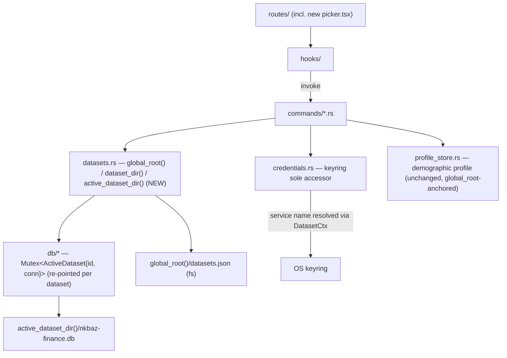

# Architecture Spine — Local Profiles & Nixus Cloud (Step 1)

## Design Paradigm

The existing layered Tauri/React architecture is unchanged: `routes/` → `hooks/` → Tauri `invoke` → `commands/` → `db/` (SQLite) or a top-level sole-accessor store (`credentials.rs` for keyring, `profile_store.rs` for the demographic profile). This spine adds exactly one new cross-cutting layer beneath all of it: a **bootstrap-gated dataset context**.

The app is **single-active-dataset, never concurrent-multi-tenant**: exactly one dataset is "active" process-wide at any moment, and there may be **zero** active datasets during the picker window (AD-6a). Switching datasets **drops and reopens** state — it never serves two datasets at once. Every existing domain module (finance, car, settings, onboarding, backup, danger-zone) stays unaware it is multi-tenant at all; it keeps reading "the" `app_data_dir`, and that resolution now flows through one of two named authorities (AD-5) instead of being computed independently at each call site.



**Dependency rule:** `commands/*.rs` and `db/*` never call `app.path().app_data_dir()` directly except inside `datasets.rs` (AD-5). `credentials.rs` remains the only module touching `keyring_core::Entry` (inherited from `architecture-login.md`). `profile_store.rs` remains the only accessor of the demographic-profile directory (inherited from `architecture-user-profile.md`).

## Invariants & Rules

### AD-1 — One dataset = one directory + one complete, independent SQLite file

- **Binds:** CAP-2, CAP-3
- **Prevents:** Two datasets ever sharing tables/schema/connection and leaking data into each other; rewriting every `db/*` query to filter by dataset.
- **Rule:** Isolation is achieved by **which directory `init_db` is pointed at**, never by a shared file with per-dataset rows/schemas. `db/mod.rs`'s `MIGRATIONS` runner, `db/backup.rs`, and `db/danger_zone.rs`'s wipe-coverage test run completely unmodified against whichever directory is active — they must never become dataset-aware internally.

### AD-2 — Default dataset is the existing `app_data_dir` root; new datasets get `datasets/<uuid>/`; CAP-6 labels are auto-generated

- **Binds:** CAP-2, CAP-6
- **Prevents:** Any code path moving, copying, or rewriting the pre-existing `nkbaz-finance.db` during migration; a free-text label field appearing anywhere (the SPEC's own non-goal).
- **Rule:** The Default dataset's `dataset_id` is the fixed literal `"default"`, `is_default: true` is set only on this one entry, and its dataset directory **is** `app_data_dir` itself — `nkbaz-finance.db`, `config`, and existing (unsuffixed) keyring service names stay exactly where they are, untouched. `app_data_dir` is simultaneously `global_root()` (AD-5) — it therefore also parents `datasets.json` and `datasets/`, but **no code ever treats "Default's directory" as a copyable/deletable unit**; only the named files inside it are ever targeted (AD-5's rule). Every dataset created via CAP-4, CAP-5, or CAP-6 gets a new `app_data_dir/datasets/<uuid>/` directory with its own fresh, migrated `nkbaz-finance.db`. `<uuid>` is a lowercase UUID v4, generated once and used **byte-identical, never re-cased or slugged**, as both the directory name and the keyring service-name suffix (AD-8) — mirroring the "validate, never slug" precedent already established for Cognito `sub` in `profile_store.rs`. A dataset created via CAP-6 gets an auto-generated label `"Local Profile <n>"` (`<n>` = count of existing non-default, non-cloud-linked datasets + 1) — no free-text label input exists in this pass.

### AD-3 — `datasets.json` is the single source of truth for the picker, with one schema and one writer lock

- **Binds:** CAP-1, CAP-3, CAP-4, CAP-5, CAP-6
- **Prevents:** The picker reconstructing the dataset list by scanning directories or opening per-dataset SQLite files; two concurrent mutators (a synchronous `create_dataset` call and the OAuth callback thread) corrupting or last-writer-wins-clobbering the file; an unparseable registry being silently treated as "missing" and orphaning every non-default dataset.
- **Rule:** One registry file at `global_root()/datasets.json` (AD-5). Entry shape, always written in full: `{ id: string, label: string, kind: "local" | "cloud-linked", cognito_sub: string | null, linked_from: string | null, is_default: bool, created_at: string }`. It is written only through `datasets.rs`'s atomic-write helper (the `write_json_atomic` pattern promoted into `json_store.rs`), and every read-modify-write sequence against it (`create_dataset`, the Login/Migrate post-callback writer, any future mutator) serializes through the **registry lock** — the same single in-process lock named in AD-6/AD-12 — held for the full duration of the read-modify-write, not just the final write. **The registry lock is released before any `select_dataset`/hand-off call that itself acquires the AD-6 `ActiveDataset` lock, in both Login and Migrate — the one narrow exception (Migrate's brief nested active-id re-check) is named explicitly in AD-6's Lock ordering rule and AD-12; no other nesting of the two locks exists.** **Missing** file → bootstrap per AD-4. **Present but unparseable** file → a hard `AppError`, surfaced to the user; it is never silently recreated (recreating would orphan every non-default dataset on disk). On every **read**, each entry's `id` is re-validated against the same filesystem-safe charset AD-2 generates it with before being used to build any path or keyring name; a failing entry is skipped and logged, not fatal to the whole registry load.

### AD-4 — Bootstrap/migration state machine runs before any UI renders

- **Binds:** CAP-2
- **Prevents:** Any user-visible action, prompt, or delay on the upgrade path; a fresh install ending up with no Default entry; a partial/legacy-shaped Default entry that fails to deserialize against AD-3's schema.
- **Rule:** On launch, before the picker or anything else mounts: if `datasets.json` is missing, create it (under the AD-3 lock) with exactly one entry using AD-3's **full** schema — `{ id: "default", label: "Default", kind: "local", cognito_sub: null, linked_from: null, is_default: true, created_at: now }` — regardless of whether a legacy `nkbaz-finance.db` already exists at the root (upgrade) or not (fresh install). No file is moved either way (AD-2). If `datasets.json` already exists, this step is a no-op read (subject to AD-3's corrupt-registry rule).

### AD-5 — `datasets.rs` exposes exactly three path functions, only two of which are path *roots*

- **Binds:** all (CAP-1..CAP-6)
- **Prevents:** A silently-uncounted `app.path().app_data_dir()` call site reading/writing the wrong scope; a hand-composed `global_root().join("datasets").join(id)` appearing at a call site (which mis-resolves for `id == "default"`, since Default has no `datasets/` subdirectory); a path result ever being handed to a recursive/whole-directory operation (which, for Default, would mean deleting or copying `datasets.json` and every other dataset — the exact failure mode AD-2's zero-movement design would otherwise invite).
- **Rule:** `datasets.rs` is the **only** module calling `app.path().app_data_dir()`. It exposes three functions: `global_root(&app) -> PathBuf` (the directory itself — used for `datasets.json`, the demographic `profiles/` dir, and anything explicitly global); `dataset_dir(&app, id: &str) -> PathBuf` (the one primitive that actually branches: `global_root()` when `id == "default"`, else `global_root().join("datasets").join(id)`) — this is a **pure, lock-free** function, since it only formats a path from an `id` the caller already has; and `active_dataset_dir(&app) -> Result<PathBuf, AppError>`, a convenience for callers that do **not** already hold the `ActiveDataset` guard (AD-6a) — it acquires that guard itself just long enough to read the id, calls `dataset_dir` with it, and returns `AppError::NotConfigured` if no dataset is active (AD-6a). **Any call site that already holds the `ActiveDataset` guard — `backup.rs`, `import.rs`, `danger_zone.rs`'s SQL path (AD-6b) — MUST build its path as `dataset_dir(&app, &guard.id)` directly, using the id it already has from the guard it's holding, and MUST NOT call `active_dataset_dir()` from inside that critical section** (doing so would re-acquire the same non-reentrant lock and deadlock). `AD-12`'s Migrate branch resolves the *source* dataset's directory the same way: via `dataset_dir(&app, source_id)`, never `active_dataset_dir()`, since the source is not necessarily the currently-active dataset by the time the callback fires. **Every result from `dataset_dir`/`active_dataset_dir` is only ever used to build a path to a specifically named file — `nkbaz-finance.db` and its `-wal`/`-shm` sidecars — never passed to a recursive delete, copy, or walk.** All seven existing `app.path().app_data_dir()` call sites are re-pointed to one of these functions, not five:
  - `lib.rs` (setup/bootstrap) → `global_root()` (runs AD-4).
  - `commands/backup.rs` (`export_backup`, `import_backup`) → holds the `ActiveDataset` guard (AD-6b) and builds the path via `dataset_dir(&app, &guard.id)` + literal filename.
  - `commands/danger_zone.rs` (`delete_all_data`) → its SQL-table wipe (`wipe_all(conn)`) already operates on the currently-open, dataset-scoped connection via the held `ActiveDataset` guard and needs **no separate path resolution at all**; its separate deletion of the demographic `profiles/` directory continues to use `global_root()` **unchanged** — it is not, and must not become, dataset-scoped (AD-13).
  - `commands/profile.rs` (`resolve_profiles_dir`) → `global_root()` (AD-13, unchanged).
  - `commands/import.rs` (statement-import staging files) → holds the `ActiveDataset` guard and builds the path via `dataset_dir(&app, &guard.id)` — imported statements are per-dataset financial data and must be isolated exactly like AI-provider keys (CAP-3's spirit), a call site the original brownfield count missed.
  - `commands/maintenance.rs` (`vehicle_catalog/`) → `global_root()` — reference catalog data, not user data, same class as the bundled ISO 3166 dataset; stays global.

### AD-6 — Active dataset (id + connection) is one guarded struct with no connection until selected; switching is a locked, all-or-nothing hot-swap

- **Binds:** CAP-1, CAP-3
- **Prevents:** Any command silently touching Default's (or any) data before the user has chosen a dataset; a jarring full-app reload on every switch; two datasets' connections open simultaneously; a failed switch leaving the path and the connection pointing at different datasets; two independent lock acquisitions (one for "which id is active", one for "the connection") ever letting a `select_dataset` interleave between them.
- **Rule:**
  - **AD-6a:** The existing `DbState` becomes `Mutex<ActiveDataset>`, where `ActiveDataset { id: Option<String>, conn: Option<Connection> }` — **one struct behind one lock**, so "which dataset" and "its connection" can never be read or swapped independently of each other. It starts `{ id: None, conn: None }` and stays that way until the first `select_dataset` succeeds. Any command requiring DB access while `conn` is `None` returns `AppError::NotConfigured` (reused, not a new variant — matches the Consistency Conventions' "no new `AppError` variant" rule) rather than falling back to Default. Every one of the existing ~125 `State<DbState>` access sites across `db/*.rs` gains the same one-line `.conn.as_ref().ok_or(AppError::NotConfigured)?` guard where they previously did a bare `.lock()` — mechanical, but real and pervasive; not hidden as "unchanged."
  - **AD-6b:** `select_dataset(id)` (in `commands/datasets.rs`, delegating to `datasets.rs`) resolves the target's directory via `dataset_dir(&app, id)` (AD-5) and opens+migrates it via the existing `init_db`/`open_configured` path **before** touching any lock. Only once that succeeds does it acquire the `ActiveDataset` lock (AD-6a) and swap `id`+`conn` together, in one critical section, then release it. `backup.rs`/`import.rs`/`danger_zone.rs` acquire the **same** `ActiveDataset` lock once to read both `id` and `conn` together for the duration of their operation — never two separate acquisitions of "the path" and "the connection" — closing the window a `select_dataset` could otherwise land in between them. On failure, the previous `ActiveDataset` state is left exactly as it was and an error is returned — never a partial state where the path and the open connection disagree.
  - **AD-6c:** A successful `select_dataset` emits a `dataset:switched` event with payload `{ dataset_id, kind }` — **every time**, including the very first selection of a run (the event means "this dataset is now active", not "changed from a previous one"). The frontend's sole switch-completion signal is this event.
  - **Lock ordering (binding, shared with AD-3/AD-12):** the registry lock (AD-3) and the `ActiveDataset` lock (this AD) are two distinct locks. **Registry → ActiveDataset is the only nesting direction ever used, and only for one bounded operation:** AD-12's Migrate branch, while holding the registry lock, briefly acquires-and-releases the `ActiveDataset` lock purely to re-read the currently-active id for its abort check (a single quick read, not held across any I/O). Every other case — `select_dataset` itself (AD-6b), and both Login's and Migrate's final hand-off — acquires the registry lock, **fully releases it**, and only then acquires the `ActiveDataset` lock (e.g. via `select_dataset`). The reverse order (`ActiveDataset` held while acquiring the registry lock) is never used anywhere, so no cross-lock deadlock is constructible.
  - The frontend must present a switch as a "log out of profile A / log into profile B" transition (return to the picker, then into the new dataset's dashboard) — never a raw page reload — per the product intent.

### AD-7 — Full query-cache clear on every dataset activation; no frontend-persisted state survives a switch

- **Binds:** CAP-1, CAP-3
- **Prevents:** Any stale, previous-dataset (or no-dataset) data rendering after activation — the same class of bug D5 in `architecture-user-profile.md` guarded against for one query key, generalized to every key — including state that lives outside TanStack Query entirely.
- **Rule:** A `useDatasets.ts` listener on `dataset:switched` (AD-6c) MUST call `queryClient.clear()` (a full clear, not a scoped `removeQueries`) on every occurrence, including the first of a run, because virtually every existing query key is now implicitly dataset-scoped. **This extends to any frontend-persisted state that mirrors per-dataset data** — e.g. `components/import/importDraft.ts`'s `localStorage`-backed import draft, and the onboarding/setup-banner dismissal flags in `DangerZone.tsx`/`SetupIncompleteBanner.tsx`/`CarOnboardingChecklist.tsx` — none of which may leak across a dataset switch. This spine does not enumerate every such key exhaustively (that is a story-writing survey task against the four files named above as known starting points), but the **rule is binding now**: no `localStorage`/component-state value that represents one dataset's data or progress may be readable after switching to another.

### AD-8 — AI-provider keyring entries are per-dataset; Default keeps today's unscoped name

- **Binds:** CAP-3
- **Prevents:** One dataset's AI/API keys becoming visible to another; forcing an upgrading Default user to re-enter an already-configured key; a dataset id being transformed differently between its directory name and its keyring service name.
- **Rule:** `credentials.rs`'s AI/AWS key functions gain a `dataset_id` parameter and compute the keyring **service** name as the literal `"nkbaz-finance"` when `dataset_id == "default"` (unchanged, zero migration) and `"nkbaz-finance-<dataset_id>"` for every other dataset, using the exact same UUID string as the directory name (AD-2) — never re-cased or slugged. `credentials.rs` remains the sole module touching `keyring_core::Entry` (inherited, unweakened).

### AD-9 — Cognito's session storage stays global and unscoped this pass [ADOPTED]

- **Binds:** CAP-4, CAP-5
- **Prevents:** Scope creep into a per-dataset session model this pass; premature plumbing for a capability not being built now.
- **Rule:** `credentials.rs`'s `nixus-auth`/`cognito-session` keyring entry and the in-process `SESSION_CACHE` singleton are **not** touched. There is exactly one Cognito session on the machine at a time, exactly as today. True per-account session isolation (signing into two different Nixus Cloud accounts and having both "stay signed in" independently) is explicitly future work — see Deferred.

### AD-10 — Cloud-linked signed-in/out display is derived via the existing Rust-internal subject resolver, never via `AuthState`

- **Binds:** CAP-5
- **Prevents:** Building new per-dataset session plumbing just to satisfy one UI badge; re-adding `sub` to the `AuthState` wire type or accepting it as an IPC parameter, which `architecture-user-profile.md`'s D3 explicitly forbids (`AuthState`'s wire shape carries only `email`/`name`, never `sub`).
- **Rule:** A cloud-linked dataset's registry entry statically records `cognito_sub` and `label` (email, from the `id_token` at link time — AD-12) at link time. Its "signed in / signed out" state in `ProfileMenu.tsx` is computed **entirely on the Rust side**: `commands/datasets.rs` calls the existing internal `commands::auth::current_subject()` helper (D3's designated, IPC-never-crossing resolution point) and compares its result to the active dataset's stored `cognito_sub`, returning only the boolean badge state (never the `sub` itself) to the frontend. Match → signed-in (existing `sign_out` works unchanged); no match, or `current_subject()` erroring as no-session → signed-out. No new Rust state; no change to `AuthState`.

### AD-11 — One unchanged OAuth mechanism, branched post-callback by intent

- **Binds:** CAP-4, CAP-5
- **Prevents:** Two divergent Cognito flows (a "login" one and a "migrate" one) that could drift out of sync on PKCE/state/token-exchange correctness; a stale intent outliving the callback window it belongs to.
- **Rule:** `start_login` gains a `LoginIntent` enum (`Login`, or `Migrate` carrying the source dataset's id), held in-process **inside `commands/auth_listener.rs`**, alongside the same PKCE `state`/verifier it already carries across the redirect round-trip (per `architecture-login.md`'s 2026-08-15 loopback-redirect amendment) — so the intent shares that listener's exact single-request/5-minute-timeout lifetime and can never outlive the attempt it was created for. PKCE, the `state` CSRF check, the token exchange, and `credentials.rs`'s session storage are **100% unchanged**. Only `complete_auth_callback`'s post-token-exchange branch differs (AD-12); the legacy `nixus://auth/callback` deep-link fallback path (still recognized per the amendment) carries no intent and always behaves as `LoginIntent::Login`.

### AD-12 — Post-callback branch: find-or-create-by-sub (Login, most-recent tie-break) vs copy-and-link (Migrate, lock-held)

- **Binds:** CAP-4, CAP-5
- **Prevents:** A migrated dataset losing data or AI-provider keys; the original dataset being mutated or deleted during migration; a dataset switch racing a Migrate's checkpoint-and-copy mid-flight (including a switch that happens during the async browser round-trip, before the callback even fires); copying `-wal`/`-shm` sidecars into a corrupt duplicate; an unresolvable ambiguity when more than one cloud-linked dataset shares a `cognito_sub`; the registry lock ever being held across a `select_dataset` call (which would deadlock the callback thread against AD-6b's own lock use).
- **Rule:**
  - `LoginIntent::Login`: acquire the registry lock; look up `datasets.json` for entries with `kind: "cloud-linked"` and matching `cognito_sub`. None found → create a new dataset (AD-2 shape), tag it `kind: "cloud-linked"`, `cognito_sub`, `label: <email from id_token>`, append to the registry. One or more found → select the one with the most recent `created_at` (deterministic tie-break; multiple cloud-linked datasets sharing one `sub` is an accepted, documented edge case — see Deferred — not one this rule prevents, only makes deterministic). Either way: **release the registry lock, then** call `select_dataset(id)` (AD-6) — exactly mirroring Migrate's own lock-then-release-then-select ordering below, so the non-reentrant registry lock is never held across a `select_dataset` call in either branch (a lock held across both calls would deadlock the callback thread against itself, since AD-6b's `select_dataset` never touches the registry lock but a naive "release inside `select_dataset`" reading would).
  - `LoginIntent::Migrate` (carrying the source dataset's id): acquires the **same registry lock** for the **entire** copy operation, not just the final write — this is what prevents a concurrent `create_dataset`/Login from mutating the registry mid-copy. Immediately after acquiring it, **re-check that the source dataset is still the currently active one** — a brief, bounded acquire-and-release of the `ActiveDataset` lock purely to read its `id` (the one named exception to AD-6's lock-ordering rule, never held across any I/O); if the user switched away during the browser round-trip, abort with an error and create nothing, rather than checkpointing whichever dataset happens to be active now. Otherwise: create a new dataset directory (AD-2 shape); checkpoint the source dataset's connection (`PRAGMA wal_checkpoint(TRUNCATE)`, reusing `export_backup`'s exact sequence) and `std::fs::copy` **only the main `nkbaz-finance.db` file**, resolving its path via `dataset_dir(&app, source_id)` (AD-5, not `active_dataset_dir()`) — never any `-wal`/`-shm` sidecar, which post-checkpoint should not exist but must not be copied if it does; copy the source dataset's per-dataset AI-provider keyring entries (AD-8) into the new dataset's keyring slot by an **explicit, enumerated list of the fixed key names `credentials.rs` already defines** (keyring entries cannot be enumerated at runtime, so "copy the keyring" is not an implementable instruction); tag the new entry `kind: "cloud-linked"`, `cognito_sub`, `label`, `linked_from: source_dataset_id`; append to the registry; **release the registry lock; then** `select_dataset(new_id)`. The source dataset's registry entry and files are **never** modified or removed.

### AD-13 — The demographic Profile feature stays global, unaffected

- **Binds:** all (boundary clarification)
- **Prevents:** `profile_store.rs`'s `<global_root()>/profiles/<sub>.json` accidentally becoming dataset-scoped, or colliding in name/directory with the new dataset concept; `danger_zone.rs`'s existing whole-`profiles/`-directory delete becoming per-dataset (a silent behavior regression — today it is machine-wide and stays machine-wide).
- **Rule:** `profile_store.rs`, its `/profile` route, and its Cognito-`sub`-keyed documents are **not touched** and stay anchored at `global_root()` (AD-5) regardless of which dataset is active — they represent "who is signed in" (still global per AD-9), not "which dataset is open." The new dataset-isolation directory is named `datasets/` in code and filesystem, deliberately distinct from the existing singular `profiles/` directory, so the two concepts never share a name or a path. `routes/index.tsx`'s existing `check_onboarding_status` gate is unchanged and simply now runs *after* AD-14's picker gate rather than first — since `onboarding_completed` lives in `db/config.rs`, itself inside each dataset's own SQLite file (AD-1), it is automatically evaluated against whichever dataset was just activated with no code change.

### AD-14 — The picker is a chrome-free route gated ahead of everything else; no data leaves the machine

- **Binds:** CAP-1, CAP-4, CAP-5
- **Prevents:** Any launch path reaching the dashboard, onboarding wizard, or `AccountPromptDialog` before a dataset is chosen; a persisted "last profile" shortcut reappearing; a future story adding sync/upload plumbing disguised as auth work; an untested Playwright fleet after this ships.
- **Rule:** A new `routes/picker.tsx` renders without sidebar/`TopBar`/`DestinationNav` — `__root.tsx` conditionally skips shell rendering when the matched route is chrome-free, rather than a full pathless-layout-route reorg of every existing file (lowest blast radius; no chrome-free template exists today). Before any other route resolves, a flag tracking "a dataset has been selected this run" is checked (Rust-side, alongside `ActiveDataset` (AD-6a), so it cannot be bypassed by a frontend reload); unset → redirect to `/picker`. Nothing persists this flag across launches (satisfies "no last-used-profile shortcut"). `AccountPromptDialog` is **deleted** — fully superseded by the picker's own "Log in with Nixus Cloud" action, not left dormant, and its dedicated spec asserting its i18n keys exist (e.g. `auth-i18n.test.ts` or equivalent) is updated/removed in the same change, not left to fail CI. **The only network calls this feature makes are Cognito's existing `/oauth2/authorize` and `/oauth2/token` endpoints — the same ones `architecture-login.md` already established.** AD-12's Migrate copy is 100% local filesystem + local keyring; no new endpoint, and no financial, car, profile, or dataset data is ever transmitted, satisfying the SPEC's "no data leaves the machine" constraint as a checkable fact, not an aspiration. Because this gate mounts a root-level `invoke()` (`get_active_dataset`/equivalent) ahead of everything else, every existing Playwright spec's Tauri mock switch must add a case for it — since today's ~30 spec files each inline their own mock with no shared helper, this is a known, bounded, one-time cost of this AD (per the documented `project-context.md` pitfall), not optional cleanup; introducing a shared mock helper while touching all 30 is a reasonable but non-mandatory bonus.

## Consistency Conventions

| Concern | Convention |
| --- | --- |
| Naming | Code entity/module/dir/id: `Dataset` / `datasets.rs` / `datasets/` / `dataset_id` — never "profile" in code identifiers. User-facing copy: "profile" (per SPEC). `commands/datasets.rs`, not `db/datasets.rs` (no SQL of its own — it orchestrates directories + the registry, mirroring `profile_store.rs`'s top-level, non-SQLite precedent). Top-level `src-tauri/src/datasets.rs` and `commands/datasets.rs` intentionally share a basename (distinct Rust module paths — `crate::datasets` vs `crate::commands::datasets`, exactly the store/command split every other feature already uses); story-writers should not treat this as a naming defect to "fix" by renaming either one. |
| Data & formats | Registry entries: `snake_case` JSON, full AD-3 schema always written (no partial entries), `created_at` ISO 8601 per project rule 4. New commands follow existing `#[tauri::command(rename_all = "snake_case")]` / `Result<T, AppError>` conventions — no new `AppError` variant needed beyond what `AppError::File`/`AppError::Validation` already cover. |
| State & cross-cutting | At most one active dataset process-wide, or none before selection (AD-6a); all `app_data_dir` resolution flows through `datasets.rs`'s named functions (AD-5), never a bare `app.path().app_data_dir()` elsewhere; cache invalidation on dataset activation is a full `queryClient.clear()` plus the frontend-persisted-state sweep (AD-7), never a scoped `removeQueries` (that convention stays reserved for auth-session-only changes per `architecture-user-profile.md`'s D5); the registry lock (AD-3) and the `ActiveDataset` lock (AD-6) are two distinct locks, registry-first-then-released, never nested in the reverse order (AD-6/AD-12) — one named exception: AD-12's Migrate active-id re-check briefly nests registry→ActiveDataset for a read-only check, never for I/O. |
| UI surface | The picker reuses `@nixus/shared/ui` primitives and the existing dark-theme tokens exactly as the rest of the app — no OS-native dialog, no parallel design system (SPEC constraint). `ProfileMenu.tsx` is **modified**, not replaced: when the active dataset's `kind == "local"`, its entry point reads "Migrate to Nixus Cloud" (replacing today's "Sign In with Nixus Cloud") and triggers `LoginIntent::Migrate`; when `kind == "cloud-linked"`, it renders the AD-10-derived signed-in/signed-out badge plus the existing `sign_out` action. |
| i18n | Every locale-key addition or removal lands in `en.json` and `fr.json` in the same change (the existing locale-parity CI suite enforces this — inherited, not new). New keys for this feature live under a new `datasets.*` namespace (picker strings, the "Migrate to Nixus Cloud" label) — exact key names are a story-writing detail, the namespace is not. The keys `auth.promptTitle`, `auth.promptBody`, `auth.promptFutureFeatures`, `auth.createAccount`, `auth.continueOffline`, and `profile.signIn` are **all retired** together with `AccountPromptDialog`/the old sign-in label (AD-14) — `profile.signIn`'s string ("Sign In with Nixus Cloud") has no remaining caller once `ProfileMenu.tsx`'s local-dataset case always shows "Migrate to Nixus Cloud" regardless of global auth state. None are left orphaned. |

## Stack

No new dependencies. This feature is built entirely on what the project already has:

| Name | Version | Role here |
| --- | --- | --- |
| rusqlite | 0.38 (bundled SQLite) | Unchanged; `init_db` re-pointed per dataset |
| keyring / keyring-core | 4 / 1 | `credentials.rs` gains a dataset-scoped service-name parameter; no new crate |
| Tauri | 2.x | New `dataset:switched` event; `app.path().app_data_dir()` now called only from `datasets.rs` |
| TanStack Router | 1.167.0 | New `routes/picker.tsx`; conditional shell in `__root.tsx` via existing `useRouterState` |
| TanStack Query | 5.90.21 | `queryClient.clear()` on dataset activation |

## Structural Seed

```text
apps/desktop/src-tauri/src/
├── datasets.rs                  # NEW — global_root(), active_dataset_dir(), registry read/write
│                                 #       (via json_store::write_json_atomic) under one mutation
│                                 #       lock, list_datasets(), create_dataset(), select_dataset()
├── json_store.rs                # EXISTING (from architecture-user-profile.md) — reused as-is
├── credentials.rs                # MODIFIED — AI/AWS key fns take dataset_id; service name literal
│                                 #            "nkbaz-finance" for default, suffixed otherwise.
│                                 #            Cognito session fns UNCHANGED (AD-9).
├── profile_store.rs               # UNCHANGED (AD-13) — still resolves via global_root()
├── commands/
│   ├── datasets.rs               # NEW — list_datasets, create_dataset, select_dataset,
│   │                              #       get_active_dataset (thin orchestration over datasets.rs)
│   ├── auth.rs                    # MODIFIED — start_login(intent: LoginIntent)
│   ├── auth_listener.rs           # MODIFIED — LoginIntent stored alongside PKCE state/verifier;
│   │                              #            complete_auth_callback branches per AD-12
│   ├── backup.rs                  # MODIFIED — resolves dir via datasets::active_dataset_dir
│   ├── danger_zone.rs             # MODIFIED — SQL wipe via active connection (unchanged); the
│   │                              #            separate profiles/ delete stays on global_root()
│   ├── import.rs                  # MODIFIED — statement-import staging via active_dataset_dir
│   ├── maintenance.rs             # MODIFIED — vehicle_catalog/ path via global_root (unchanged
│   │                              #            scope, just re-pointed through the new authority)
│   └── mod.rs                     # MODIFIED — get_db_status returns the real active dataset path
│                                  #            (fixes the already-misleading literal, while touched)
└── db/                            # MODIFIED — init_db still takes a directory, otherwise
                                   # untouched; DbState becomes Mutex<ActiveDataset> (AD-6a),
                                   # so every existing State<DbState> access site gains one
                                   # `.conn.as_ref().ok_or(AppError::NotConfigured)?` guard
                                   # where it previously did a bare `.lock()` (~125 sites)

apps/desktop/src/
├── routes/
│   ├── picker.tsx                 # NEW — chrome-free, lists datasets, "Log in with Nixus Cloud",
│   │                               #       "+ New local profile" (CAP-6)
│   └── __root.tsx                 # MODIFIED — conditional shell skip for chrome-free routes;
│                                   #            launch gate to /picker when no dataset selected
├── hooks/
│   └── useDatasets.ts              # NEW — useDatasets(), useSelectDataset(), useCreateDataset();
│                                   #        listens for dataset:switched -> queryClient.clear()
└── components/
    └── auth/
        ├── AccountPromptDialog.tsx  # DELETED (AD-14)
        └── ProfileMenu.tsx          # MODIFIED — local vs cloud-linked entry point (see UI convention)
```

## Capability → Architecture Map

| Capability | Lives in | Governed by |
| --- | --- | --- |
| CAP-1 Launch picker | `routes/picker.tsx`, `__root.tsx` launch gate, `DbState` gate | AD-6a, AD-14 |
| CAP-2 Default auto-migration | `datasets.rs` bootstrap, `datasets.json` | AD-2, AD-3, AD-4 |
| CAP-3 Multiple isolated local profiles | `datasets.rs`, `credentials.rs` (dataset_id param), `db/*` unchanged | AD-1, AD-5, AD-6, AD-7, AD-8 |
| CAP-4 Log in with Nixus Cloud (from picker) | `commands/auth.rs`/`auth_listener.rs` (`LoginIntent::Login`), `commands/datasets.rs` | AD-11, AD-12, AD-14 |
| CAP-5 Migrate to Nixus Cloud (from a profile) | `components/auth/ProfileMenu.tsx`, `commands/auth.rs`/`auth_listener.rs` (`LoginIntent::Migrate`), `commands/backup.rs` copy path reuse | AD-9, AD-10, AD-11, AD-12, AD-14 |
| CAP-6 Create additional local profiles | `commands/datasets.rs::create_dataset`, `routes/picker.tsx` | AD-2, AD-3 |

## Deferred

- **True per-account Cognito session isolation.** Signing into two different Nixus Cloud accounts and having both stay independently "signed in" is out of scope this pass (AD-9) — revisit if/when a second simultaneous cloud identity becomes a real requirement, not before.
- **Multiple cloud-linked datasets sharing one `cognito_sub`.** Possible via repeated Migrate from different local datasets; AD-12 makes Login's resulting choice deterministic (most-recent) rather than preventing the situation. Revisit if this proves confusing in practice.
- **Dataset deletion / rename from the picker.** Confirmed future work per the SPEC's own non-goals; no directory-removal or registry-mutation path is built now.
- **Full pathless-layout-route reorg** of `apps/desktop/src/routes/` for chrome-free views. AD-14's conditional-shell approach is the lowest-risk fix for one new route; if more chrome-free routes appear later, revisit the layout-route structure then.
- **Cloud data sync/persistence of any kind.** Explicitly a non-goal of the SPEC; nothing here builds toward it beyond the fact that `cognito_sub` is already the natural future join key (inherited posture from `architecture-login.md`/`architecture-user-profile.md`).
- **Whether Migrate (CAP-5) should also copy the demographic `/profile` document.** Since that document is keyed globally by `sub` (AD-13), not by dataset, it is already visible to any dataset once signed in under that `sub` — no copy is needed or possible in the current model. Flagged here rather than silently assumed correct; worth a sanity check against user expectation during story-writing.
- **`delete_all_data`'s demographic-`profiles/`-directory wipe stays machine-wide, not per-dataset (AD-5/AD-13).** Deleting all data from *any one* dataset still erases every signed-in account's demographic profile on the machine, matching today's existing behavior exactly. This is an intentional parity decision, not an oversight — but it is a real, user-visible consequence worth calling out explicitly (and possibly surfacing in the danger-zone confirmation copy) during story-writing, rather than assumed obvious.
- **AD-6's atomicity is a single in-process lock, not a crash-safe two-phase commit.** Acceptable for a single-user desktop app with no concurrent external writers; revisit only if a real crash-mid-switch data-loss report surfaces.
- **Deployment/environments/infra.** Unaffected by this feature — no new AWS resources, no new build/release step beyond the existing Tauri build. Not re-litigated here; see `architecture-login.md`/`architecture-desktop.md` for the standing posture.
