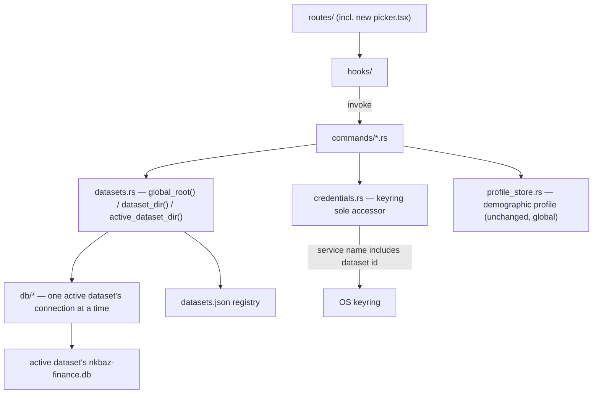
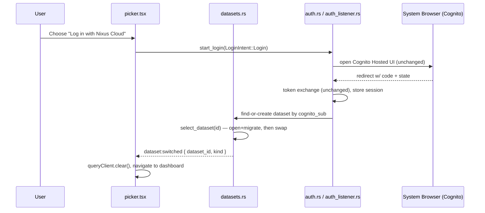

# Solution Design — Local Profiles & Nixus Cloud (Step 1)

_A human-readable walkthrough of the decisions in `ARCHITECTURE-SPINE.md`, with the rationale the spine deliberately omits. This document is the companion to read; the spine is the companion to build from._

## 1. What we're building

Today, Nixus is strictly single-tenant: one install, one SQLite file, one set of AI-provider keys, one implicit "user." The product's stated future is local-core with an optional Nixus Cloud account layered on top — and this feature is step one of that: the ability to have more than one completely isolated on-device dataset ("local profile" in the UI, `Dataset` in code), a launch-time picker to choose one, a zero-loss automatic migration of today's single dataset into a "Default" profile, and two on-ramps to a Nixus Cloud identity (fresh login, or migrating a copy of an existing local profile). **No data leaves the machine in this pass** — cloud sync is future work; this pass only lays the identity/data-scoping groundwork.

The six capabilities (CAP-1 through CAP-6) are defined in `SPEC.md`. This document and the spine cover how they get built without breaking anything the app already does.

## 2. The core idea: one directory per dataset

The single biggest decision in this design is also the simplest to say: **a "local profile" is nothing more than which directory the app's SQLite file lives in.** Everything else — the picker, the migration, the Cloud on-ramps — is built on top of that one fact.

We considered and rejected a shared-database approach (one SQLite file, tables tagged with a profile column). It would touch every existing query in every `db/*.rs` file and create a real risk of one profile's rows leaking into another's queries through a forgotten `WHERE` clause — exactly the kind of bug CAP-3's isolation guarantee exists to prevent. Pointing `init_db` at a different directory, by contrast, touches nothing about *how* the database is queried — it only changes *which file* is open. `db/mod.rs`'s migration runner, `db/backup.rs`, and the machine-checked wipe-coverage test in `db/danger_zone.rs` all keep working completely unmodified, because from their point of view nothing has changed — they're still just operating on "the" database.

The Default profile gets special treatment: instead of moving today's `nkbaz-finance.db` into some new per-profile subdirectory, **Default's directory is `app_data_dir` itself, unchanged.** This means the automatic migration for existing users (CAP-2) moves zero bytes — there is no copy, no rename, nothing that could partially fail. Every dataset created afterward (via login, migrate, or manually) gets a fresh subdirectory under `app_data_dir/datasets/<uuid>/`.

The one wrinkle this creates — and it's worth understanding, because it drove several of the trickier rules in the spine — is that Default's directory is *also* the parent of the registry file and the `datasets/` folder holding every other profile. That means **no operation is ever allowed to treat "the active dataset's directory" as a whole unit to copy or delete** — if it did, and Default happened to be active, deleting "the active dataset's directory" would delete the registry and every other profile along with it. Every operation in this design (backup, danger-zone, migrate) is written to touch only specifically named files (`nkbaz-finance.db` and its journal sidecars), never a whole directory, specifically to make this safe.

## 3. Naming: "Dataset" in code, "profile" in the UI

The SPEC's own constraint calls this out explicitly: there's already a "Profile" feature in the app (first/last name, DOB, income bracket — reached from the account menu, keyed by your Cognito identity) that has nothing to do with this feature. Reusing the word "profile" in code for the new concept would make every future grep through the codebase ambiguous. So: user-facing copy stays "profile" (that's the vocabulary the SPEC and the product use), but the code entity is called `Dataset` — `datasets.rs`, `datasets/` directory, `dataset_id`. The two features never share a name, a directory, or a code path.

## 4. Switching profiles: it should feel like logging out, not restarting

Early in scoping this, the natural first instinct is "switching profiles relaunches the app" — simplest to reason about, closest to how a lot of similar tools work. But that's not what was asked for: switching should feel like **logging out of one profile and into another**, without the app reloading. That single UX requirement is what shaped most of the concurrency design in this feature.

Making that safe (never touching the wrong profile's data mid-switch, never leaving two profiles half-open) required being explicit about a few things a simpler design could leave implicit:

- **There can be zero active datasets.** Between process start and the moment a profile is picked, there is no open database connection at all — commands that need one get a clear "no active dataset" error rather than silently falling back to Default. This is what makes the picker a real gate rather than a suggestion.
- **The "which dataset" and "the open connection to it" are one fact, not two.** They live in one guarded structure, swapped together, so nothing can ever observe a state where the app thinks profile B is active but still has profile A's connection open (or vice versa).
- **A switch either fully succeeds or changes nothing.** The new database is opened and migrated *before* anything about the "current" profile changes; if that fails, the old profile (or "none") is left exactly as it was.

## 5. The registry: one small JSON file, one lock

The picker needs to show a list of profiles — labels, whether each is local or cloud-linked, which Cognito account a cloud-linked one belongs to. Rather than have the picker open every profile's database just to read that (slow, and it would mean touching data before the user has even chosen anything), all of that lives in one small file: `datasets.json`, sitting next to the profiles themselves. It's the picker's only source of truth.

The subtle part is that more than one thing can want to write to this file without coordinating with each other: a user clicking "+ New local profile" in the picker, and — completely independently, on whatever thread handles the OAuth redirect — a Nixus Cloud login or migration finishing and needing to add its own new entry. Those two writers had to be made to take turns, not just write "atomically" (an atomic write only protects the final bytes on disk, not the read-then-decide-what-to-write step that happens first). So every change to this file goes through one lock, and — this took two passes to get right during review — that lock is *always* released before doing anything that might need the *other* lock (the one guarding "which dataset is active"), so the two can never wait on each other.

## 6. The two Nixus Cloud paths: same login, different endings

"Log in with Nixus Cloud" (from the picker) and "Migrate to Nixus Cloud" (from inside a profile you're already using) go through the *exact same* Cognito sign-in — same PKCE flow, same browser popup, same token exchange. Nothing about the OAuth mechanics changes. The only difference is what happens *after* a successful sign-in, and that difference is carried as one small piece of context (which of the two actions you took) alongside the same short-lived state Nixus already keeps for the duration of a sign-in attempt.

- **Log in:** look for a profile already linked to that Nixus Cloud account. Found it → open it. Never seen this account before → create a fresh, empty profile linked to it. Either way, you land on a profile tied to that account.
- **Migrate:** always creates a *new* profile — a full copy of the one you were just using, now linked to the Nixus Cloud account you just signed into. Your original profile is never touched; it stays in the picker exactly as it was, as a fallback.

Copying the data reuses the exact same "checkpoint, then copy the file" sequence the app's existing backup feature already uses — proven, and the only part of the SQLite file that's safe to duplicate directly. One thing worth being deliberate about: if you start a "Migrate" and then somehow switch to a different profile before finishing signing in (the browser round-trip can take a while), the app checks — right when the sign-in completes — that you're still on the same profile you started from, and refuses to proceed if you're not, rather than silently copying the wrong data.

Because Cognito sign-in stays global and unscoped this pass (see below), a cloud-linked profile's "signed in" badge isn't a separate thing to track — it's just "does the one Cognito session on this machine right now happen to belong to the account this profile is linked to?" No new state, no new plumbing, and it composes correctly with the existing sign-out button.

## 7. What stays deliberately simple this pass

A few things came up during design that could have been built now but weren't, on purpose:

- **Cognito sign-in itself stays exactly as it is today — one session for the whole machine, not one per profile.** Signing into two different Nixus Cloud accounts at once, with both staying independently "remembered," is a real future feature, but not this one. Building it now would mean touching the keyring session-storage code that's already shipped and working; that's real risk for a capability nobody asked for yet.
- **AI-provider keys, on the other hand, genuinely do need to be separate per profile** — that's explicit in the SPEC, and the fix is small: the existing keyring lookup gains one more piece of context (which profile) to build its key name from. The Default profile keeps its exact existing key name, so nobody who's already configured an AI key loses it.
- **No deleting or renaming profiles from the picker.** Confirmed future work.

## 8. Structure at a glance





```mermaid
sequenceDiagram
    participant User
    participant Menu as ProfileMenu.tsx
    participant Auth as auth.rs / auth_listener.rs
    participant Browser as System Browser (Cognito)
    participant DS as datasets.rs

    User->>Menu: Choose "Migrate to Nixus Cloud" (active profile A)
    Menu->>Auth: start_login(LoginIntent::Migrate{source: A})
    Auth->>Browser: open Cognito Hosted UI (unchanged)
    Browser-->>Auth: redirect w/ code + state
    Auth->>Auth: token exchange (unchanged), store session
    Auth->>DS: is A still the active dataset?
    alt user switched away
        DS-->>Auth: abort, no dataset created
    else still on A
        DS->>DS: create new dataset B; checkpoint+copy A's .db; copy A's AI keys
        DS->>DS: select_dataset(B)
        DS-->>Menu: dataset:switched { dataset_id: B, kind: cloud-linked }
    end
```

## 9. Where each capability lands

| Capability | What it looks like to the user | What makes it work |
| --- | --- | --- |
| CAP-1 | A styled, full-screen picker on every launch, before anything else | The picker route gates ahead of every other route; nothing is remembered between launches |
| CAP-2 | Existing users see a "Default" profile with everything intact | Zero-movement migration — Default *is* the existing app data directory |
| CAP-3 | Multiple profiles, each fully separate (data, settings, AI keys) | One directory + one SQLite file + one keyring namespace per profile |
| CAP-4 | "Log in with Nixus Cloud" from the picker opens (or reopens) a linked profile | Same Cognito flow; post-login lookup by account |
| CAP-5 | "Migrate to Nixus Cloud" from inside a profile copies it to a new cloud-linked profile, original untouched | Same Cognito flow; post-login copy, never convert |
| CAP-6 | "+ New local profile" adds an empty, ready-to-use profile | Same creation path the other capabilities already need, exposed directly |

## 10. Review history

This design went through two rounds of adversarial review (an independent reviewer trying to construct two spec-compliant implementations that would still behave incompatibly) plus a rubric pass checking completeness against the SPEC and the existing codebase, and three reconciliation passes against the SPEC, the prior login/profile architecture decisions, and the product's longer-term cloud vision. The first draft had real gaps — a self-deadlock in the login flow, an under-specified registry-write race, an unimplementable comparison against data the auth system doesn't expose over IPC — all closed in the version this document describes. See `.memlog.md` for the full decision trail and `reviews/` for the detailed review write-ups.
