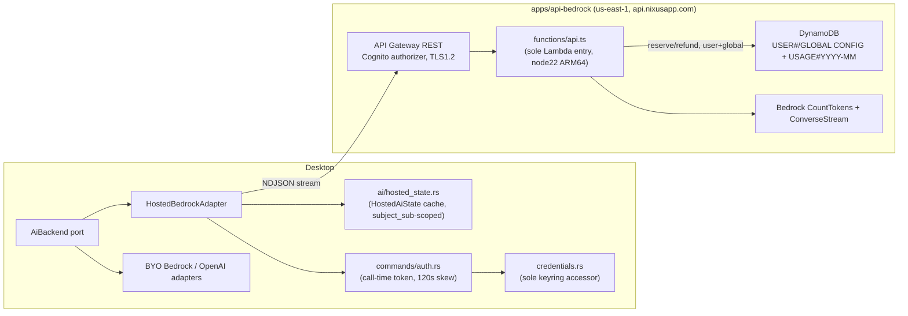

# Architecture Spine — Nixus Cloud Bedrock

## Paradigm

**Server-brokered AI gateway with ports-and-adapters provider routing.** No AWS credential ever reaches a device. The desktop routes every AI call through one `AiBackend` port; Hosted Bedrock and existing BYO/OpenAI clients are interchangeable adapters behind it. The server owns everything cost-bearing (model, tokens, quota); the desktop owns everything product-shaped (prompts, tool calls, parsing). Disclosure of hosted processing is a legal/product surface (Terms/Privacy Policy), not an in-app consent gate.

## Inherited Invariants

- Cognito user pool + stable `sub` is the sole identity authority (`architecture-login.md`); this feature adds a scope, not a second identity system.
- `credentials.rs` is the sole keyring accessor; `commands/auth.rs` owns Cognito token lifecycle (`architecture-login.md`).
- Premium hosted-AI capability is independent of Keygen/LemonSqueezy module licensing (`architecture-entitlements-licensing.md`). That document supplies cloud-service conventions only (AWS SAM, TypeScript, Node.js 22 ARM64, structured CloudWatch logs, pay-per-use) — never shared entitlement state.
- `AppError` is the only error shape on the desktop; no parallel error type.
- `architecture.md`'s stale Cognito/DynamoDB/Stripe licensing design is historical only; not authoritative for identity, licensing, or API shape. Only its still-valid platform conventions (independent `apps/*` pay-per-use cloud services) carry forward here.

## Decisions (AD)

### AD-1: Server-side brokering only
**Binds:** every hosted Bedrock invocation path.
**Prevents:** any AWS credential, static or temporary, being vended to or cached on a device.
**Rule:** the desktop never holds an AWS credential; Bedrock is only called from the Lambda using its execution role.

### AD-2: Transport — Regional REST API + streaming Lambda
**Binds:** the cloud edge for all hosted AI routes.
**Prevents:** HTTP API or Function URL (no streaming support/no Cognito authorizer with the same guarantees); use of the default execute-api endpoint as a production fallback.
**Rule:** one Regional API Gateway REST API in `us-east-1`, Cognito user-pool authorizer, one Lambda AWS_PROXY integration (SAM `Api` event `ResponseTransferMode: RESPONSE_STREAM`, generated integration `ResponseTransferMode: STREAM`) serving both routes. TLS 1.2 minimum policy. Default execute-api endpoint is disabled in the production stack; the custom domain is part of stack configuration, not optional.

### AD-3: Auth — managed authorizer + custom scope
**Binds:** every API route.
**Prevents:** custom JWT verification code; trusting any body-supplied user identifier; refreshing a token that structurally lacks the required scope as if that could ever succeed; a generic API Gateway authorizer error body violating the canonical error envelope.
**Rule:** Cognito user-pool authorizer validates the access token and derives `sub` from verified context; token must carry resource-server scope `nixus-api/ai.invoke`, detected desktop-side from the access token's `scope` claim. A session whose token lacks the scope is classified locally on the desktop as `reauthentication_required` (full sign-in required) rather than being retried through ordinary refresh, which cannot add a scope to an existing grant. API Gateway's `GatewayResponses` for the authorizer's own `UNAUTHORIZED`/`ACCESS_DENIED` responses (expired or invalid token) are configured to emit the canonical pre-output error envelope with code `unauthorized`, so an authorizer-level rejection never falls back to API Gateway's default, uncontracted error body.

### AD-4: One Lambda, one entry point, operation discriminator
**Binds:** compute topology.
**Prevents:** one Lambda per AI surface or per route; a Lambda-per-operation explosion.
**Rule:** one Node.js 22 ARM64 Lambda (512 MB, 300s timeout, reserved concurrency 10) backs both routes behind a single `streamifyResponse`-wrapped handler, `src/functions/api.ts`, which routes internally to `handlers/status.ts` / `handlers/invoke.ts`. `invoke` dispatches on a closed operation enum.

### AD-5: Exact quota field authority and idempotent reserve/refund
**Binds:** all quota accounting, per user and globally.
**Prevents:** token-based or global-only quota; double-charging or silent overcharge across a tool-call turn; SDK retries double-applying a transaction.
**Rule:** `charged_count` is the sole net quota authority; remaining = `max(0, monthly_request_limit - charged_count)`. `reservation_count`, `refund_count`, `completed_count`, `failed_after_commit_count`, and per-operation/token aggregates are monotonic observability counters that never gate anything. A `period_key` (UTC `YYYY-MM`), a `reservation_id`, and three server-generated idempotency tokens (reserve/refund/finalize) are computed once at request start and carried through — never recomputed mid-request. Reserve, refund, and finalize are each one `TransactWriteItems` call, each atomically updating **both** the user's and the `GLOBAL` usage item, using its own `ClientRequestToken` so a retried SDK call cannot double-apply. Finalize increments the applicable `completed_count` or `failed_after_commit_count` on both items, the matching per-operation settled counter, and the token aggregates; it never changes `charged_count`. `dynamodb:TransactWriteItems` is the IAM action backing all three (there is no separate `ConditionCheckItem` IAM action).

### AD-6: DynamoDB shape — per-user config/usage plus global hard cap
**Binds:** entitlement, usage, and global-abuse storage.
**Prevents:** a bootstrap Lambda; treating a missing user record as entitled on the enforcement path; a single compromised/misconfigured user record exhausting total spend.
**Rule:** one on-demand table. `pk=USER#<sub>` / `sk=CONFIG` holds `premium`, `monthly_request_limit`, `updated_at` (no version field to remember — the reserve transaction condition-checks the exact `premium=true` and exact `monthly_request_limit` value from the strongly consistent read just performed, retrying the read-then-reserve sequence once on a condition-check mismatch). `pk=USER#<sub>` / `sk=USAGE#<YYYY-MM>` holds the AD-5 fields. `pk=GLOBAL` / `sk=CONFIG` holds `enabled`, `monthly_request_limit` (default 1000), `updated_at`; `pk=GLOBAL` / `sk=USAGE#<YYYY-MM>` mirrors the same charged/monotonic fields. Every reserve/refund transaction atomically gates and updates **both** the user item and the `GLOBAL` item in one `TransactWriteItems` call. A missing, disabled, or exhausted `GLOBAL` config returns `503 hosted_unavailable` — `enabled=false` is the manual emergency kill switch. On `POST /v1/ai/invoke`, a missing/malformed user `CONFIG`, `premium=false`, or `monthly_request_limit<=0` fails closed (`403`/`429`). On `GET /v1/ai/status`, the same user-config condition returns `200` with zeroed non-premium fields — a status read is not an enforcement gate. No PostConfirmation Lambda.

### AD-7: Commit event is `messageStart`; soft deadline
**Binds:** response wire format and stream lifecycle for `invoke`.
**Prevents:** silent double-output on failure; losing HTTP status on preflight errors; committing to a stream before Bedrock has actually started; an abandoned invocation running past the Lambda's remaining time.
**Rule:** `application/x-ndjson` frames `meta | delta | end | error`, preceded by API Gateway's required streaming-metadata JSON and exactly eight NUL bytes (a missing/malformed prelude is `500`). The Lambda reserves quota (AD-5/AD-6), then calls `ConverseStream`. Any exception before the `messageStart` event is pre-output: refund + a real pre-output HTTP status (400/401/403/413/429/503), no NDJSON body — desktop fallback is legal here. `messageStart` is the exact commit event: only after it may the Lambda write the API Gateway streaming prelude and the `meta` frame; from that point on, failure increments `failed_after_commit_count` (never refunds) and surfaces as an in-band `error` frame — no fallback, no retry. When Lambda remaining time reaches a 10-second soft deadline, an `AbortController` stops upstream work and idempotent finalize/failure accounting runs in a `finally` block; a hard crash or timeout past that point may still leak `charged_count`/settled metrics, an explicitly accepted v1 risk with no reconciler.

### AD-8: Server-owned ceilings, closed operation set, CountTokens gate
**Binds:** request/response validation, request handling order, wire message schema.
**Prevents:** client-selected model, client-selected token limits, open-ended operation strings, an oversized input reaching `ConverseStream` uncounted, spending a `CountTokens` call on a caller who can never be reserved anyway.
**Rule:** operation ∈ `{chat, statement_import, project_advice, trends_insight}`. Every `invoke` request is handled in this exact order: (0) transport guard — `Content-Encoding` must be absent or `identity`; any other value is rejected pre-output with `415 unsupported_encoding`, no fallback; (1) schema/byte validation against the closed wire contract, with base64 content decoded only after this step, and decoded media size checked against the 4 MiB ceiling before any Bedrock call; (2) strongly consistent `USER`/`GLOBAL` config reads and eligibility classification (premium, enabled, limits); (3) `bedrock:CountTokens` on the final Converse-shaped input, only reached if step 2 classified the caller as eligible and step 1's media-size check passed; (4) the reserve transaction (AD-5/AD-6), which rechecks the same config; (5) `ConverseStream`. `CountTokens` never runs for a non-premium, disabled, missing-config, or globally-disabled caller — those are rejected at step 2 with `403`/`429`/`503` before any Bedrock call. A `CountTokens` failure is pre-reservation `503 hosted_unavailable`; an input-ceiling overage (chat 32,768; statement_import 64,000; project_advice 8,192; trends_insight 8,192) is pre-reservation `400 validation`. API Gateway's and Lambda's own request-size ceilings remain outer limits above and beyond the ones this document owns. Output-token ceilings (chat 4096; statement_import 8192; project_advice 1024; trends_insight 1024) are enforced by the Converse call itself; a `max_tokens` stop reason is explicit in the `end` frame, never a silent parse failure. The wire message schema is closed: `messages: CloudAiMessage[]` where `CloudAiMessage = { role: "user"|"assistant", content: CloudAiContent[] }` and content is `{type:"text",text}` | `{type:"image",format:"png"|"jpeg",data_base64}` | `{type:"document",format:"pdf",data_base64}` — there is no separate `media` field and no client-supplied document `name`; attachments are message content, and the Lambda always supplies a fixed, neutral Bedrock document name (`statement`), never a client-provided one. `chat`/`project_advice`/`trends_insight` accept text content only; `statement_import` accepts exactly one user message containing exactly one text block and exactly one image-or-document block. Unknown fields are rejected. Desktop sends `{ operation, system, messages, client_request_id }`; `client_request_id` is tracing-only, never an idempotency token.

### AD-9: Provider precedence — closed fallback table
**Binds:** desktop AI routing across all four surfaces.
**Prevents:** a user-facing provider toggle overriding hosted precedence; ad hoc fallback prose diverging per code path.
**Rule:** all four surfaces depend on one `AiBackend` port. Hosted Bedrock has highest precedence whenever a signed-in premium user has quota, even over an explicitly configured OpenAI provider. Fallback is governed by one closed table keyed on the pre-output failure code (see companion doc's Closed Fallback Table); anything after `messageStart` never falls back or retries. Bedrock-only surfaces require BYO Bedrock or return a typed error. One visible chat turn may use hosted for its first Bedrock invocation and BYO for a second (tool-loop) invocation if quota state changes between them — accepted v1 behavior, each invocation independently obeys the closed table.

### AD-10: Credential lifecycles stay separate; deliberate skew change
**Binds:** desktop auth/credential boundary.
**Prevents:** merging Cognito session state with per-dataset BYO AI credentials; treating hosted-AI credential testing as a proxy for BYO credential testing.
**Rule:** `credentials.rs` remains the sole keyring accessor. `commands/auth.rs` provides a call-time access token refreshed with a 120-second skew — a deliberate change from the live zero-skew `is_session_expired` check; the implementation must update that function's comment and tests to reflect the new skew, not silently diverge. One refresh+retry per call on a `401`; a session missing the required scope goes to `reauthentication_required` instead (AD-3). `commands/settings.rs::test_ai_connection` remains explicitly outside hosted routing — it tests the BYO credentials the user entered, never the premium hosted path.

### AD-11: Content statelessness is scoped to Nixus-controlled systems
**Binds:** all logging and persistence Nixus operates in this feature.
**Prevents:** any prompt, response, financial content, attachment, or file name/path landing in Nixus's own DynamoDB, CloudWatch, or app logs; a false guarantee about what AWS/Bedrock itself does with the content.
**Rule:** Bedrock request/response content exists only in Lambda memory for the duration of one invocation and is never written to Nixus-controlled storage. Persisted/logged fields are limited to `sub`, period, the AD-5 counters, operation, timestamps, latency, status, token usage. This statelessness guarantee covers Nixus's own systems only — AWS may process and, per Bedrock's terms and abuse-detection policies, retain request content; Nixus does not control or override that. Desktop's `cc_parser.rs` must not log the statement file path, and no `AppError`/log path anywhere in the hosted-AI call chain may include raw model output or transaction content, before hosted rollout ships.

### AD-12: CI/CD via GitHub OIDC, no long-lived AWS keys
**Binds:** `apps/api-bedrock` delivery pipeline.
**Prevents:** copying the licensing bridge's manual-deploy posture onto this service; any long-lived `AWS_*_ACCESS_KEY_ID`/`SECRET` pair for this pipeline; the application stack creating the very role that deploys it.
**Rule:** `.github/workflows/api-bedrock-ci.yml` verifies every PR (install, lint/typecheck/test, `sam validate`, `sam build`) and deploys on push to the default branch via `aws-actions/configure-aws-credentials@v6` using GitHub OIDC `role-to-assume` (workflow `permissions: id-token: write, contents: read`), gated by a protected `environment: production` requiring approval. This supersedes any static-secret-pair design while reusing `web-ci.yml`'s verify→deploy job shape. **Prerequisite (one-time, out-of-band):** the GitHub OIDC identity provider in AWS IAM and a least-privilege deploy role must already exist — created by a separately reviewed bootstrap stack or manual step, never by `nixus-bedrock-api` itself. The IAM trust policy's `sub` condition restricts the assuming identity to this repository and the `production` GitHub environment (`repo:<org>/<repo>:environment:production`) — it does not and cannot simultaneously encode a branch restriction in that same claim. Restricting deployment to the default branch is instead enforced by the workflow's own `push: branches` trigger condition plus the `production` environment's branch-protection rule (deployment branch policy) in GitHub — two independent controls, not one `sub` claim doing both jobs. `nixus-bedrock-api`'s own SAM template must not define or grant this role.

### AD-13: Disclosure is Terms/Privacy, not an in-app gate
**Binds:** rollout gating and legal-copy correctness.
**Prevents:** an in-app consent toggle or modal as the disclosure mechanism (explicitly not adopted); shipping hosted AI while marketing copy contradicts it.
**Rule:** Terms of Service and Privacy Policy are the sole authorization/disclosure mechanism for hosted AI — no in-app consent gate is built. Production rollout is blocked until those documents clearly state: financial prompts/statements are transmitted through Nixus infrastructure to AWS Bedrock; that hosted processing happens directly in `eu-west-2` (United Kingdom), and AWS's abuse-detection implications for that region (amended 2026-08-26; the original US cross-region wording is now factually wrong and must not be restored); that non-retention is Nixus-controlled only (per AD-11) and does not bind AWS; the existence of a request quota; and BYO fallback behavior. Any README/marketing claim equivalent to "data never leaves your machine" must be corrected before rollout — it is not accurate once a user is on the hosted path.

### AD-14: Global hard cap and budget alerting are independent controls
**Binds:** total spend exposure.
**Prevents:** one control (per-user quota) being the only thing standing between a bug/abuse case and unbounded spend; overclaiming that AWS Budgets can isolate cost to one stack.
**Rule:** the `GLOBAL` config/usage items (AD-6) are the hard, service-specific stop, enforced in the same transaction as every reserve/refund — `enabled=false` is the manual kill switch. An AWS Budget of $50/month scoped to Amazon Bedrock service spend across the AWS account (cost allocation by stack/resource is not claimed or relied on unless separately verified), with alerts at 80% and 100%, is a separate, softer control: it notifies, it does not stop traffic. Separate CloudWatch alarms/metrics on API Gateway and Lambda error rates cover the non-Bedrock half of the stack. Non-premium abuse is additionally bounded by the Cognito authorizer at the edge, stage throttle (AD-15), and reserved concurrency (AD-4); a WAF is explicitly deferred unless observed abuse justifies the added cost.

### AD-15: Deployment topology
**Binds:** the production stack's shape.
**Prevents:** ad hoc per-deploy URLs; accidental production quota use from local development; the stack deleting or replacing the DynamoDB table.
**Rule:** one production SAM stack, `nixus-bedrock-api`, no staging environment in v1. Stable production URL `https://api.nixusapp.com`, compiled into release desktop builds; local development defaults hosted AI disabled unless `NIXUS_CLOUD_AI_API_URL` is explicitly set. Stage throttle 10 RPS / burst 20; `DataTraceEnabled=false`; Bedrock model-invocation logging disabled and verified as such. The DynamoDB table has a stable logical ID and key schema, `PAY_PER_REQUEST`, point-in-time recovery enabled, and `DeletionPolicy: Retain` / `UpdateReplacePolicy: Retain`; the deploy role must not be able to delete or replace it, enforced by stack policy or manual break-glass where CloudFormation resource-level protection alone is insufficient. SAM parameters take the existing Cognito user pool ARN/ID, app-client ID, Route53 hosted-zone ID, and an alert email as inputs — this stack never imports or owns the user pool. **One-time operational seed (manual, post-deploy, pre-traffic):** after the first successful stack deployment and before any traffic is enabled, an admin manually creates `pk=GLOBAL, sk=CONFIG` with `enabled=false`, `monthly_request_limit=1000`, `updated_at` via AWS console/runbook — this is manual DynamoDB item creation, never a Lambda custom resource or bootstrap function. `enabled` is flipped to `true` only after CloudWatch alarms, the AWS Budget, the Legal & Disclosure gate (AD-13), and the Cognito scope update are all verified. Per-user `CONFIG` items remain manually created the same way, one per premium user.

## Stack Seed (verified 2026-08-25)

| Concern | Choice |
|---|---|
| Runtime | Node.js 22.x, ARM64, AWS Lambda (retained deliberately for entitlements-architecture alignment; supported through Apr 2027; Node 24 available but not adopted) |
| API | API Gateway Regional REST API, `AWS_PROXY`, `ResponseTransferMode=STREAM`, custom domain only (no default execute-api in prod) |
| Auth | Cognito user-pool authorizer, scope `nixus-api/ai.invoke` detected from the access-token `scope` claim |
| Model | `anthropic.claude-3-7-sonnet-20250219-v1:0` (direct foundation model, **not** an inference profile), Bedrock region `eu-west-2` — amended 2026-08-26, see [Amendments](#amendments) |
| Data | DynamoDB, on-demand (`PAY_PER_REQUEST`), PITR enabled, `Retain` deletion/replace policy |
| IaC | AWS SAM, stack `nixus-bedrock-api`, one production stack, no staging |
| Test | Vitest |
| Logs | CloudWatch, structured JSON, 14-day retention, `DataTraceEnabled=false` |
| CI/CD | GitHub Actions, `aws-actions/configure-aws-credentials@v6`, GitHub OIDC, protected `environment: production` |
| Cost guardrails | Per-user + `GLOBAL` charged-count hard cap; AWS Budget $50/mo at 80%/100% alert |

## Capability Map



```mermaid
sequenceDiagram
  participant D as Desktop
  participant G as API Gateway
  participant L as Lambda
  participant Dd as DynamoDB
  participant B as Bedrock
  D->>G: POST /v1/ai/invoke (Bearer token, operation, payload)
  G->>L: AWS_PROXY (authorizer-verified sub)
  L->>L: schema/byte validation (closed message/content union)
  L->>Dd: consistent read USER#CONFIG + GLOBAL#CONFIG (eligibility classification)
  alt not eligible (non-premium / disabled / missing config / global exhausted)
    L-->>D: 403/429/503 (pre-output, no CountTokens call)
  else eligible
    L->>B: CountTokens (input ceiling check)
    alt CountTokens fails or input over ceiling
      L-->>D: 503 (CountTokens failure) or 400 (input overage) — pre-reservation
    else input ok
      L->>Dd: TransactWriteItems reserve USER USAGE + GLOBAL USAGE (ClientRequestToken)
      alt reserve condition-check fails
        L-->>D: 403/429 (pre-output)
      else reserved
        L->>B: ConverseStream
        alt exception before messageStart
          L->>Dd: TransactWriteItems refund (ClientRequestToken)
          L-->>D: 503 (pre-output, no NDJSON body)
        else messageStart received
          L-->>D: API GW prelude + meta frame (commits)
          B-->>L: further stream events
          L-->>D: delta ... end frames (stop_reason, input/output_tokens)
          opt mid-stream failure
            L-->>D: in-band error frame (failed_after_commit_count++, no refund)
          end
        end
      end
    end
  end
  Note over L: AbortController fires at 10s remaining; finalize runs in finally
```

## Conventions

- Package scope `@nixus/`; new app `apps/api-bedrock/`; shared contracts `packages/shared/src/types/cloud-ai.ts` (TS-owned; Rust wire models mirror this shape deliberately).
- One Lambda, one entry point: `src/functions/api.ts` is the sole handler/router for both routes; it dispatches internally to `handlers/status.ts`/`handlers/invoke.ts` — never a Lambda per route or per operation.
- Hosted-AI status is Rust-internal (`ai/hosted_state.rs`) — no Tauri command, no frontend hook, no TanStack Query key for it. `HostedAiState` carries `subject_sub`; it is cleared on sign-out, session expiry, sign-in as a different `sub`, or an auth-callback subject change, and is invalidated before use on any mismatch — no cross-user process cache. `403`, `429`, and `503` from `/v1/ai/invoke` all invalidate the cache immediately; a `503`/`hosted_unavailable` response may additionally be cached briefly (max 60 seconds) to avoid hammering a disabled or globally exhausted gateway, but the server's per-user and `GLOBAL` state remains authoritative — the 60-second cache is a client-side rate-limiting courtesy, never a substitute for a fresh check.
- Wire JSON is snake_case at the public API boundary; the Lambda validates/translates it into AWS SDK Converse-shaped types internally — the SDK's own payload naming is never part of the public contract.
- Structured CloudWatch JSON logs, no request/response bodies, 14-day retention, explicit log group (CloudFormation-created; not `logs:*`).
- IAM (exact actions, no broad prose): the Lambda role grants `logs:CreateLogStream` + `logs:PutLogEvents` scoped to the one explicit log group; `dynamodb:GetItem` + `dynamodb:TransactWriteItems` scoped to the one table; `bedrock:CountTokens` + `bedrock:InvokeModelWithResponseStream` scoped to the **one direct foundation-model ARN**, derived in-template from the model id and the Bedrock region so the grant cannot drift from the identity actually invoked (amended 2026-08-26; a direct model does not fan out, so the region wildcard the cross-region profile required is gone). No static credentials, no SSM/Secrets Manager. DynamoDB IAM cannot isolate by sort key — the code boundary (and its tests) enforces that the Lambda never mutates a `CONFIG` item outside a transaction condition check; only the deploy/admin role edits config directly.

## Deferred

- S3-backed statement upload — only if real statement media exceeds the 4 MiB raw ceiling.
- A reconciler for the accepted v1 leak risk (Lambda crash/hard-timeout past the soft deadline).
- A staging environment / second SAM stack — v1 ships one production stack plus local SAM.
- Admin UI or billing automation for premium/quota management — console-edited DynamoDB record only.
- Any status/quota UI (e.g. a premium badge) surfaced from `HostedAiState` via a new Tauri command — v1 has no status UI at all.
- WAF in front of the API — added only if observed abuse justifies the cost, per AD-14.
- Retiring `nixus://auth/callback` deep-link fallback plumbing (owned by `architecture-login.md`, not this feature).

## Amendments

### 2026-08-26 — direct `eu-west-2` model replaces the cross-region inference profile

**User-approved.** AD-8's mandatory pre-reservation `bedrock:CountTokens` call is not
implementable on a cross-region inference profile: `us.anthropic.claude-sonnet-4-6`, every
other probed `us.anthropic.*` profile, and the Nova direct models all answered
`ValidationException: The provided model doesn't support counting tokens`. Bare
`anthropic.claude-3-7-sonnet-20250219-v1:0` in `eu-west-2` returned an input-token count
for the identical probe.

What changes: the Bedrock model identity and the region its runtime calls target
(`BedrockRegion` → the Lambda's `BEDROCK_REGION`, owned explicitly rather than inherited),
the IAM resource (one derived foundation-model ARN, no region wildcard), and the
disclosure copy (direct London processing, not US cross-region).

What does not change: `CountTokens` stays ahead of reservation; model and region stay
server-owned and invisible to clients; the API, Lambda, and quota table stay in
`us-east-1`; AD-2, AD-5–AD-7, AD-9–AD-12, AD-14, and AD-15 are untouched.

`CountTokens` and `ConverseStream` both pass on the direct model. `GLOBAL` stays disabled
until the remaining rollout gates clear — see `docs/runbooks/hosted-ai-rollout.md`.

### 2026-08-26 — pre-revenue concurrency simplification

**User-approved.** The Lambda uses the account's shared unreserved pool rather than a
function-level reservation. This removes the quota-increase dependency for the first
customer. API Gateway throttling (10 RPS / burst 20), per-user/global request quotas, and
server-owned token ceilings remain the v1 cost controls. Revisit a dedicated reservation
only if observed traffic or shared-account contention justifies it.

Any fallback from this model, any region other than `eu-west-2`, or any reintroduction of
an inference profile is a further amendment, not an implementation detail.

## Status

`final` — reviewer gate passed and fixes applied; amended 2026-08-26 (see Amendments).
