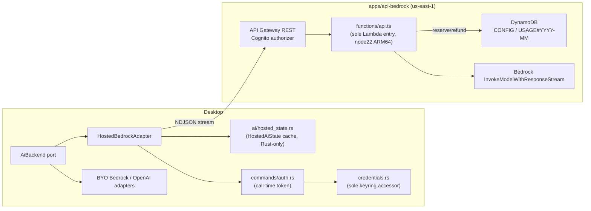
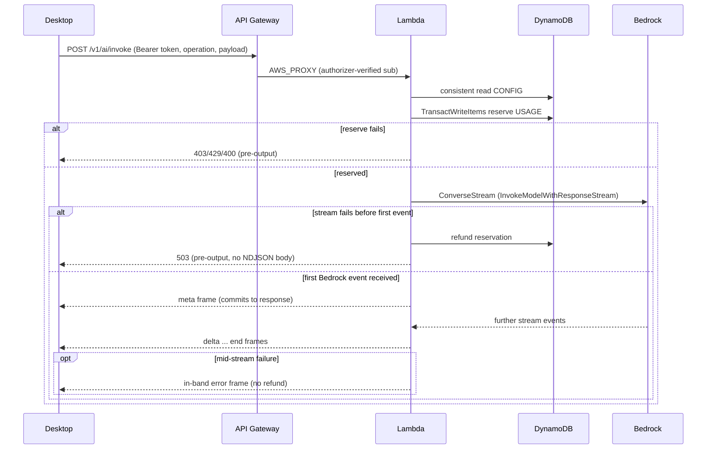

# Architecture Spine — Nixus Cloud Bedrock

## Paradigm

**Server-brokered AI gateway with ports-and-adapters provider routing.** No AWS credential ever reaches a device. The desktop routes every AI call through one `AiBackend` port; Hosted Bedrock and existing BYO/OpenAI clients are interchangeable adapters behind it. The server owns everything cost-bearing (model, tokens, quota); the desktop owns everything product-shaped (prompts, tool calls, parsing).

## Inherited Invariants

- Cognito user pool + stable `sub` is the sole identity authority (`architecture-login.md`); this feature adds a scope, not a second identity system.
- `credentials.rs` is the sole keyring accessor; `commands/auth.rs` owns Cognito token lifecycle (`architecture-login.md`).
- Premium hosted-AI capability is independent of Keygen/LemonSqueezy module licensing (`architecture-entitlements-licensing.md`). That document supplies cloud-service conventions only (AWS SAM, TypeScript, Node.js 22 ARM64, structured CloudWatch logs, pay-per-use) — never shared entitlement state.
- `AppError` is the only error shape on the desktop; no parallel error type.
- `architecture.md`'s stale Cognito/DynamoDB/Stripe licensing design is historical only; not authoritative for identity, licensing, or API shape. Only its still-valid platform conventions (independent `apps/*` pay-per-use cloud services) carry forward here.

## Decisions (AD)

### AD-1: Server-side brokering only
**Binds:** every hosted Bedrock invocation path.
**Prevents:** any AWS credential, static or temporary, being vended to or cached on a device.
**Rule:** the desktop never holds an AWS credential; Bedrock is only called from the Lambda using its execution role.

### AD-2: Transport — Regional REST API + streaming Lambda
**Binds:** the cloud edge for all hosted AI routes.
**Prevents:** HTTP API or Function URL (no streaming support/no Cognito authorizer with the same guarantees).
**Rule:** one Regional API Gateway REST API in `us-east-1`, Cognito user-pool authorizer, one Lambda AWS_PROXY integration per route with `ResponseTransferMode: RESPONSE_STREAM`.

### AD-3: Auth — managed authorizer + custom scope
**Binds:** every API route.
**Prevents:** custom JWT verification code; trusting any body-supplied user identifier.
**Rule:** Cognito user-pool authorizer validates the access token and derives `sub` from verified context; token must carry resource-server scope `nixus-api/ai.invoke`.

### AD-4: One Lambda, operation discriminator
**Binds:** compute topology.
**Prevents:** one Lambda per AI surface; a Lambda-per-route explosion.
**Rule:** one Node.js 22 ARM64 Lambda (512 MB, 300s timeout, reserved concurrency 10) serves both routes; `POST /v1/ai/invoke` dispatches internally on a closed operation enum.

### AD-5: Quota unit and reserve/refund semantics
**Binds:** all quota accounting.
**Prevents:** token-based or global quota; double-charging or silent overcharge across a tool-call turn.
**Rule:** one quota unit = one Bedrock invocation. Reserve via `TransactWriteItems` before calling `ConverseStream`; refund the same period only on failure before the first valid Bedrock event is received. Once that first event arrives and streaming commits, the reservation stays charged regardless of outcome. No reconciler in v1.

### AD-6: DynamoDB single-table shape, fail-closed on invoke
**Binds:** entitlement + usage storage.
**Prevents:** a bootstrap Lambda; treating a missing record as entitled on the enforcement path.
**Rule:** one on-demand table, `pk=USER#`; `sk=CONFIG` (premium, monthly_request_limit, version, updated_at) and `sk=USAGE#<YYYY-MM>` (reserved/completed/refunded counts, per-operation counters, token aggregates). On `POST /v1/ai/invoke`, missing/malformed config, `premium=false`, or `limit<=0` fails closed (403/429). On `GET /v1/ai/status`, the same condition returns `200` with zeroed non-premium fields — a status read is not an enforcement gate. No PostConfirmation Lambda — absent users are simply non-premium.

### AD-7: Framing and fallback boundary
**Binds:** response wire format for `invoke`.
**Prevents:** silent double-output on failure; losing HTTP status on preflight errors; committing to a stream before Bedrock has actually started.
**Rule:** `application/x-ndjson` frames `meta | delta | end | error`. The Lambda reserves quota, then calls `ConverseStream`. If stream establishment fails, or any failure occurs before the first valid Bedrock event, the Lambda refunds the reservation and returns a real pre-output HTTP status (400/401/403/413/429/503) with no NDJSON body — desktop fallback is legal here. Only once the first Bedrock event arrives does the Lambda commit to the response and emit `meta`; from that point on, failure is an in-band `error` frame and the client never falls back or retries the same operation against another provider.

### AD-8: Server-owned ceilings, closed operation set
**Binds:** request/response validation.
**Prevents:** client-selected model, client-selected token limits, open-ended operation strings.
**Rule:** operation ∈ `{chat, statement_import, project_advice, trends_insight}`. Model/inference profile and per-operation output-token ceiling are server constants, never client input. Desktop sends finalized messages/system/media plus a client request ID (tracing only).

### AD-9: Provider precedence — hosted-first ports-and-adapters
**Binds:** desktop AI routing across all four surfaces.
**Prevents:** a user-facing provider toggle overriding hosted precedence; two divergent AI call paths.
**Rule:** all four surfaces depend on one `AiBackend` port. Hosted Bedrock has highest precedence whenever a signed-in premium user has quota, even over an explicitly configured OpenAI provider. Pre-output quota/outage falls back to the prior configured provider (BYO Bedrock, or OpenAI where the surface supports it); Bedrock-only surfaces require BYO Bedrock or return a typed error.

### AD-10: Credential lifecycles stay separate
**Binds:** desktop auth/credential boundary.
**Prevents:** merging Cognito session state with per-dataset BYO AI credentials.
**Rule:** `credentials.rs` remains the sole keyring accessor. `commands/auth.rs` provides a call-time access token refreshed with a 120-second skew; one 401 refresh+retry per call before falling back or erroring. Per-dataset BYO credentials remain independently owned.

### AD-11: Content statelessness
**Binds:** all logging and persistence in this feature.
**Prevents:** any prompt, response, financial content, attachment, or file name/path landing in DynamoDB or CloudWatch.
**Rule:** Bedrock request/response content exists only in Lambda memory for the duration of one invocation. Persisted/logged fields are limited to `sub`, period, counts, operation, timestamps, latency, status, token usage.

### AD-12: CI diverges from the licensing precedent by design
**Binds:** `apps/api-bedrock` delivery pipeline.
**Prevents:** copying the licensing bridge's manual-deploy posture onto this service.
**Rule:** a dedicated `.github/workflows/api-bedrock-ci.yml` verifies every PR (install, lint/typecheck/test, `sam validate`, `sam build`) and auto-deploys on push to the default branch using a separately scoped SAM deploy IAM principal — distinct from both the web CDN key and any future licensing-bridge deploy key.

## Stack Seed (verified 2026-08-25)

| Concern | Choice |
|---|---|
| Runtime | Node.js 22.x, ARM64, AWS Lambda |
| API | API Gateway Regional REST API, `AWS_PROXY`, `ResponseTransferMode=STREAM` |
| Auth | Cognito user-pool authorizer, scope `nixus-api/ai.invoke` |
| Model | `us.anthropic.claude-sonnet-4-6` (cross-region inference profile), `us-east-1` |
| Data | DynamoDB, on-demand (`PAY_PER_REQUEST`) |
| IaC | AWS SAM, stack `nixus-bedrock-api` |
| Test | Vitest |
| Logs | CloudWatch, structured JSON, 14-day retention |
| CI/CD | GitHub Actions, `aws-actions/configure-aws-credentials@v4` |

## Capability Map

## Conventions

- Package scope `@nixus/`; new app `apps/api-bedrock/`; shared contracts `packages/shared/src/types/cloud-ai.ts`.
- One Lambda, one entry point: `src/functions/api.ts` is the sole handler/router for both routes; it dispatches internally to `handlers/status.ts`/`handlers/invoke.ts` — never a Lambda per route or per operation.
- Hosted-AI status is Rust-internal (`ai/hosted_state.rs`) — no Tauri command, no frontend hook, no TanStack Query key for it.
- snake_case wire JSON; strict TypeScript; typed errors mapped into existing `AppError` philosophy on desktop.
- Structured CloudWatch JSON logs, no request/response bodies, 14-day retention.
- IAM: Lambda role scoped to CloudWatch Logs, `GetItem`/`TransactWriteItems`/`UpdateItem` on the one table, `bedrock:InvokeModelWithResponseStream` on the approved inference profile ARN and its destination foundation-model ARNs. No static credentials, no SSM/Secrets Manager.

## Deferred

- S3-backed statement upload — only if real statement media exceeds the 4 MiB raw ceiling.
- Usage reconciliation for leaked reservations from Lambda crashes.
- Staging environment / second SAM stack — v1 ships one production stack plus local SAM.
- Admin UI for quota/premium management — console-edited DynamoDB record only.
- Any status/quota UI (e.g. a premium badge) surfaced from `HostedAiState` via a new Tauri command — v1 has no status UI at all.
- Retiring `nixus://auth/callback` deep-link fallback plumbing (owned by `architecture-login.md`, not this feature).

## Status

`draft` — pending Reviewer Gate.
