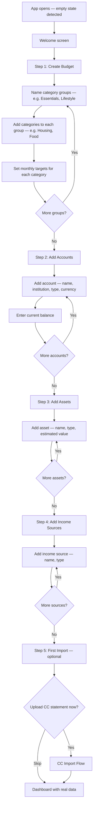
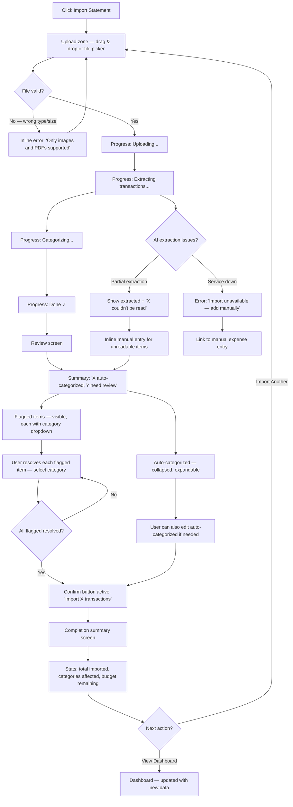
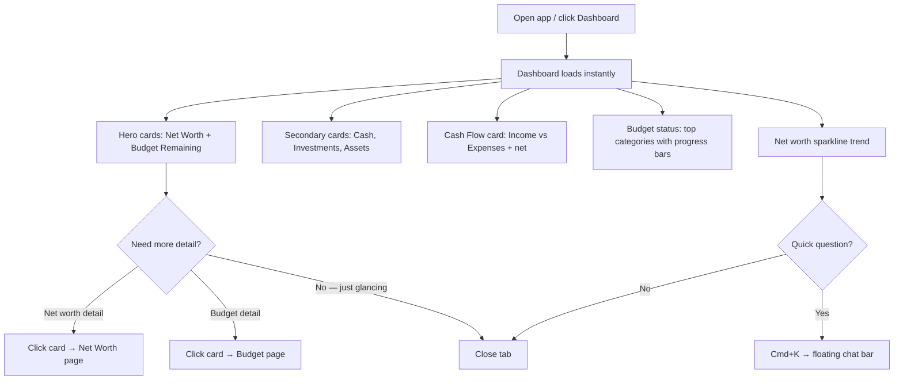
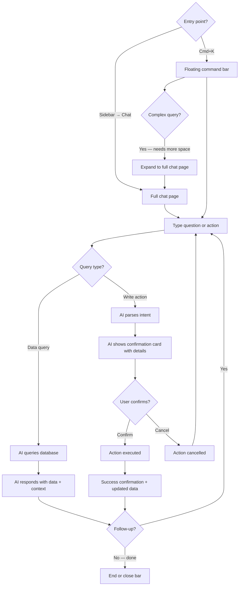
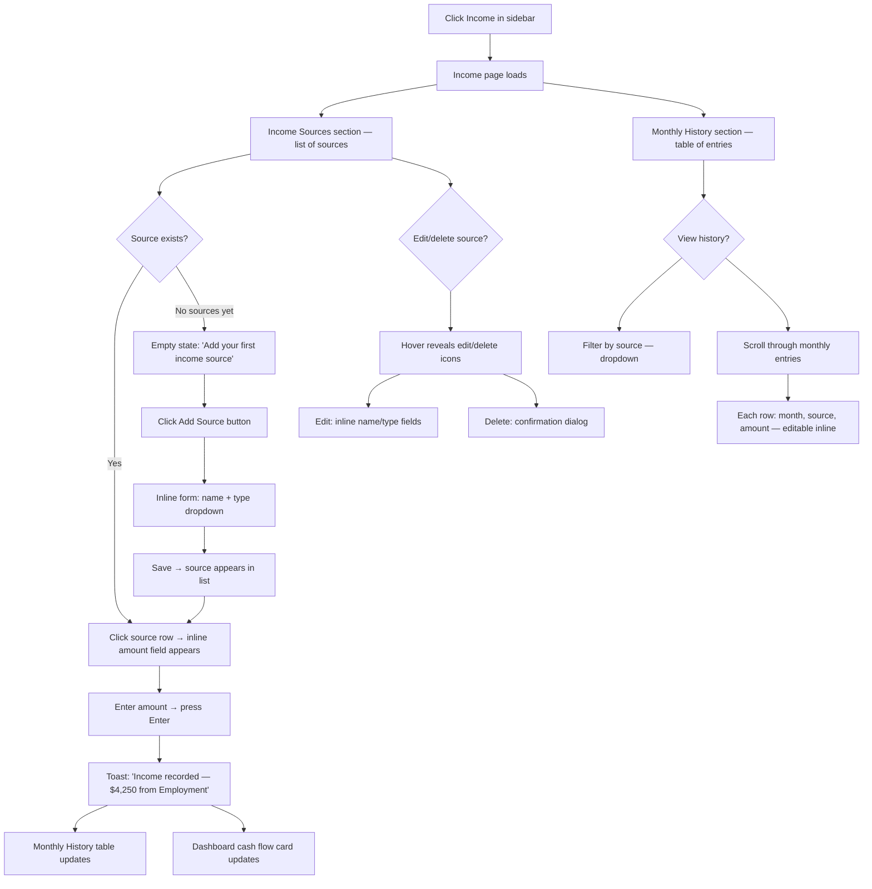
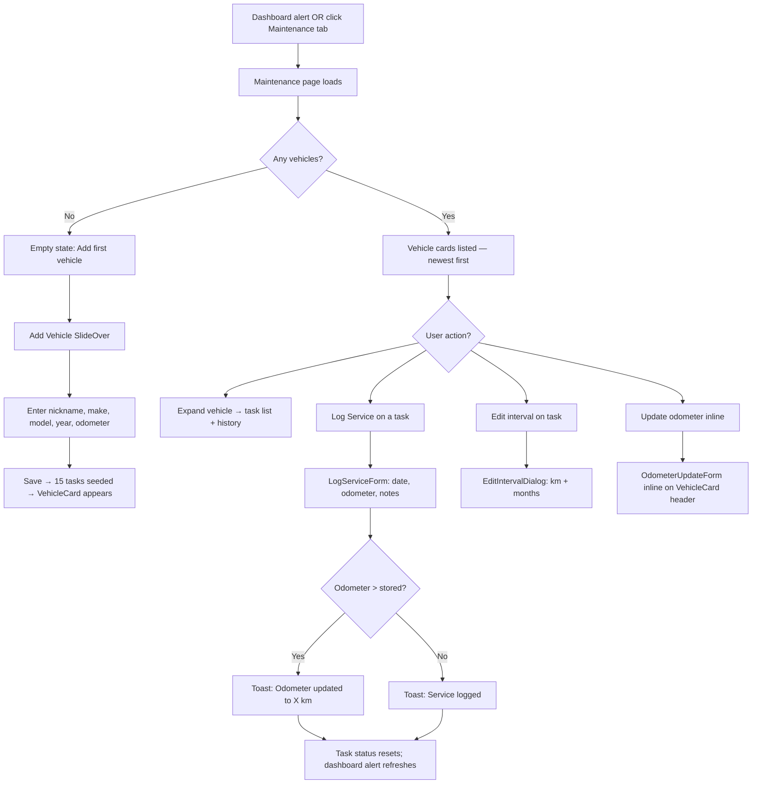
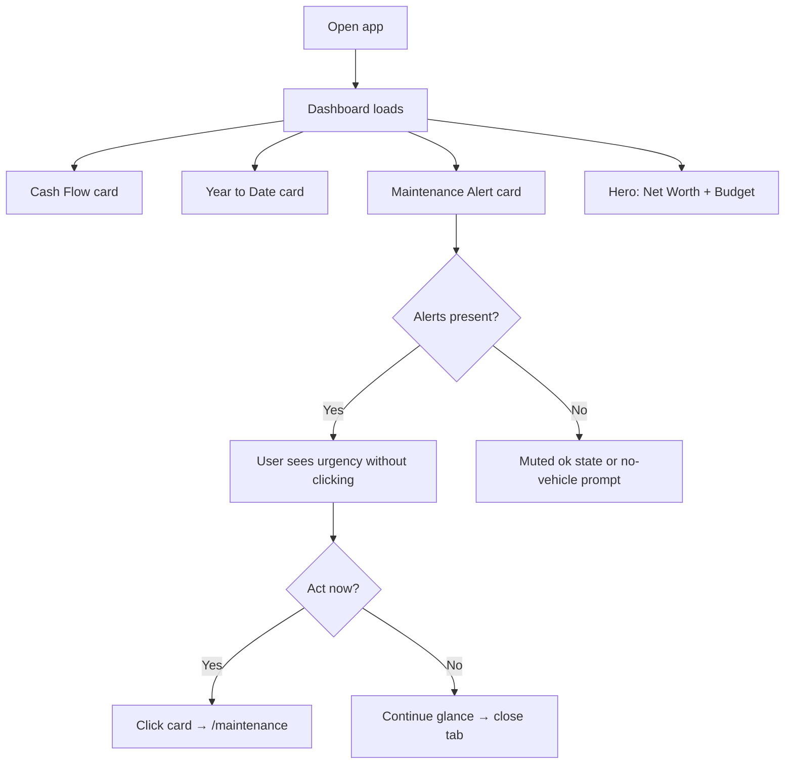
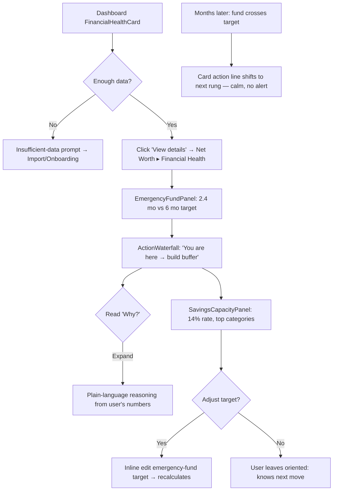

# UX Design Specification nkbaz-finance

**Author:** dev
**Date:** 2026-03-14

---

## Executive Summary

### Project Vision

nkbaz-finance is a personal finance SPA that replaces manual spreadsheet tracking with an automation-first approach. The core UX thesis: financial tools die when they demand effort. The app eliminates friction by automating data entry via AI-powered CC statement parsing, and consolidates budgeting, expense tracking, income tracking, multi-account balances, passive assets, and net worth history into a single interface. Income sources and monthly entries complete the cash flow picture — income versus expenses — enabling smarter AI recommendations. An AI chat provides natural language access to all financial data and operations. Built as a single-user desktop-first application.

### Target Users

Single-user application built for a power user with a complex financial portfolio (multiple banks, investment accounts, crypto, property, business ownership). Tech-savvy, comfortable with all features, uses the app bi-weekly primarily when CC statements arrive. Values efficiency, automation, and a complete financial picture in one place.

### Key Design Challenges

1. **Information density vs. clarity** — Dashboard must present budget status, account balances, spending breakdown, cash flow (income vs. expenses), and net worth at a glance without overwhelming. Minimal aesthetic with breathing room demands ruthless prioritization of screen real estate.
2. **AI import review flow** — The core loop (upload → progress → review exceptions → confirm) must feel effortless. Exception review cannot feel like manual work — it must feel like a quick quality check on automation that already did the heavy lifting.
3. **Dual AI chat modality** — Chat exists as both a dedicated page (deep exploration, multi-turn queries) and a floating bar (quick queries, fast actions). Two interaction postures for the same engine, each needing distinct UX treatment.
4. **Income entry as a micro-win** — Recording income must feel like acknowledging a win, not logging a chore. The interaction should be fast (one click, one field, Enter) and the feedback should be immediate (dashboard cash flow updates, toast confirms).

### Design Opportunities

1. **CC import "magic moment"** — The emotional payoff of watching transactions auto-categorize and the dashboard update in real-time. Animation and progressive feedback can make automation feel tangible and satisfying.
2. **shadcn component system** — Clean, consistent, composable components (cards, tables, dialogs, command palette) enabling a cohesive minimal design language with fast iteration.
3. **Dashboard as home base** — The landing page and emotional anchor of the app. Budget health, net worth trend, cash flow, recent activity — all at a glance, zero-click. Everything radiates outward from here.
4. **Income as cash flow completion** — Income data transforms the dashboard from "what did I spend?" to "am I ahead or behind?" The cash flow card (income vs. expenses) answers the most important personal finance question in a single glance.

## Core User Experience

### Defining Experience

The app serves two core interactions at different frequencies:

- **Bi-weekly active moment — CC Import Loop:** Upload a CC statement (screenshot/PDF) → watch AI progress → review only the flagged exceptions (auto-categorized transactions are summarized but collapsed) → confirm → dashboard updates. This is the moment that proves the product thesis. It must feel like a quick quality check, not data entry.
- **Anytime passive moment — Dashboard Glance:** Open the app, absorb budget health and net worth at a glance, close the tab. Zero cognitive load. Like checking the time.

The ONE interaction to get right is the CC import review. If reviewing 3 flagged transactions out of 18 feels as easy as approving a notification, we've won.

### Platform Strategy

- **Tauri desktop application** — native window, React + shadcn frontend, Rust backend
- **Mouse/keyboard** as primary input — desktop-native interactions
- **Local-first data storage** — no server required for MVP, data lives on the user's machine
- **shadcn component library** as the design system foundation — clean, composable, consistent
- **Client-side routing** within the Tauri webview (dashboard, budget, income, accounts, assets, net worth, import, chat)
- **Native OS integration** — native file dialogs for CC upload, native window chrome, system menu bar
- **Cmd+K floating bar** feels native — like Spotlight/Raycast, not a browser overlay

### Effortless Interactions

1. **CC import review** — Only flagged exceptions shown for review. Auto-categorized transactions summarized with a count ("15 auto-categorized") but collapsed. User reviews only what needs attention.
2. **Dashboard glance** — All key metrics visible on load. No clicks, no drilling, no scrolling to get the picture. Budget health, net worth sparkline, account balances — all above the fold.
3. **Balance updates** — Updating account balances and asset values should be inline and immediate. No modals, no multi-step forms. Click the number, type the new one, done.
4. **AI chat quick bar** — Floating bar for fast queries ("how much on groceries this month?") without leaving the current view. Full page for deeper exploration.

### Critical Success Moments

1. **First CC import** — User uploads a statement and sees transactions appear auto-categorized. This is the "I'm never going back to spreadsheets" moment. Must feel like magic.
2. **Dashboard first load** — After initial setup and first import, the dashboard shows real data. The user sees their financial picture consolidated for the first time. Must feel complete, not empty.
3. **Exception review confidence** — When the user sees "15 auto-categorized, 3 need review," they need to trust the 15 are correct. Confidence comes from being able to expand and verify without disrupting the flow.
4. **Net worth over time** — The first time the user sees their net worth trend line after a few months of data. The payoff of consistent tracking made visible.

### Experience Principles

1. **Automation earns trust** — Show the AI's work. Summarize what was auto-handled, surface only what needs attention. Build confidence through transparency, not hiding.
2. **Glanceable by default, explorable on demand** — Every view starts with the essential summary. Detail is one click away but never forced on the user. Dashboard sparkline → full net worth page. Import summary → expanded transaction list.
3. **Minimal navigation, maximum context** — Main nav stays lean: Dashboard, Budget, Income, Accounts, Assets, Net Worth, Import, Chat. Each view is self-contained with everything needed in context.
4. **Data entry is a last resort** — Every manual input (balance updates, expense entry, budget setup) should feel like the fastest possible path. Inline editing, smart defaults, minimal fields.

## Desired Emotional Response

### Primary Emotional Goals

1. **In control** — The user sees their entire financial picture in one place and feels clarity, not overwhelm. The dashboard delivers a calm "I know where I stand" feeling every time it loads.
2. **Relieved** — The drudgework is gone. The CC import moment is fundamentally about relief — the AI did the tedious part, and the user just checks its work.
3. **Confident** — The user trusts the numbers. Auto-categorized transactions feel reliable. Net worth figures feel accurate. The system earns trust through transparency.

### Emotional Journey Mapping

| Stage | Desired Emotion | Design Implication |
|-------|----------------|-------------------|
| Opening the app | Calm clarity | Dashboard loads instantly with all key metrics visible. No loading spinners blocking the view. |
| CC statement upload | Anticipation | Progress indicator with clear stages (uploading → extracting → categorizing → done). The user watches the AI work. |
| Import results appear | Relief + satisfaction | "15 auto-categorized, 3 need review" — the heavy lifting is done. A subtle animation or visual cue marks completion. |
| Reviewing exceptions | Confidence | Matter-of-fact tone. "3 need your input" — no apology, no drama. Quick category selection and move on. |
| Confirming import | Reward | Dashboard updates visibly — budget bars shift, numbers refresh. The user sees the impact of their 2-minute workflow. |
| Dashboard glance | Control | Everything at a glance. Budget health, net worth trend, balances. Open, absorb, close. |
| Under budget | Delight | Visual cue when a category is under target — subtle but satisfying. A small win the user earned. |
| Something goes wrong | Pragmatic calm | No drama, no apology. "3 transactions couldn't be read — enter them manually." The workflow continues. |
| Recording income | Quiet satisfaction | Entering payday amount is a micro-win. Toast confirms, cash flow card updates. Feels like checking off "got paid." |
| Seeing cash flow positive | Confidence + control | Income exceeds expenses — the cash flow bar is green. A reinforcing signal that finances are on track. |
| Returning to the app | Familiarity | Everything is where they left it. No re-orientation needed. The app remembers context. |

### Micro-Emotions

- **Confidence over skepticism** — Critical. The user must trust AI categorization. Design for transparency: show what was auto-handled, make it expandable for verification.
- **Accomplishment over frustration** — The bi-weekly workflow should end with a feeling of "done." Budget updated, dashboard current, finances handled.
- **Delight over mere satisfaction** — Small reward moments (import complete animation, under-budget visual cues, net worth trending up) elevate the experience from utility to something you look forward to.

### Design Implications

1. **Confidence → Transparency patterns** — Auto-categorized transactions are collapsed but expandable. The user can verify without being forced to. Trust is built, not assumed.
2. **Relief → Progress and completion cues** — Import progress shows clear stages. Completion gets a visual moment — not a party, but an acknowledgment. "Done. 18 transactions imported."
3. **Reward → Subtle celebration patterns** — Budget categories under target get a visual cue (green accent, checkmark). Net worth trending up gets a positive indicator. These are earned moments, not gratuitous animation.
4. **Calm → Error handling without anxiety** — Failures are stated plainly with a clear path forward. "3 couldn't be read" + inline manual entry. No error modals, no red alerts for recoverable situations.

### Emotional Design Principles

1. **Earn delight, don't manufacture it** — Reward moments are tied to real user wins (under budget, import complete, net worth up). No confetti for clicking a button.
2. **Calm is the baseline** — The default emotional state is quiet confidence. Reward moments punctuate the calm, they don't replace it.
3. **Pragmatic over precious** — When things go wrong, be direct and offer the fix. No apologetic copy, no dramatic error states. Just: here's what happened, here's what to do.
4. **Show progress, not process** — The user sees results and outcomes, not internal system states. Import stages are the exception — watching the AI work builds anticipation and trust.

## UX Pattern Analysis & Inspiration

### Inspiring Products Analysis

**1. Linear (Project Management)**
- **What they nail:** Information density without overwhelm. Clean sidebar nav, keyboard-first interactions, and a design language that feels fast and precise. Everything loads instantly and feels snappy.
- **Why it matters for us:** Linear proves you can show a lot of data in a minimal interface. Their use of subtle color coding, compact rows, and contextual actions (hover to reveal) is exactly the pattern we need for budget categories and transaction lists.
- **Key takeaway:** Speed and keyboard shortcuts make power users feel at home. Minimal chrome, maximum content.

**2. Wealthsimple (Finance/Investing)**
- **What they nail:** Financial data presented with breathing room. Clean cards, generous whitespace, smooth transitions. Net worth and portfolio views feel calm despite showing complex numbers. Their use of sparklines and trend indicators turns data into a feeling.
- **Why it matters for us:** This is the closest analog to our dashboard. They prove that financial data can feel approachable, not spreadsheet-like. Their green/red trend indicators and portfolio breakdown charts are the emotional design patterns we want.
- **Key takeaway:** Financial data presented with whitespace and clear typography creates calm confidence. Trend lines tell a story that raw numbers can't.

**3. ChatGPT (AI Chat Interface)**
- **What they nail:** The conversational AI pattern is now the standard. Clean message bubbles, streaming responses, clear input area. The floating/persistent input bar is familiar to everyone. Their approach to confirming actions and showing intermediate states (thinking, searching) builds trust in AI.
- **Why it matters for us:** Our AI chat — both the dedicated page and floating bar — should feel instantly familiar. No learning curve. The streaming response pattern also maps to our CC import progress (uploading → extracting → categorizing → done).
- **Key takeaway:** Don't reinvent the chat pattern. Use the conventions users already know. Show the AI's intermediate states to build trust.

### Transferable UX Patterns

**Navigation Patterns:**
- **Linear's sidebar nav** — Compact left sidebar with icon + label. Collapses to icons on smaller viewports. Maps directly to our nav: Dashboard, Budget, Income, Accounts, Assets, Net Worth, Import, Chat.
- **Wealthsimple's tab-based sub-navigation** — Within a view (e.g., Accounts), use horizontal tabs to switch context without leaving the page. Useful for Budget (by month) and Net Worth (by period).

**Interaction Patterns:**
- **Linear's inline editing** — Click a field, edit in place, press Enter. No modals. Perfect for balance updates and budget target adjustments.
- **Linear's contextual actions on hover** — Edit/delete buttons appear on row hover, not cluttering the default view. Ideal for transaction lists and account rows.
- **ChatGPT's streaming responses** — Progressive text rendering builds anticipation. Adapt this for CC import stages — show each transaction appearing as it's extracted.

**Visual Patterns:**
- **Wealthsimple's card-based dashboard** — Each metric gets its own card with generous padding. Cards create visual groupings without heavy borders. Perfect for our dashboard sections (budget summary, net worth, accounts).
- **Wealthsimple's sparklines** — Small inline trend charts that convey direction without requiring a full chart view. Ideal for net worth on the dashboard.
- **shadcn's command palette (cmdk)** — Could power the floating AI chat bar. Familiar Cmd+K pattern for quick access.

### Anti-Patterns to Avoid

1. **Dashboard overload (Mint/old Quicken)** — Cramming every metric onto one screen with tiny fonts and dense tables. Destroys the "calm glance" goal. We use cards with breathing room instead.
2. **Modal-heavy workflows** — Forcing users through multi-step modals for simple actions (adding an expense, updating a balance). We use inline editing and minimal forms.
3. **Hidden AI confidence** — Not showing the user why the AI made a categorization choice. Erodes trust. We show expandable auto-categorized transactions so the user can verify.
4. **Gratuitous animation** — Animating everything kills the "fast utility" feeling. We reserve animation for earned moments only (import completion, budget status updates).
5. **Aggressive error states** — Red banners and modal alerts for recoverable situations. We use inline, matter-of-fact messaging with clear next steps.

### Design Inspiration Strategy

**What to Adopt:**
- Linear's sidebar navigation pattern — clean, compact, icon + label
- Linear's inline editing and hover-to-reveal actions
- Wealthsimple's card-based layout with breathing room
- Wealthsimple's sparkline trend indicators
- ChatGPT's conversational interface conventions
- shadcn's command palette for the floating AI bar

**What to Adapt:**
- Wealthsimple's portfolio view → our net worth breakdown by category
- ChatGPT's streaming responses → our CC import progress stages
- Linear's keyboard shortcuts → power-user shortcuts for common actions (Cmd+K for chat, Cmd+I for import)

**What to Avoid:**
- Mint-style dashboard density — conflicts with breathing room goal
- Modal-heavy data entry — conflicts with "data entry is a last resort" principle
- Hidden AI reasoning — conflicts with "automation earns trust" principle
- Over-animation — conflicts with calm baseline emotional goal

## Design System Foundation

### Design System Choice

**shadcn/ui** — A collection of accessible, customizable components built on Radix UI primitives and styled with Tailwind CSS. Components are copied into the project (not imported as a dependency), giving full ownership and customization control.

### Rationale for Selection

1. **Aesthetic alignment** — shadcn's default design language delivers the minimal-with-breathing-room aesthetic we defined. Clean borders, generous padding, neutral foundations with intentional accent colors.
2. **Solo developer velocity** — No dependency lock-in. Copy components, own the code, customize without fighting library opinions. Fast iteration on a solo project.
3. **Pattern coverage** — Direct component matches for our core needs: sidebar navigation, card layouts, data tables, command palette (cmdk), dialogs, forms, and charts.
4. **Accessibility for free** — Radix UI primitives handle keyboard navigation, focus management, screen reader support, and ARIA attributes. WCAG 2.1 AA compliance on core interactions without extra effort.
5. **Tailwind foundation** — Consistent design tokens (spacing, colors, typography) via Tailwind config. Rapid styling iteration. Theming through CSS variables.
6. **Community and ecosystem** — Active development, strong documentation, growing ecosystem of extensions and examples. Well-suited for React/Next.js SPAs.

### Implementation Approach

**Core Components to Use:**
- **Layout:** Sidebar, Card, Separator, Tabs
- **Navigation:** Sidebar Nav (icon + label, collapsible), Breadcrumb
- **Data Display:** Table (for transactions, accounts), Chart (for net worth trends, budget bars), Badge (for status indicators)
- **Forms:** Input, Select, Button, Form (for budget setup, manual entry, account management)
- **Feedback:** Progress (for import stages), Toast (for confirmations), Alert (for inline errors)
- **AI Chat:** Command (cmdk) for floating bar, custom chat UI for dedicated page
- **Overlay:** Dialog (sparingly — only for destructive confirmations like delete), Sheet (for detail panels)

**Component Customization Strategy:**
- Use shadcn components as-is where they fit
- Extend with custom compositions for domain-specific patterns (budget category row, transaction review card, net worth breakdown)
- Avoid wrapping shadcn components in abstraction layers — keep it flat and direct

### Customization Strategy

**Color Palette:**

| Token | Value | Usage |
|-------|-------|-------|
| Background | Neutral white/off-white | Page background, card backgrounds |
| Foreground | Slate 900 | Primary text, headings |
| Muted | Slate 100–200 | Secondary backgrounds, borders, subtle dividers |
| Muted Foreground | Slate 500 | Secondary text, labels, placeholders |
| Primary | Teal 600 | Primary actions, active nav items, key indicators |
| Primary Foreground | White | Text on primary buttons |
| Accent | Teal 50–100 | Hover states, selected rows, subtle highlights |
| Positive | Emerald 500 | Under budget, net worth up, successful import, positive trends |
| Warning | Amber 500 | Approaching budget limit, flagged transactions needing review |
| Destructive | Rose 500 | Over budget, delete actions, negative trends |

**Design Tokens:**
- **Border radius:** `0.5rem` (soft but not bubbly — matches the minimal aesthetic)
- **Spacing scale:** Tailwind default (4px base) — generous padding on cards (p-6), comfortable gaps between sections (gap-6)
- **Typography:** System font stack (Inter if available) — clean, readable, professional
- **Shadows:** Minimal — `shadow-sm` on cards for subtle depth, no heavy drop shadows

**Emotional Design through Color:**
- Positive (emerald) appears when the user earns a win: under budget, net worth trending up, import complete
- Warning (amber) is informational, not alarming: "approaching limit," "needs review"
- Destructive (rose) is reserved for genuine negatives: over budget, value declining, delete confirmation
- The dominant palette is neutral (slate + teal) — calm is the baseline, color punctuates meaning

## Defining Experience

### The One-Liner

"Upload your CC statement and watch it categorize itself."

This is the interaction users would describe to a friend. If this feels effortless and magical, the product succeeds.

### User Mental Model

**Before nkbaz-finance:** "I have a list of spending, and I need to sort it into buckets." The user is the **doer** — they open a spreadsheet, read each transaction, type it in, assign a category. Manual, repetitive, draining.

**With nkbaz-finance:** "I hand my statement to the app, and it sorts everything for me. I just check its work." The user becomes the **reviewer** — a fundamentally different cognitive posture. Less effort, more confidence.

**Key mental model shifts:**
- From data entry → quality review
- From "I have to do this" → "I just have to verify this"
- From dreading the task → anticipating the result

### Success Criteria

1. **Speed** — From upload to confirmed import in under 2 minutes for a typical 15-25 transaction statement
2. **Accuracy feel** — User sees most transactions auto-categorized correctly on first glance. Trust is immediate.
3. **Exception brevity** — Flagged items are few (3-5 typical) and each takes one click to resolve (select correct category from dropdown)
4. **Impact visibility** — After confirmation, the user sees the summary and then the dashboard reflects the new data. Cause and effect are tangible.
5. **Repeat confidence** — By the third import, the user doesn't even think about it. Upload, glance, confirm, done.

### Novel UX Patterns

The CC import flow combines **established patterns in an innovative sequence:**

- **File upload** — Established. Drag-and-drop zone, familiar to everyone.
- **Progress stages** — Established (progress bars), adapted for AI transparency. Showing "extracting → categorizing → done" is novel in that it makes AI work visible, building trust.
- **Exception-only review** — Novel combination. Most import flows show everything. We show only what needs attention, with auto-handled items collapsed behind a summary count. This is the key UX innovation.
- **Summary → dashboard transition** — Established (confirmation screens), but the emotional design is intentional: the summary is the "reward pause" before the dashboard payoff.

### Experience Mechanics

**1. Initiation:**
- **Primary path:** Quick-action upload button visible on the dashboard (persistent, prominent — this is the core action)
- **Secondary path:** Navigate to Import page via sidebar nav
- **Trigger:** User has a new CC statement (bi-weekly cadence)
- **Entry point:** Click upload button → drag-and-drop zone appears (or file picker)

**2. Upload & Processing:**
- User drops screenshot (image) or PDF onto the upload zone
- File type validated instantly (image/PDF only, size limit)
- Progress stages appear immediately:
  - Uploading... (file transfer)
  - Extracting transactions... (AI reading the document)
  - Categorizing... (AI mapping to budget categories)
  - Done ✓
- Each stage transitions smoothly. The user watches the AI work — this builds anticipation and trust.

**3. Review:**
- **Summary header:** "18 transactions extracted — 15 auto-categorized, 3 need review"
- **Flagged transactions** shown as cards/rows, each with:
  - Merchant name and amount (from AI extraction)
  - AI's best guess category (pre-selected but editable)
  - Category dropdown to select the correct one
  - One click per flagged item to resolve
- **Auto-categorized section:** Collapsed by default with count. Expandable for verification. Each row shows merchant, amount, assigned category. Editable if the AI got it wrong.
- **Confirm button:** "Import 18 transactions" — single action to finalize

**4. Completion:**
- **Summary screen:** "18 transactions imported to March 2026 budget"
  - Quick stats: total amount imported, categories affected, any notable changes to budget status
  - Subtle completion animation (checkmark, brief fade-in)
  - "View Dashboard" primary button + "Import Another" secondary link
- **Dashboard transition:** User clicks through to dashboard, which now reflects the imported data. Budget bars have shifted. The impact is visible and immediate.

**5. Error Handling:**
- **Blurry/unreadable image:** AI extracts what it can. Unreadable transactions listed as "couldn't be read" with inline manual entry fields. No modal, no blocker — the workflow continues.
- **Wrong file type:** Inline message at upload zone: "Only images and PDFs supported." No page navigation, no modal.
- **AI service down:** "Import is temporarily unavailable. You can add transactions manually." Link to manual expense entry. No dramatic error state.

## Visual Design Foundation

### Color System

The color system is built on shadcn's CSS variable architecture, themed through Tailwind. Colors serve meaning, not decoration.

**Semantic Color Map:**

| Role | Token | Value | Contrast Ratio | Usage |
|------|-------|-------|----------------|-------|
| Background | `--background` | White (#FFFFFF) | — | Page canvas |
| Card | `--card` | White (#FFFFFF) | — | Card surfaces, elevated containers |
| Card border | `--border` | Slate 200 (#E2E8F0) | — | Subtle card edges, dividers |
| Foreground | `--foreground` | Slate 900 (#0F172A) | 15.4:1 on white | Primary text, headings |
| Muted | `--muted` | Slate 100 (#F1F5F9) | — | Secondary backgrounds, table stripes |
| Muted foreground | `--muted-foreground` | Slate 500 (#64748B) | 4.6:1 on white | Labels, placeholders, secondary text |
| Primary | `--primary` | Teal 600 (#0D9488) | 4.5:1 on white | CTAs, active nav, links |
| Accent | `--accent` | Teal 50 (#F0FDFA) | — | Hover states, selected rows |
| Positive | `--positive` | Emerald 600 (#059669) | 4.5:1 on white | Under budget, net worth up, import success |
| Warning | `--warning` | Amber 500 (#F59E0B) | 3.1:1 (use on dark bg) | Approaching limit, flagged for review |
| Destructive | `--destructive` | Rose 500 (#F43F5E) | 4.5:1 on white | Over budget, negative trends, delete |

**Color Usage Rules:**
- Neutral slate dominates 90% of the interface — calm baseline
- Teal primary is used sparingly: CTAs, active navigation, key interactive elements
- Semantic colors (positive/warning/destructive) appear only when data warrants them — earned, not decorative
- No colored backgrounds on cards — white cards on a white/off-white page with subtle borders

### Typography System

**Font Stack:**
- **Primary:** `Inter, -apple-system, BlinkMacSystemFont, "Segoe UI", sans-serif`
- **Monospace (for financial figures):** `"JetBrains Mono", "Fira Code", ui-monospace, monospace`

**Rationale:** Inter is clean, highly readable, and designed for screens. Monospace for financial figures ensures consistent digit widths — $1,234.56 always aligns cleanly in columns and cards.

**Type Scale:**

| Level | Size | Weight | Line Height | Usage |
|-------|------|--------|-------------|-------|
| Display | 2rem (32px) | 700 | 1.2 | Net worth total on dashboard |
| H1 | 1.5rem (24px) | 600 | 1.3 | Page titles (Dashboard, Budget, etc.) |
| H2 | 1.25rem (20px) | 600 | 1.4 | Section headers (Budget Categories, Accounts) |
| H3 | 1.125rem (18px) | 500 | 1.4 | Card titles, subsection headers |
| Body | 1rem (16px) | 400 | 1.5 | Default text, descriptions, chat messages |
| Small | 0.875rem (14px) | 400 | 1.5 | Table cells, labels, metadata |
| Caption | 0.75rem (12px) | 500 | 1.5 | Timestamps, helper text, badges |

**Financial Figures:**
- Dollar amounts use monospace at the same size as surrounding text
- Large dashboard figures (net worth, total budget) use Display size in monospace with semibold weight
- Positive amounts: emerald color. Negative amounts: rose color. Neutral: default foreground.

### Spacing & Layout Foundation

**Base Unit:** 4px (Tailwind default)

**Spacing Scale:**

| Token | Value | Usage |
|-------|-------|-------|
| `space-1` | 4px | Tight gaps: between icon and label, badge padding |
| `space-2` | 8px | Compact gaps: between related items in a row |
| `space-3` | 12px | Card internal padding (compact content) |
| `space-4` | 16px | Default gap between elements |
| `space-6` | 24px | Card padding (generous — our standard) |
| `space-8` | 32px | Section gaps within a page |
| `space-12` | 48px | Major section separations |

**Layout Structure:**
- **Sidebar:** Fixed width 240px (expanded), 64px (collapsed — icons only). Left-anchored.
- **Main content area:** Fluid, max-width 1280px, centered with auto margins
- **Dashboard grid:** CSS Grid, responsive columns. 2-3 columns for card layout depending on content.
- **Content padding:** `p-6` (24px) inside cards, `gap-6` (24px) between cards

**Layout Principles:**
1. **Cards are the primary container** — Every distinct piece of information lives in a card. Cards create visual grouping without heavy borders.
2. **Consistent vertical rhythm** — Sections separated by `space-8`, elements within sections by `space-4`, items within elements by `space-2`.
3. **Left-to-right importance** — Most important information (budget status, net worth) anchors the top-left of the dashboard grid.
4. **Breathing room over density** — When in doubt, add space. A card with `p-6` and `gap-4` internally reads calmer than `p-4` and `gap-2`.

### Accessibility Considerations

**Color Contrast:**
- All text meets WCAG 2.1 AA minimum contrast (4.5:1 for normal text, 3:1 for large text)
- Warning color (amber) used only with dark foreground text or on dark backgrounds — never as standalone text on white
- Interactive elements maintain 3:1 contrast against adjacent non-interactive elements

**Typography Accessibility:**
- Minimum body text: 16px (1rem) — no tiny text for core content
- Smallest text (caption, 12px) used only for supplementary metadata, never for critical information
- Line height ≥ 1.5 for body text ensures comfortable reading

**Interaction Accessibility:**
- All interactive elements have visible focus rings (shadcn/Radix default)
- Keyboard navigation: Tab through all interactive elements, Enter/Space to activate
- Touch targets: minimum 44px for any clickable element (future mobile consideration)
- Color is never the sole indicator of meaning — always paired with text, icon, or shape

## Design Direction Decision

### Design Directions Explored

Eight design directions were generated as an interactive HTML showcase (`ux-design-directions.html`), covering:

- **Directions 1-4:** Dashboard layout variations (classic dense, spacious cards, light sidebar, compact icon-only nav)
- **Direction 5:** CC import flow (upload → exception review → completion summary)
- **Direction 6:** AI chat (dedicated page + floating Cmd+K bar)
- **Direction 7:** Budget management view (category groups, progress bars, monthly nav)
- **Direction 8:** Net worth detail view (trend chart, category breakdown)

### Chosen Direction

**Direction 2: Spacious Cards** as the primary layout approach, combined with:

- **Dark sidebar navigation** (consistent across directions 1, 2, 4-8) — Linear-inspired, icon + label, teal active state
- **Import flow from Direction 5** — upload zone, exception-only review with collapsed auto-categorized summary, completion screen with stats
- **AI chat from Direction 6** — dedicated page for deep queries + floating Cmd+K command bar for quick access
- **Budget view from Direction 7** — category groups with progress bars, inline badges (on track / warning / over), monthly navigation
- **Net Worth view from Direction 8** — large trend chart, stacked category breakdown bar, percentage grid

### Design Rationale

1. **Spacious cards align with emotional goals** — Generous padding (32px) and larger type sizes (40px for hero numbers) create the calm, confident dashboard glance. Each metric gets visual weight without competing for attention.
2. **2-column hero layout** — Net worth and budget remaining as the two dominant cards anchors the "open, glance, close" experience. The most important numbers are the biggest and highest on the page.
3. **3-column secondary cards** — Cash, Investments, Assets as a supporting row gives the net worth breakdown at a glance without requiring navigation to the full Net Worth page.
4. **Dark sidebar provides contrast** — The dark nav creates a clear separation between navigation and content, letting the white cards with financial data stand out as the focal point.
5. **Consistent across all views** — The spacious card pattern extends naturally to Budget (category group cards), Accounts (account list cards), and Net Worth (trend card + breakdown card).

### Implementation Approach

**Dashboard Layout:**
- 2-column grid for hero cards (Net Worth + Budget), each with `p-8` (32px) padding
- 3-column grid for secondary metric cards (Cash, Investments, Assets)
- Full-width CashFlowSummaryCard (Income vs. Expenses + Net, with progress bar)
- Full-width card for top budget categories with badges
- All cards: white background, subtle border, `shadow-sm`, `rounded-lg`

**Sidebar:**
- Fixed 240px dark sidebar, icon + label navigation
- Teal active state with right border accent
- 9 nav items: Dashboard, Budget, Income, Accounts, Assets, Net Worth, Import, and an **AI** section (replaces the former single "AI Chat" item)
- The **AI** section label in the sidebar navigates to `/ai` (the agent landing page); it is styled as a module header, visually grouped below the Finance items
- Within any `/ai/*` route, the InnerTabNav shows one tab per agent (e.g. **Budget Helper**, future agents); tabs navigate to `/ai/$agentId`
- Quick-action Import button in page header (primary teal button)

**Cross-View Consistency:**
- Every view uses the card-based layout with the same spacing tokens
- Hero numbers (Display size, 32-40px, monospace) for primary metrics on each page
- Badges for status indicators (positive/warning/destructive) consistent everywhere
- Inline editing pattern for balance updates and budget target adjustments

## User Journey Flows

### Journey 1: First-Time Setup (Onboarding)

**Trigger:** User opens the app for the first time — no data exists yet.

**Flow:**



**UX Details:**
- **Welcome screen:** Brief, warm. "Let's set up your finances." Progress indicator showing 5 steps.
- **Each step:** Card-based form, minimal fields, inline validation. "Add another" button keeps the flow going without page navigation.
- **Skip option:** Every step after Step 1 (Budget) is skippable. You need at least a budget to make the app useful.
- **Progress bar:** Horizontal step indicator at the top — Step 1 of 5, Step 2 of 5, etc. Labels: Budget → Accounts → Assets → Income → Import.
- **Income step (Step 4):** "Set up your income sources so we can track your cash flow." Add source name + type (employment, freelance, investment, other). No amount entry during onboarding — amounts are recorded monthly on the Income page. This keeps the step lightweight and skippable.
- **Completion:** After onboarding, land on the dashboard with whatever data was entered. No empty states for sections that were filled in.

### Journey 2: CC Import Loop (Core Bi-Weekly Flow)

**Trigger:** User clicks "Import Statement" button on dashboard or navigates to Import page.

**Flow:**



**UX Details:**
- **Upload zone:** Large drag-and-drop area, centered in content. Accepts PNG, JPG, PDF.
- **Progress stages:** Stepper with 4 stages. Current stage animated. Each stage transitions after completion — user watches the AI work.
- **Review screen:** Exception-only. Auto-categorized items collapsed behind a green summary ("15 auto-categorized ✓"). Flagged items shown as warning-styled cards with pre-selected category dropdown.
- **Confirm button:** Disabled until all flagged items have a category selected. Shows count: "Import 18 transactions."
- **Completion:** Centered summary with checkmark animation. Three stats (total amount, categories, budget remaining). Two CTAs: "View Dashboard" (primary) and "Import Another" (secondary).

### Journey 3: Dashboard Glance

**Trigger:** User opens the app (default landing page) or clicks Dashboard in sidebar.

**Flow:**



**UX Details:**
- **Zero-click view:** Everything visible on load. No tabs, no accordions, no "load more." The dashboard is a snapshot.
- **Cash flow card:** Full-width card between secondary metrics and budget rows. Three columns: Income (emerald) | Expenses (rose) | Net (emerald if positive, rose if negative). Horizontal progress bar showing expense consumption of income. Answers "am I ahead or behind?" in one glance. Clickable → navigates to Income page.
- **Clickable cards:** Each hero card links to its detail page. Cursor changes on hover. Subtle hover elevation.
- **Import CTA:** "Import Statement" button always visible in page header for quick access to the core workflow.
- **Floating chat:** Cmd+K shortcut overlays the command palette for quick queries without navigating away.

### Journey 4: AI Chat (Query & Action)

**Trigger:** User navigates to AI Chat page or presses Cmd+K for floating bar.

**Flow:**



**UX Details:**
- **Floating bar (Cmd+K):** Command palette style. Quick query → inline response. If the conversation gets complex, "Open in full chat" link transitions to the dedicated page.
- **Full chat page:** ChatGPT-style. Message bubbles, streaming responses, clear input area. Conversation history persisted.
- **Write actions:** AI always shows a confirmation card before executing. Card shows exactly what will change (merchant, amount, category, date). User must click Confirm.
- **Data queries:** AI responds with formatted data (tables, comparisons, summaries). Monospace for numbers. Trend indicators where relevant.

### Journey 5: Income Entry

**Trigger:** User navigates to Income page via sidebar (typically on payday or when recording income).

**Flow:**



**UX Details:**
- **Income Sources section:** Card at the top of the page. Each source is a row (IncomeSourceRow) showing name, type badge, and the most recent recorded amount. Hover reveals edit/delete icons (Linear-style contextual actions).
- **Recording income:** Click a source row → an inline amount field slides open for the current month → type the amount → Enter to save. This is the core interaction — one click, one field, one Enter. It mirrors the inline balance editing pattern from Accounts.
- **Monthly History section:** Card below sources. Table with columns: Month, Source, Amount. Right-aligned monospace amounts. Sorted newest first. Filterable by source via a Select dropdown above the table. Each row is inline-editable (click amount to change).
- **Adding a source:** "Add Source" outline button in the Income Sources card header. Clicking it adds a new row at the top with inline fields for name (text Input) and type (Select: Employment, Freelance, Investment, Other). Enter to save, Escape to cancel. Same inline-add pattern used across the app.
- **Type badges:** Employment (teal), Freelance (sky), Investment (purple), Other (slate). Consistent badge styling with budget status badges.
- **Page header:** "Income" (H1) with current month subtitle ("March 2026"). Right side: "Add Source" outline button.
- **Emotional design:** Recording income is a micro-win. The toast confirmation uses positive (emerald) styling. The amount appears in the history instantly. The dashboard cash flow updates. The user feels: "Got paid, app knows, done."

### Journey Patterns

**Entry Point Pattern:**
- Every major flow has a primary entry (sidebar nav) and a shortcut (dashboard CTA, Cmd+K)
- Shortcuts reduce steps-to-value for frequent actions

**Progressive Disclosure Pattern:**
- Summary first, detail on demand
- Dashboard → detail pages. Import summary → expanded transactions. Chat floating bar → full page.
- Never force detail on the user. Always let them drill in.

**Confirmation Pattern:**
- Destructive or write actions always require explicit confirmation
- Confirmation shows exactly what will happen (no vague "Are you sure?")
- AI chat confirmations use a card preview. Import uses a count-based confirm button.

**Error Recovery Pattern:**
- Errors are inline and contextual, never modal
- Every error provides a clear next step
- Partial success is always better than blocking failure (partial AI extraction > "upload failed")

### Flow Optimization Principles

1. **Minimize steps to value** — Dashboard loads with everything visible. Import goes from upload to confirmed in 4 interactions (drop file, wait, resolve flags, confirm). Chat responds in a single turn for simple queries.
2. **Front-load automation** — AI does the work first, user reviews second. Never ask the user to do something the system can attempt automatically.
3. **Provide escape hatches** — Every automated step has a manual fallback. AI can't parse? Enter manually. Don't want onboarding? Skip steps. Complex chat query? Expand to full page.
4. **Show earned progress** — Completion screens, progress bars, updated dashboard numbers. Every action should result in visible change that confirms "it worked."

## Component Strategy

### Design System Components

**shadcn/ui components used directly (no customization needed):**

| Component | Usage |
|-----------|-------|
| Button | CTAs, actions, navigation (primary, outline, ghost variants) |
| Card | Every content container — dashboard metrics, budget groups, account lists |
| Badge | Status indicators — "on track," "82%," "over $10" |
| Table | Transaction lists, expense history |
| Input | Manual entry fields, balance inputs, search |
| Select | Category dropdowns in import review, account type selection |
| Form | Budget setup, account creation, asset entry, income source setup, onboarding steps |
| Dialog | Destructive confirmations only (delete account, delete asset) |
| Toast | Success/error notifications (import complete, balance updated) |
| Progress | Import progress bar within stepper stages |
| Tabs | Monthly navigation in Budget, time period in Net Worth |
| Separator | Visual dividers between card sections |
| Sidebar | Main navigation — dark theme, icon + label |
| Command (cmdk) | Floating AI chat bar (Cmd+K) |
| Sheet | Detail panels (transaction detail, account detail) |
| Alert | Inline error/info messages (import errors, service unavailable) |
| Chart (Recharts) | Net worth trend lines, sparklines, budget category bars |

### Custom Components

#### DashboardMetricCard

**Purpose:** Display a single key financial metric with trend context on the dashboard.
**Anatomy:**
- Card title (muted, 14px)
- Value (Display/H1 size, monospace, 32-40px)
- Trend indicator (direction arrow + percentage + description)
- Optional: sparkline chart (net worth card) or progress bar (budget card)

**States:** Default, hover (subtle elevation for clickable cards), loading (skeleton)
**Variants:**
- Hero (large — 2-column, `p-8`, 40px value) — Net Worth, Budget Remaining
- Secondary (standard — 3-column, `p-8`, 24px value) — Cash, Investments, Assets

**Accessibility:** Card is a clickable link to detail page. `role="link"`, descriptive `aria-label` ("Net Worth: $487,230, up 2.3%").

---

#### BudgetCategoryRow

**Purpose:** Display a single budget category with progress toward its monthly target.
**Anatomy:**
- Category label (14px, font-weight 500)
- Progress bar (8-10px height, colored by status)
- Amount text (monospace, "spent / target")
- Status badge (positive/warning/destructive)

**States:** Default, hover (row highlight for click-to-expand), expanded (shows recent transactions in this category)
**Variants:** None — consistent across all categories.
**Bar Colors:**
- Safe (teal): < 75% spent
- Warning (amber): 75-100% spent
- Over (rose): > 100% spent

**Accessibility:** Progress bar has `role="progressbar"`, `aria-valuenow`, `aria-valuemin`, `aria-valuemax`. Badge text provides status to screen readers.

---

#### TransactionReviewCard

**Purpose:** Display a flagged transaction during CC import review, allowing category correction.
**Anatomy:**
- Merchant name (14px, font-weight 500)
- Amount (monospace, right-aligned)
- "AI suggests:" label + category Select dropdown (pre-selected with AI's best guess)

**States:** Default (warning-styled border + background), resolved (border shifts to positive, dropdown confirmed)
**Variants:** None.

**Accessibility:** Select dropdown is keyboard-navigable. Card has `aria-label` describing the transaction and its review status.

---

#### AutoCategorizedSummary

**Purpose:** Collapsed summary of auto-categorized transactions during import review.
**Anatomy:**
- Checkmark icon + count text ("15 transactions auto-categorized")
- "View all" expand toggle

**States:** Collapsed (default), expanded (shows full transaction list below — each row editable)
**Variants:** None.

**Accessibility:** Expand toggle is a button with `aria-expanded` state.

---

#### AccountRow

**Purpose:** Display a single account with inline-editable balance.
**Anatomy:**
- Account name (14px, font-weight 500)
- Account type + currency (12px, muted)
- Balance (monospace, 14px, font-weight 500)

**States:** Default, hover (reveals edit icon on balance), editing (balance becomes an input field — click number, type new value, press Enter to save)
**Variants:** Same component for both financial accounts and passive assets (different type labels).

**Accessibility:** Edit affordance via hover is supplemented by keyboard — Tab to balance, Enter to edit. `aria-label` on the editable field.

---

#### NetWorthBreakdownBar

**Purpose:** Stacked horizontal bar showing net worth composition by category.
**Anatomy:**
- Horizontal bar divided into colored segments (proportional width per category)
- Legend grid below: category name, color dot, dollar amount, percentage

**States:** Default, hover on segment (tooltip with category name + amount + %)
**Variants:** None.
**Colors:** Each asset category gets a distinct color — Teal (cash), Sky blue (TFSA), Purple (RRSP), Amber (crypto), Emerald (property), Pink (business).

**Accessibility:** Each segment has `aria-label` with category, amount, and percentage. Legend provides the same information in text form.

---

#### ImportProgressStepper

**Purpose:** Show the multi-stage progress of CC statement import.
**Anatomy:**
- 4 steps in a horizontal row: Uploaded → Extracted → Categorized → Review
- Each step: label + status icon (checkmark for done, spinner for current, empty for pending)
- Connector arrows between steps

**States per step:** Pending (muted text), current (teal background, animated), done (green background + checkmark)
**Variants:** None.

**Accessibility:** `role="progressbar"` on container. `aria-valuenow` reflects current step number. Each step has `aria-label` with status.

---

#### ChatMessageBubble

**Purpose:** Display a single message in the AI chat conversation.
**Anatomy:**
- Message text (14px, line-height 1.5)
- For AI messages: may contain formatted data (tables, monospace numbers), embedded action confirmation cards
- Timestamp (optional, caption size)

**States:** Default
**Variants:**
- User message: teal background, white text, right-aligned, bottom-right rounded corner
- AI message: muted background, default text, left-aligned, bottom-left rounded corner
- AI action confirmation: contains embedded Card with action details + Confirm/Cancel buttons

**Accessibility:** Messages in a `role="log"` container with `aria-live="polite"` for new messages.

---

#### FloatingChatBar

**Purpose:** Quick-access AI chat overlay triggered by Cmd+K, usable from any page.
**Anatomy:**
- Chat icon + text input + keyboard shortcut badge (ESC to close)
- Response area below input (appears after query, inline)
- "Open in full chat" link for complex queries

**States:** Closed (not visible), open (centered overlay with backdrop blur), responding (shows AI response inline)
**Variants:** None.
**Built on:** shadcn Command (cmdk) component, extended with response display area.

**Accessibility:** Focus trapped in overlay when open. ESC closes. Input auto-focused on open. `role="dialog"` with `aria-label`.

---

#### OnboardingWizard

**Purpose:** Guide first-time users through initial setup in 5 steps.
**Anatomy:**
- Horizontal step indicator (Step 1 of 5, with labels: Budget → Accounts → Assets → Income → Import)
- Content area: card-based form for current step
- Navigation: "Next" primary button, "Skip" ghost button (steps 2-5), "Back" ghost button (steps 2+)

**States per step:** Completed (checkmark), current (highlighted), upcoming (muted)
**Variants:** None.

**Accessibility:** Step indicator has `role="tablist"` with each step as `role="tab"`. Current step content has `role="tabpanel"`. Keyboard navigable.

---

#### IncomeSourceRow

**Purpose:** Display a single income source with inline income recording capability.
**Anatomy:**
- Source name (14px, font-weight 500)
- Type badge (12px — Employment/Freelance/Investment/Other with type-specific colors)
- Last recorded amount (monospace, 14px, muted — shows most recent entry or "—" if none)

**States:** Default, hover (reveals edit/delete icons on right side), recording (inline amount Input slides open below the row for current month entry), editing (name and type become inline-editable fields)
**Variants:** None — consistent across all income source types.
**Type Badge Colors:** Employment (teal), Freelance (sky), Investment (purple), Other (slate).

**Interaction:** Click the source row → inline amount field appears below with current month label and dollar-prefixed Input → Enter to save → toast confirms → row updates last recorded amount. This mirrors the inline balance editing pattern from AccountRow.

**Accessibility:** Row is keyboard-navigable. Enter on a focused row opens the recording field. Edit/delete actions accessible via Tab. `aria-label` includes source name, type, and last amount.

---

#### IncomeEntryRow

**Purpose:** Display a single monthly income entry in the history table.
**Anatomy:**
- Month (14px, "March 2026" format)
- Source name (14px, muted)
- Amount (monospace, 14px, font-weight 500, right-aligned)

**States:** Default, hover (row highlight + edit icon on amount), editing (amount becomes inline Input)
**Variants:** None.

**Accessibility:** Amount field editable via keyboard (Tab to amount, Enter to edit). `aria-label` on each row with month, source, and amount.

---

#### CashFlowSummaryCard

**Purpose:** Display income vs. expenses for the current month on the dashboard, answering "am I ahead or behind?"
**Anatomy:**
- Card title: "Cash Flow — March 2026" (muted, 14px)
- Three-column layout inside the card:
  - **Income:** Label (muted, 12px) + amount (monospace, H3 18px, emerald)
  - **Expenses:** Label (muted, 12px) + amount (monospace, H3 18px, rose)
  - **Net:** Label (muted, 12px) + amount (monospace, H3 18px, emerald if positive / rose if negative)
- Progress bar below: horizontal bar showing expenses as a proportion of income
  - Bar background: muted (slate 100)
  - Bar fill: emerald when < 90%, amber when 90-100%, rose when > 100%
  - If no income recorded: bar hidden, replaced with muted text "No income recorded this month"

**States:** Default, hover (subtle elevation — card is clickable, navigates to Income page), loading (skeleton), empty (no income data — shows muted prompt "Record your income to see cash flow")
**Variants:** None.

**Layout position:** Full-width card on the dashboard, placed between the secondary metric cards (Cash, Investments, Assets) and the budget status rows. Uses `p-6` padding, consistent card styling.

**Accessibility:** Card is a clickable link to Income page. `role="link"`, `aria-label` ("Cash Flow: $4,250 income, $3,180 expenses, net positive $1,070"). Progress bar has `role="progressbar"` with `aria-valuenow` (expense percentage of income).

---

### Component Implementation Strategy

**Build order follows user journey criticality:**

All custom components are compositions of shadcn primitives — Card, Button, Badge, Select, Input, Progress, Command. No new atomic components. Every custom component uses the established design tokens (colors, spacing, typography, radius).

**Component naming convention:** PascalCase, descriptive, domain-specific (e.g., `BudgetCategoryRow` not `ProgressRow`).

**File structure:**
- `components/ui/` — shadcn components (generated, not modified)
- `components/` — custom domain components (compositions of shadcn primitives)

### Implementation Roadmap

**Phase 1 — Core Loop (ship first):**
- DashboardMetricCard — needed for dashboard (landing page)
- BudgetCategoryRow — needed for dashboard + budget page
- ImportProgressStepper — needed for CC import flow
- TransactionReviewCard — needed for CC import review
- AutoCategorizedSummary — needed for CC import review
- AccountRow — needed for dashboard + accounts page

**Phase 2 — Complete Experience:**
- CashFlowSummaryCard — needed for dashboard cash flow view
- IncomeSourceRow — needed for income page
- IncomeEntryRow — needed for income page history table
- NetWorthBreakdownBar — needed for net worth page
- ChatMessageBubble — needed for AI chat page
- FloatingChatBar — needed for Cmd+K overlay
- OnboardingWizard — needed for first-time setup (5 steps including income)

**Rationale:** Phase 1 covers the dashboard glance + CC import loop — the two core interactions. Phase 2 adds income tracking, cash flow visibility, net worth detail, AI chat, and onboarding. Income components are Phase 2 because the app is functional without them (budget + expenses are the core), but they complete the financial picture and enable smarter AI recommendations.

## UX Consistency Patterns

### Button Hierarchy

**Primary (teal filled):** One per visible context. The main action: "Import 18 Transactions," "Confirm," "Next," "Save."
**Outline (bordered):** Secondary actions alongside a primary: "Import Another," "Add Category," "Back."
**Ghost (text only):** Tertiary actions, navigation: "Skip," month arrows ("← Feb / Apr →"), "Cancel."
**Destructive (rose filled):** Only inside confirmation dialogs for irreversible actions: "Delete Account," "Remove Asset."

**Rules:**
- Never two primary buttons in the same visual group
- Destructive buttons never appear without a confirmation step
- Ghost buttons never perform write operations — they navigate or dismiss

### Feedback Patterns

**Success (Toast):**
- Appears bottom-right, auto-dismisses after 4 seconds
- Green left border, checkmark icon
- Used for: balance updated, expense added, budget saved
- Copy is past-tense and specific: "Balance updated to $8,234.50"

**Error (Inline Alert):**
- Appears directly below the element that caused it — never a modal, never a banner
- Rose left border, description + clear next step
- Used for: file upload failure, validation error, service unavailable
- Copy is matter-of-fact: "Only images and PDFs supported" — not "Oops! Something went wrong"

**Warning (Inline + Badge):**
- Amber styling, used contextually
- Badge on budget categories approaching limit ("82%")
- Inline alert for flagged import items needing review
- Never blocks the workflow — informational only

**Loading (Skeleton):**
- Cards show skeleton placeholders (pulsing gray blocks matching content shape)
- No spinners on page load — skeletons maintain layout stability
- Import progress uses the dedicated stepper (not a generic spinner)

### Form & Data Entry Patterns

**Inline Editing:**
- Click a value (balance, budget target) → field becomes an Input → type new value → Enter to save, Escape to cancel
- No modal, no separate edit page. The edit happens in place.
- Toast confirms the save: "Budget target updated to $700"

**Form Fields:**
- Label above input (never placeholder-only — labels persist for accessibility)
- Validation on blur, not on keystroke
- Error message appears directly below the field in rose text
- Required fields: no asterisk — all fields in a form are required unless marked "(optional)"

**Financial Inputs:**
- Dollar amounts use monospace font in inputs
- Auto-format with commas on blur ($1,234.56)
- Currency symbol shown as a prefix inside the input (not a separate label)
- Negative values allowed for credit card balances — displayed in rose

**Dropdowns (Select):**
- Used for: category selection (import review), account type, asset type, income source type, currency
- Pre-selected with the most likely option where possible (AI's best guess, user's most common choice)
- Searchable for lists > 7 items (budget categories)

### Navigation Patterns

**Sidebar (persistent):**
- Always visible. 9 items: Dashboard, Budget, Income, Accounts, Assets, Net Worth, Import, and an **AI** section
- The AI section label navigates to `/ai`; within `/ai/*` routes the InnerTabNav displays agent tabs instead of finance tabs
- Active item: teal text + right border accent; the AI section label uses a subtle section separator above it to visually distinguish it from the Finance group
- Active item: teal text + right border accent
- Clicking active item does nothing (no reload)

**Page Header:**
- Every page: title (H1) + optional subtitle (date, context)
- Right side: page-level actions (Import button on dashboard, Add Category on budget)
- No breadcrumbs — sidebar provides location context, navigation is flat

**Sub-navigation (Tabs):**
- Horizontal tabs within a page for time-based or category-based switching
- Budget: month tabs (← Feb | **March 2026** | Apr →)
- Net Worth: period tabs (6M | **1Y** | ALL)
- Tabs don't change the URL — they filter the current view

**Keyboard Shortcuts:**
- Cmd+K: Open floating AI chat bar
- Escape: Close any overlay (chat bar, dialog)
- Enter: Confirm inline edit
- Tab: Navigate between interactive elements

### Empty & Loading States

**First-time empty (before onboarding):**
- Redirect to OnboardingWizard — never show an empty dashboard

**Post-onboarding empty sections:**
- Each empty card shows a single-line message + action button
- Dashboard with no expenses: "No expenses yet. Import your first CC statement." + Import button
- Dashboard cash flow with no income: "Record your income to see cash flow." + link to Income page. Card remains visible but with muted prompt instead of numbers — maintains layout stability.
- Accounts with none added: "No accounts yet. Add your first account." + Add Account button
- Income page with no sources: "Add your first income source to start tracking cash flow." + Add Source button. Single centered message in the sources card.
- Income page with sources but no entries: Sources list populated, history table shows: "No income recorded yet. Click a source above to record this month's income."
- Never show a blank white card with no context

**Loading states:**
- Skeleton screens for initial data fetch (match card layouts)
- No full-page loading screens — sidebar and page structure render immediately
- Import progress uses the dedicated stepper, not a generic loading state

### Data Display Patterns

**Financial Amounts:**
- Always monospace (`JetBrains Mono`)
- Always include currency symbol ($) and two decimal places ($1,234.56)
- Positive amounts: default foreground color (unless contextually positive — then emerald)
- Negative amounts: rose color
- Large hero numbers: Display size (32-40px), semibold

**Percentages & Trends:**
- Trend up: emerald, "↑" prefix
- Trend down: rose, "↓" prefix
- Neutral/flat: muted foreground, no arrow
- Always include both absolute and relative change where space allows ("↑ +$10,942 (+2.3%)")

**Dates:**
- Display format: "March 14, 2026" (full month name for readability)
- Short format in tables: "Mar 14" (abbreviated month)
- Relative dates only for very recent: "Today," "Yesterday" — then switch to absolute

**Tables:**
- Hover highlight on rows (accent background)
- Right-align all numerical columns
- Monospace for all financial columns
- Sortable columns where relevant (amount, date)
- No pagination — scroll within the card container

## Responsive Design & Accessibility

### Responsive Strategy

**Desktop-only (Tauri):** No mobile or tablet layouts required. The app runs in a native desktop window with a fixed minimum size.

**Window resize behavior:**
- **Minimum window size:** 1024px × 680px (enforced by Tauri — window cannot be resized smaller)
- **Sidebar:** Fixed 240px at all window sizes. Does not collapse.
- **Main content area:** Fluid, fills remaining width. Cards reflow within CSS Grid.
- **Dashboard grid behavior:**
  - ≥ 1280px: Hero cards 2-column, secondary cards 3-column (designed layout)
  - 1024-1279px: Hero cards 2-column (narrower), secondary cards stack to 2-column then 1-column
- **Tables:** Horizontal scroll within card container if content exceeds width (rare at 1024px+)
- **No breakpoints needed** — single continuous fluid layout within the supported range

### Breakpoint Strategy

Not applicable in the traditional sense. Tauri enforces minimum window dimensions. The layout is fluid within the 1024px–unlimited range using CSS Grid `auto-fit` / `minmax()` for card grids.

| Window Width | Layout Behavior |
|-------------|----------------|
| 1024px (minimum) | 2-column hero cards, 2-column secondary cards, budget rows slightly compressed |
| 1280px (designed for) | Full spacious layout — 2-column hero, 3-column secondary, generous padding |
| 1440px+ | Extra space absorbed by content max-width (1280px) with centered margins |
| Fullscreen | Content stays max-width 1280px, centered. Extra space is breathing room. |

### Accessibility Strategy

**Target:** WCAG 2.1 AA best-effort. Not a hard compliance requirement, but good practices followed throughout.

**Color & Contrast:**
- All text meets 4.5:1 contrast ratio (already verified in Visual Foundation)
- Color never used as the sole indicator — always paired with text, icon, or shape
- Warning (amber) only used with dark text or on dark backgrounds

**Keyboard Navigation:**
- Full keyboard navigability for all interactive elements
- Tab order follows visual layout (left-to-right, top-to-bottom)
- Cmd+K opens floating chat from anywhere
- Enter confirms inline edits, Escape cancels
- Arrow keys navigate within tab groups (budget months, time periods)
- Focus rings visible on all interactive elements (shadcn/Radix default)

**Screen Reader Support:**
- Semantic HTML throughout (nav, main, section, headings)
- ARIA labels on all custom components (documented in Component Strategy)
- `aria-live="polite"` on chat messages and toast notifications
- Financial amounts include currency in screen reader text ("487,230 dollars")
- Progress stepper announces stage changes

**Motion & Animation:**
- All animations respect `prefers-reduced-motion` OS setting
- When reduced motion is preferred: completion checkmarks appear instantly (no animation), import progress stages update without transition, budget bars render at final width without animation
- No animation is required to understand the UI — all animations are enhancement only

### Testing Strategy

**Accessibility Testing:**
- Keyboard-only navigation walkthrough for all user journeys
- axe-core or similar automated accessibility linting in development
- VoiceOver (macOS) testing for screen reader compatibility — primary since Tauri targets macOS
- Color contrast verification with browser dev tools

**Window Resize Testing:**
- Test at minimum (1024px), designed (1280px), and wide (1440px+) widths
- Verify card grid reflow at intermediate sizes
- Ensure no content overflow or horizontal scrollbars on main layout

### Implementation Guidelines

**Tauri-Specific:**
- Set `minWidth: 1024` and `minHeight: 680` in Tauri window config
- Use native file dialog (`dialog.open()`) for CC statement upload
- Use native window title bar — no custom chrome needed
- Register global shortcut for Cmd+K via Tauri's shortcut API

**Layout:**
- Use CSS Grid with `minmax()` for responsive card grids — no media queries needed
- Content area max-width 1280px with `margin: 0 auto`
- All spacing via Tailwind utility classes (consistent with design tokens)

**Accessibility:**
- Use Radix UI primitives (via shadcn) for all interactive components — accessibility built in
- Add `aria-label` to all custom components during implementation
- Include `prefers-reduced-motion` media query wrapper for all CSS animations
- Test with keyboard after each new component or page is built

---

## AI Section & Multi-Agent Chat (Added 2026-05-18)

This section extends the Component Strategy with UX design requirements for the AI agent landing page, per-agent chat layout, conversation history, updated sidebar navigation, and FloatingChatBar agent awareness.

### Navigation: AI Section in Sidebar

The sidebar "AI Chat" nav item is replaced by an **AI** section:

- A subtle visual separator above the AI group distinguishes it from the Finance items (Dashboard … Import)
- The **AI** label navigates to `/ai` (the agent landing page)
- Within any `/ai/*` route, the InnerTabNav renders one tab per available agent (e.g. **Budget Helper**, additional agents in future sprints)
- Clicking an agent tab navigates to `/ai/$agentId` and resumes or starts a conversation for that agent
- The `/chat` route redirects to `/ai/budget-helper` — existing bookmarks and Cmd+K deep links continue to work

**Sidebar item count:** 9 (Dashboard, Budget, Income, Accounts, Assets, Net Worth, Import, AI)

---

#### AgentLandingPage (`/ai`)

**Purpose:** Entry point for the AI section; lets the user choose which agent to chat with.
**Anatomy:**
- Page title "AI Assistants" (H1) with subtitle "Choose an assistant to get started" (muted, Body)
- 2-column card grid; each card contains:
  - Agent icon (Bot icon or custom SVG, 32px, teal)
  - Agent name (H3, 18px, font-weight 500)
  - 1-line description (Body, muted foreground)
  - "Start chatting →" link (teal, 14px) — navigates to `/ai/$agentId`

**States:** Default, hover on card (subtle elevation + teal border highlight), empty (no agents configured — not expected in v1)
**Variants:** None — all agent cards share the same layout.
**Navigation:** Clicking anywhere on a card (or the link) navigates to `/ai/$agentId`; if the agent has an existing conversation it resumes the most recent one, otherwise a new conversation starts.

**Accessibility:** Each card is a focusable link (`role="link"`). `aria-label` includes agent name and description ("Budget Helper — Ask questions about your spending and budget. Start chatting."). Grid container has `role="list"` with each card as `role="listitem"`.

---

#### AgentChatPage (`/ai/$agentId`)

**Purpose:** Dedicated 2-column layout for chatting with a specific AI agent, with conversation history on the left and the active chat on the right.
**Anatomy:**
```
┌──────────────────────────────────────────────────────┐
│ InnerTabNav: [Budget Helper] [Agent 2...]            │
├─────────────────┬────────────────────────────────────┤
│ ConversationList│  ActiveChat                        │
│  panel (220px)  │  (fluid)                           │
└─────────────────┴────────────────────────────────────┘
```
- **Left column:** `ConversationListPanel` — fixed 220px width, full page height minus InnerTabNav and page header
- **Right column:** fluid — fills remaining width; contains `ChatMessageBubble` list (scrollable) + fixed input bar at bottom
- A `Separator` (1px, muted border) divides the two columns
- Left column is collapsible: collapses to a 48px icon-only strip (chevron toggle button at top of panel)

**States:** Default (both panels visible), collapsed-left (left panel at 48px icon strip, right panel expands)
**Variants:** None — consistent across all agents.

**Accessibility:** Two-panel layout uses `role="complementary"` on the left panel and `role="main"` on the right. Focus management: when a new conversation is loaded, focus moves to the chat input.

---

#### ConversationListPanel

**Purpose:** Left-column panel showing all past conversations for the current agent, with a "+ New Chat" action.
**Anatomy:**
- Panel header: agent name (14px, muted, uppercase tracking) + collapse toggle button (ChevronLeft/Right icon)
- Scrollable list of `ConversationListRow` items, sorted newest first
- "+ New Chat" button (outline, full-width) pinned to the bottom of the panel
- Empty state (when no past conversations exist): centered muted text "No past conversations. Start one below." above the "+ New Chat" button

**States:** Default (expanded, 220px), collapsed (48px icon strip — only the collapse toggle and the "+ New Chat" icon are visible)
**Variants:** None.

**Accessibility:** `role="list"` on the conversation list. `aria-label="Conversation history"` on the panel. "+ New Chat" button has `aria-label="Start a new conversation"`. Collapse toggle has `aria-expanded` and `aria-label="Collapse conversation list"` / `"Expand conversation list"`.

---

#### ConversationListRow

**Purpose:** A single row in the conversation history list representing one past conversation.
**Anatomy:**
- Date (muted foreground, 12px, right-aligned, short format "May 17")
- Conversation title (14px, truncated with ellipsis at 40 characters — derived from the first user message in the conversation)
- Active state: 3px teal left border + slightly elevated background (accent teal-50)

**States:**
- Default: standard row, cursor pointer on hover, subtle background highlight (`hover:bg-accent`)
- Active (currently selected conversation): teal left border (3px solid `--primary`), `bg-accent` background
- Loading: skeleton row (pulsing gray block matching row dimensions)

**Variants:** None.

**Accessibility:** `role="listitem"`. Active row has `aria-current="true"`. Each row is a focusable button/link with `aria-label` including the date and title ("May 17 — Budget Q&A conversation").

---

#### FloatingChatBar (agent-aware enhancement)

**Purpose:** Extends the existing Cmd+K overlay with agent context so the user knows which agent they are chatting with.
**Changes from existing `FloatingChatBar`:**
- A label appears above the text input: **"Chatting with [Agent Name]"** (muted, 12px, caption size)
  - Defaults to "Chatting with Budget Helper" if no agent was previously used
  - Shows the most recently used agent name from the current session
- No agent switcher inside the floating bar (v1) — the user switches agents via the AI section
- "Open in full chat" link (existing) navigates to `/ai/$agentId` for the current agent

**States:** Same as existing (`FloatingChatBar`) — closed, open, responding.
**Variants:** None — agent label is always present when open.

**Accessibility:** Agent label is a `<p>` with `aria-live="polite"` so screen readers announce which agent is active when the bar opens. All other accessibility characteristics unchanged from the existing `FloatingChatBar` spec.

---

### Empty States (AI Section)

Following the app-wide empty state pattern (single-line message + action):

| Location | Empty condition | Message | Action |
|----------|----------------|---------|--------|
| `AgentLandingPage` | No agents available | "No assistants configured." | — (not expected in v1) |
| `ConversationListPanel` | No past conversations for this agent | "No past conversations. Start one below." | "+ New Chat" button |
| `AgentChatPage` right column | New conversation started | "Ask [Agent Name] anything about your finances." (centered, muted) | Chat input focused |

### Implementation Notes

- `AgentLandingPage` and `AgentChatPage` are new routes added alongside the existing component tree; `/chat` is a redirect only
- `ConversationListPanel` and `ConversationListRow` are new custom components composed from shadcn `Button`, `Separator`, `ScrollArea`, and Tailwind utilities
- `AgentChatPage` reuses the existing `ChatMessageBubble` component unchanged
- `FloatingChatBar` requires a minor enhancement: read the last-used agent name from app state and render the label; no structural changes to the existing component
- The InnerTabNav agent tabs use the same `InnerTabNav` component already in the codebase, with a new tab group definition for `/ai/*` routes

---

## Car Maintenance Module (Added 2026-05-29)

This section extends the UX specification for FR49–FR61 (Car Maintenance Management). It resolves PRD and architecture deferrals for alert placement, dashboard visual treatment, navigation, page layout, and interaction patterns. Technical IPC and data model decisions remain in [architecture-car-maintenance.md](architecture-car-maintenance.md).

### Design Intent

Car maintenance is a **check-in, not a chore**. Dev opens the app, sees whether anything needs attention, logs a service in under 30 seconds when he gets work done, and moves on. The module lives inside the finance app but is **not linked to passive assets** — vehicles are operational records (odometer, service history), not net-worth entries.

**Emotional goal:** Calm preparedness. Amber means "plan ahead," rose means "act now," and green/muted means "nothing to worry about." Logging a service should feel like closing a loop — countdown resets, toast confirms, dashboard clears.

### Navigation: InnerTabNav (Not Sidebar)

Add **Maintenance** to the existing accounts/assets group in `InnerTabNav`:

| Property | Value |
|----------|-------|
| Route | `/maintenance` |
| Label key | `nav.maintenance` |
| Icon | `Wrench` (lucide-react) |
| Group position | After **Assets**, before **Net Worth** |

The sidebar item count does not change — finance navigation uses InnerTabNav tabs, not sidebar links (consistent with architecture-desktop.md). Do **not** add a sidebar badge; alerts surface on the dashboard card only.

### Dashboard: MaintenanceAlertCard

**Purpose:** Zero-click maintenance status on dashboard load (Journey 3, FR58, FR62). Answers: "Does any vehicle need attention?"

**Placement:** Full-width card in the dashboard stack, **after `YearToDateCard` and before the hero 2-column grid** (Net Worth + Budget Remaining). Maintenance is actionable but secondary to monthly financial snapshot.

**Anatomy:**

```
┌─────────────────────────────────────────────────────────────┐
│ Maintenance                                    View all → │
│ 2 items need attention                                      │
│ ┌─────────────────────────────────────────────────────────┐ │
│ │ Civic · Engine oil & filter · Due in 11 days      amber │ │
│ │ RAV4 · Tire rotation · 420 km remaining           amber │ │
│ └─────────────────────────────────────────────────────────┘ │
└─────────────────────────────────────────────────────────────┘
```

- Card title: "Maintenance" (muted, 14px)
- Subtitle line: alert count summary (Body, 14px)
- Up to **2 vehicle rows** showing nickname, most urgent task (i18n task name), and urgency text
- Footer link: "View all →" (primary text, 12px) — entire card is clickable → `/maintenance`
- If more than 2 vehicles have alerts, subtitle reads "2 of 3 vehicles need attention"

**Status visual treatment (resolves architecture D7 deferral):**

| `worst_status` | Card border/ring | Subtitle tone | Row badge |
|----------------|------------------|---------------|-----------|
| `ok` | Default (no accent) | Muted positive | — |
| `upcoming` | `ring-1 ring-amber-500/30` | Amber foreground | Amber badge |
| `due` | `ring-1 ring-rose-500/40` | Rose foreground | Rose badge |
| `overdue` | `ring-1 ring-rose-500/60` | Rose foreground, font-medium | Rose badge + "Overdue" label |

**Urgency text rules (display whichever threshold is closer — matches dual-threshold evaluator):**

- Days remaining > 0: "Due in {n} days" (upcoming) or "Due today" (due)
- Km remaining > 0: "{n} km remaining" (upcoming) or "Due now" (due, km ≤ 0)
- Overdue: "Overdue by {n} days" or "{n} km overdue"
- Never show both km and days on dashboard rows — pick the more urgent dimension server-side in `most_urgent_task`

**States:**

| State | Behavior |
|-------|----------|
| Loading | Skeleton matching card layout (`data-testid="maintenance-alert-skeleton"`) |
| No vehicles | Muted empty prompt: "Track service schedules for your vehicles." + inline "Add vehicle →" link styling |
| All ok (vehicles exist) | "All maintenance up to date" — muted, no accent ring; card still links to `/maintenance` |
| Has alerts | Accent ring per worst status; list up to 2 urgent rows |

**Accessibility:** `role="link"`, `aria-label` includes alert count and most urgent item ("Maintenance: 2 items need attention. Civic oil change due in 11 days.").

---

### Journey 7: Car Maintenance Check-In

**Trigger:** User registers vehicles (first visit to `/maintenance`) or opens app and sees dashboard alert (Journey 3 crossover).

**Flow:**



**UX Details:**

- **Vehicle registration:** SlideOver panel (same pattern as Add Asset). Required: nickname, odometer (km). Optional: make, model, year. On save, backend seeds 15 default tasks — show brief toast: "Vehicle added — maintenance schedule created."
- **Multi-vehicle:** Each vehicle is a collapsible `VehicleCard`. Default: first vehicle expanded if only one; all collapsed headers visible if multiple (user expands the one they care about).
- **Passive asset separation:** No link or hint to add a passive asset. Optional muted helper on empty state only: "Maintenance tracking is separate from asset values in Net Worth."
- **Service logging:** Primary action per task row — "Log service" outline button. Opens inline expand below row (not a separate page) with date (defaults today), odometer (defaults vehicle odometer), optional notes. Enter saves; Escape cancels.
- **Odometer auto-update (FR56, NFR15):** Toast uses info variant (not error): "Odometer updated to 52,300 km based on service log." Toast must appear before user navigates away — mutation `onSuccess` handler shows toast immediately from `LogServiceResult.odometer_updated`.
- **Interval customization (FR52):** Pencil icon on task row opens `EditIntervalDialog`. Two number inputs: km interval, months interval. Helper text shows industry baseline from defaults. Validation message if both are zero.

---

### Maintenance Page Layout (`/maintenance`)

**Page header:**

- Title: "Maintenance" (H1)
- Subtitle: "{n} vehicles tracked" or hidden when empty
- Actions: "Add Vehicle" primary button (Plus icon)

**Content structure:**

```
PageHeader
└── Vehicle list (stacked cards, gap-4)
    └── VehicleCard (each vehicle)
        ├── Header: nickname, make/model/year, odometer (inline editable)
        ├── Collapsible body
        │   ├── Task list (MaintenanceTaskRow × 15)
        │   └── ServiceHistoryTable (last 10 entries, "View all" if more)
        └── Footer actions: Edit vehicle · Delete vehicle (destructive, dialog confirm)
```

**Task list sorting:** Overdue first, then due, then upcoming, then ok. Within same status, alphabetical by task name (i18n).

**Task row anatomy (`MaintenanceTaskRow`):**

| Column | Content |
|--------|---------|
| Task name | i18n from `maintenance.tasks.{task_type_key}` |
| Next due | Monospace secondary line — one of: date, km remaining, or "Not yet serviced" |
| Status | Badge: Ok (slate), Upcoming (amber), Due (amber outline), Overdue (rose) |
| Actions | "Log service" button; interval edit icon (hover visible) |

**Status badge semantics:**

| Status | Badge | Next due display |
|--------|-------|------------------|
| Ok | Slate/muted "On track" | Next due date or km (whichever comes first) |
| Upcoming | Amber "Upcoming" | "Due in 11 days" or "480 km remaining" |
| Due | Amber outline "Due" | "Due today" or "Due now" |
| Overdue | Rose "Overdue" | "12 days overdue" or "350 km overdue" |

**Never-serviced tasks:** Show "Not yet serviced" as next-due context; countdown anchors from vehicle registration date (evaluator behavior — no special UI logic).

---

### Custom Components (Maintenance)

#### MaintenanceAlertCard

Dashboard summary card — spec above. Composed from shadcn `Card`, `Badge`, `Link`. Data from `useMaintenanceAlerts()` → `get_maintenance_alert_summary`.

#### VehicleCard

**Purpose:** Collapsible container for one vehicle's tasks and history.

**Anatomy:**

- Header row: nickname (H3, 16px), make/model/year (muted, 12px), odometer (monospace, inline-editable via `OdometerUpdateForm`)
- Chevron toggle for expand/collapse
- Body: task list + service history table

**States:** Collapsed, expanded, loading skeleton, editing odometer (inline input)

**Accessibility:** Header toggle has `aria-expanded`. Odometer edit follows AccountRow keyboard pattern (Tab → Enter to edit).

#### MaintenanceTaskRow

**Purpose:** Single maintenance task with status, next due, and actions.

**States:** Default, hover (reveals interval edit icon), logging (inline LogServiceForm expanded below row)

#### EditIntervalDialog

**Purpose:** Customize km/months intervals (FR52).

**Anatomy:** Dialog with two `Input` fields (integer), baseline hint text, Save/Cancel. shadcn `Dialog` + `Form`.

#### LogServiceForm

**Purpose:** Record completed service (FR54–FR56).

**Anatomy:** Inline panel below task row — Date picker (`Input type="date"`), odometer (`Input`, km suffix label), notes (`Textarea`, optional), Save (primary) / Cancel (ghost).

**Default values:** `service_date` = today; `odometer_km` = vehicle current odometer.

#### ServiceHistoryTable

**Purpose:** Append-only service log per vehicle (FR59).

**Anatomy:** shadcn `Table` inside vehicle card — columns: Date, Task, Odometer (monospace), Notes. Newest first. Empty: "No service logged yet."

#### OdometerUpdateForm

**Purpose:** Manual odometer update (FR53).

**Anatomy:** Inline edit on VehicleCard header — click odometer → Input → Enter saves, Escape cancels. Toast: "Odometer updated."

#### AddVehicleForm

**Purpose:** Register new vehicle (FR49).

**Anatomy:** SlideOver form — nickname (required), make, model, year (optional number), odometer km (required, min 0). Matches AddAssetForm SlideOver pattern.

---

### Feedback Patterns (Maintenance-Specific)

| Event | Pattern | Copy key |
|-------|---------|----------|
| Vehicle created | Success toast | `maintenance.toast.vehicleCreated` |
| Service logged | Success toast | `maintenance.toast.serviceLogged` |
| Odometer auto-updated from log | Info toast (NFR15) | `maintenance.toast.odometerUpdated` — includes `{km}` |
| Odometer manually updated | Success toast | `maintenance.toast.odometerManual` |
| Interval updated | Success toast | `maintenance.toast.intervalUpdated` |
| Vehicle deleted | Success toast | `maintenance.toast.vehicleDeleted` |
| Validation error | Inline field error | Standard form pattern |

Toast duration: 4s for odometer auto-update (user must read the correction); 3s for others.

---

### Empty & Loading States (Maintenance)

| Location | Condition | Message | Action |
|----------|-----------|---------|--------|
| `/maintenance` page | No vehicles | "No vehicles tracked yet." | "Add Vehicle" button |
| `MaintenanceAlertCard` | No vehicles | "Track service schedules for your vehicles." | Card links to `/maintenance` |
| `MaintenanceAlertCard` | All ok | "All maintenance up to date" | Card links to `/maintenance` |
| `ServiceHistoryTable` | No logs | "No service logged yet." | — |
| Vehicle list | Loading | Skeleton cards (3 pulse rows) | — |

Follow assets page empty state pattern: centered icon (`Wrench`, muted), title, description, primary CTA.

---

### Data Display (Maintenance-Specific)

**Odometer:** Always integer km, monospace, formatted with thousands separator ("52,300 km"). Never decimals.

**Dates:** Service dates use short table format ("Mar 14"); next-due uses relative when within 14 days ("Due in 11 days"), absolute otherwise ("Due Jun 3, 2026").

**Intervals:** Display as "8,000 km / 6 mo" in edit dialog helper; store/edit as separate integer fields.

**Task names:** Always i18n — never render raw `task_type_key` in UI.

---

### Dashboard Glance Integration (Journey 3 Update)

Extend Journey 3 dashboard flow to include maintenance alert card:



Maintenance appears in the **zero-click view** alongside cash flow and YTD — no extra navigation required to know if service is due.

---

### AI Chat Integration (FR60–FR61)

No new chat UI components. Maintenance queries use existing Budget Helper chat. When AI returns maintenance data:

- Format task names via i18n keys in the prompt/formatter (backend returns `task_type_key`)
- Use monospace for odometer values and dates in table responses
- Status words map to same color semantics in markdown-free text ("upcoming", "overdue")

Suggested floating-bar queries: "When is my Civic due for an oil change?", "What maintenance is overdue?"

---

### i18n Keys (Namespace)

All strings under `maintenance.*` in `en.json` / `fr.json`:

- `nav.maintenance`
- `maintenance.tasks.*` (15 task type keys matching `defaults.rs`)
- `maintenance.status.*` (ok, upcoming, due, overdue, onTrack)
- `maintenance.toast.*`
- `maintenance.empty.*`
- `maintenance.form.*` (labels, validation)
- `dashboard.maintenance.*` (alert card copy)

---

### Implementation Notes

- `MaintenanceAlertCard` placement in `routes/index.tsx`: after `YearToDateCard`, before hero grid
- InnerTabNav: add Wrench item to accounts/assets group in `InnerTabNav.tsx`
- Reuse SlideOver from `@nixus/shared` for AddVehicleForm (matches assets pattern)
- Task status colors must match dashboard alert card semantics — use shared Tailwind classes or a `maintenanceStatusVariant()` helper
- Playwright E2E: register vehicle → verify dashboard alert → log service → verify alert clears
- Do not add maintenance to onboarding wizard in MVP — module is opt-in after initial setup

---

# Financial Decision Intelligence Module (FR83–FR89)

**Design thesis:** This module answers the question the dashboard has always implied but never answered — *"so what should I do with my money?"* It must read as **calm, confident guidance**, never as a sales pitch or financial advice. The user should feel oriented ("I know my next move"), not lectured. Deterministic numbers + plain-language reasoning earn the same trust the CC-import flow earns through transparency.

## Where Insights Surface (Placement Summary)

| Surface | Component | Answers | Frequency |
|---------|-----------|---------|-----------|
| Dashboard (zero-click) | `FinancialHealthCard` | "Where should my surplus go?" at a glance | Every app open |
| Net Worth page → **Financial Health** section | `EmergencyFundPanel`, `SavingsCapacityPanel`, `ActionWaterfall` | "Why, and what's the full picture?" | On demand / when curious |
| Existing AI chat | (Phase 3 — deferred) | Conversational "should I invest?" | Later |

The intelligence is **passive by default**. There is no nag, no notification, no sidebar badge. The only "nudge" is the recommendation copy quietly changing when the user crosses a waterfall threshold — surfaced calmly on the next dashboard glance.

## Navigation: Sub-view Under Net Worth (No New Tab)

**Decision (2026-06-06):** Financial Health does **not** get its own tab or sidebar item. It is an *interpretation* of existing data, not a manage-my-data destination — the same category as Net Worth Projection and Spending Trends, which already live as sub-views rather than top-level tabs. Adding a 10th flat nav item would harm scannability.

Instead, the detailed content lives as a **section under the Net Worth page**, which becomes the app's "wealth & planning" home (your net worth over time + where it should go next):

| Property | Value |
|----------|-------|
| Home | Net Worth page |
| Section nav | A section sub-nav on the Net Worth page: **Net Worth** · **Financial Health** (and Projection, if/when consolidated here) |
| Route | `/net-worth/financial-health` (or a section toggle within `/net-worth` — implementation choice) |
| Entry points | (1) Dashboard `FinancialHealthCard` "View details →"; (2) the Financial Health section sub-nav on the Net Worth page |
| New sidebar/InnerTabNav items | **None** |

**Section sub-nav vs. period filter:** the Net Worth section's existing period tabs (6M / 1Y / ALL) *filter* the trend; the new section sub-nav *navigates* between Net Worth and Financial Health. Keep these visually distinct — section sub-nav as a segmented control / tab row at the top of the page, period tabs scoped within the Net Worth trend card — so the two tab rows are never confused.

> **Future improvement (noted, not actioned):** the sidebar is ~9 items and growing (Dashboard, Budget, Income, Accounts, Assets, Net Worth, Maintenance, Import, AI). A future pass should group it into sections (e.g. Overview / Money / Wealth / Car / AI) so it scales. Out of scope for this module.

## Dashboard: `FinancialHealthCard`

**Purpose:** Zero-click "what should I do with my surplus?" on dashboard load (Journey 9, FR89). Pairs with `CashFlowSummaryCard` — cash flow says *am I ahead?*, this says *here's where it should go*.

**Placement:** Full-width card in the dashboard stack, **above Top Categories by Spending** (after hero net worth / budget cards and secondary account metric cards). Cash Flow remains near the top; Financial Health sits lower where planning context meets spending detail.

**Anatomy:**

```
┌─────────────────────────────────────────────────────────────┐
│ Financial Health                                  View details → │
│ ┌───────────────┬───────────────┬───────────────────────────┐ │
│ │ Emergency fund│ Savings rate  │ Next best action          │ │
│ │ 2.4 mo        │ 14%           │ Build your emergency fund │ │
│ │ ▓▓▓▓░░░░░░│6mo │ +$620/mo      │ → before investing        │ │
│ └───────────────┴───────────────┴───────────────────────────┘ │
│ Educational guidance, not professional financial advice.       │
└─────────────────────────────────────────────────────────────┘
```

- Card title: "Financial Health" (muted, 14px); footer link "View details →" → `/financial-health` (entire card clickable)
- **Three compact stat columns:**
  - **Emergency fund** — hero monospace months ("2.4 mo") + thin progress bar with target marker ("│6mo")
  - **Savings rate** — percentage + average monthly surplus/deficit ("+$620/mo")
  - **Next best action** — the single current waterfall recommendation as one short imperative line
- **Persistent disclaimer** footnote (muted, 12px, NFR22)

**Status visual treatment (reuse existing semantics):**

| Condition | Emergency-fund bar | Stat tone |
|-----------|--------------------|-----------|
| Coverage ≥ target | Teal fill, full | Positive |
| Coverage approaching target (≥ ~50%) | Amber fill | Amber foreground |
| Coverage < ~50% of target | Rose fill | Rose foreground |
| Savings rate negative (deficit) | — | Rose "–$X/mo" |

**States:**

| State | Behavior |
|-------|----------|
| Loading | Skeleton matching 3-column layout (`data-testid="financial-health-skeleton"`) |
| Insufficient data | Muted prompt: "Add accounts and a few expenses to see your financial health." → links to onboarding/import |
| No income recorded | Show emergency fund only; savings-rate column reads "Add income to see savings rate" (FR39/FR85 depend on income) |
| Healthy / funded | Teal fund bar, action line reflects next rung ("Use your registered account room") |

**Accessibility:** `role="link"`, `aria-label` summarizes all three stats and the action ("Financial health: 2.4 months emergency fund, 14% savings rate. Next: build your emergency fund.").

## Financial Health Section Layout (Net Worth → Financial Health)

**Section header (within the Net Worth page):**

- The Net Worth page shows a section sub-nav at the top: **Net Worth** · **Financial Health**
- When **Financial Health** is active: subtitle "Where your money should go next" (muted)
- No primary action button (this is an insight view, not a data-entry view)

**Content structure (Financial Health section):**

```
Net Worth page
├── Section sub-nav: [ Net Worth ] [ Financial Health ]   ← navigates
└── Financial Health section
    └── EmergencyFundPanel        (full-width card)
    └── ActionWaterfall           (full-width card — the focal element)
    └── SavingsCapacityPanel      (full-width card)
    └── Disclaimer footnote       (muted, persistent)
```

The `ActionWaterfall` is the focal element — it's the answer the user came for.

### `EmergencyFundPanel`

- Hero monospace number: months of runway ("2.4 mo")
- Horizontal progress bar with **target marker** at the user's chosen months
- Inline-editable target (click months value → stepper/input → Enter saves, FR84) — matches the inline-edit pattern used for balances; default 6 months with helper "3–6 months is a common guideline"
- Sub-line: "$X liquid savings ÷ $Y average monthly expenses" — shows the math (NFR20 traceability)

### `ActionWaterfall`

The next-best-action rendered as a **4-rung vertical ladder** (FR86):

```
✓  1. Build emergency fund        ← funded
●  2. Pay down high-interest debt ← YOU ARE HERE  [Why? ▾]
○  3. Contribute to registered accounts (TFSA/RRSP/FHSA)
○  4. Invest your surplus
```

- **Completed rungs:** check icon, muted/positive tone
- **Current rung:** highlighted (teal accent ring), bold label, expandable **"Why?"** disclosure
- **Future rungs:** muted, `○` marker
- **"Why?" disclosure** (inline expand): plain-language reasoning citing the user's own figures ("You have 2.4 months of expenses saved; your target is 6. Money beyond your everyday needs is best directed to your buffer first.")
- **Guardrail (FR87):** rung 4 reads "Invest your surplus" and its Why explains *categories* (registered vs. non-registered) — **never** names securities, products, allocations, or projected returns

### `SavingsCapacityPanel`

- Savings rate (%) + trailing-average surplus/deficit (FR85)
- A short trend (sparkline or 3/6-month mini-bar, reusing the spending-trends visual language) of monthly surplus
- **Top discretionary categories** list — the 2–3 largest discretionary spend categories with amounts, framed as "where you could free up capacity" (links to the relevant spending view). Matter-of-fact, not judgmental.

## Journey 9: The Financial Health Check (UX Flow)

**Trigger:** User notices cash accumulating, or the dashboard `FinancialHealthCard` action line catches their eye → clicks "View details."



## Emotional Design (Financial-Intelligence-Specific)

| Stage | Desired Emotion | Design Implication |
|-------|----------------|--------------------|
| Glancing at the card | Oriented | One clear next action, not a list of advice. "I know my move." |
| Reading the waterfall | Confident | The ladder shows progress already made (checked rungs) — reassurance, not pressure |
| Expanding "Why?" | Trust | Reasoning cites *their* numbers, not generic platitudes |
| Crossing a threshold | Quiet reward | Recommendation advances on its own — a sense of progress, surfaced calmly |
| Seeing discretionary categories | Empowered, not judged | "Where you could free up capacity" — neutral, factual tone |
| Negative savings rate | Pragmatic calm | No alarm. "You're spending more than you earn this month" + the buffer/cut focus. No drama (matches maintenance tone) |

## Feedback Patterns (Financial-Intelligence-Specific)

| Event | Pattern | Copy key |
|-------|---------|----------|
| Emergency-fund target updated | Success toast + recalculated panels | `financialHealth.toast.targetUpdated` |
| Recommendation changed since last visit | Calm in-card highlight (no toast) | `financialHealth.card.actionChanged` |
| Validation error (target) | Inline field error | Standard form pattern |

## Empty & Loading States (Financial Intelligence)

| Location | Condition | Message | Action |
|----------|-----------|---------|--------|
| `FinancialHealthCard` | No accounts/expenses | "Add accounts and a few expenses to see your financial health." | Card links to Import/Onboarding |
| `FinancialHealthCard` | No income recorded | "Add income to see your savings rate." (emergency fund still shown) | Links to Income |
| Net Worth → Financial Health section | Insufficient data | Centered `Compass` icon (muted), title, description, CTA to Import | "Import transactions" |
| `SavingsCapacityPanel` | < 1 month of data | "Track a full month to see your savings trend." | — |
| All panels | Loading | Skeleton matching panel layout | — |

## Data Display (Financial-Intelligence-Specific)

- **Months of runway:** one decimal, monospace ("2.4 mo"). Cap display at "12+ mo" beyond a year.
- **Savings rate:** integer percentage; surplus/deficit as signed currency respecting the values-privacy toggle (FR76).
- **All monetary values** obey the app-wide hide/show privacy toggle.
- **Disclaimer copy** is identical everywhere it appears, sourced from one i18n key.

## AI Chat Integration (Deferred — Phase 3)

No chat UI work in this module. The conversational advisor that reasons over these metrics ("should I invest my surplus?") is explicitly Phase 3 per the PRD. MVP ships the deterministic engine, the dashboard card, and the Financial Health page only. (The existing income-aware recommendation, FR39, remains unchanged.)

## i18n Keys (Namespace)

All strings under `financialHealth.*` in `en.json` / `fr.json`:

- `netWorth.section.financialHealth` (section sub-nav label — no top-level `nav.*` key, since there is no new tab)
- `financialHealth.card.*` (titles, stat labels, action line, disclaimer)
- `financialHealth.waterfall.*` (4 rung labels, "Why?", reasoning templates)
- `financialHealth.emergencyFund.*` (target editor, helper, math sub-line)
- `financialHealth.savingsCapacity.*` (rate, surplus, top-categories framing)
- `financialHealth.empty.*`
- `financialHealth.toast.*`
- `financialHealth.disclaimer` (single shared key, NFR22)

## Implementation Notes

- `FinancialHealthCard` placement in `routes/index.tsx`: after hero metrics and secondary account cards, **above Top Categories by Spending** (not immediately after Cash Flow)
- **No new sidebar/`InnerTabNav` item.** Add a section sub-nav (segmented control or tab row) to the Net Worth route that toggles between the Net Worth trend view and the Financial Health section; route `/net-worth/financial-health` or an in-page section state
- Keep the Net Worth period tabs (6M/1Y/ALL) visually distinct from the section sub-nav — they operate at different levels (filter vs. navigate)
- Reuse the existing progress-bar component (budget/cash-flow) for the emergency-fund bar with an added target marker; reuse spending-trends sparkline for the savings sparkline
- All recommendation logic is deterministic and backend-computed (NFR19) — the frontend renders results and the "Why?" reasoning string; it does not compute recommendations client-side
- Reuse the inline-edit pattern (AccountRow) for the emergency-fund target editor
- Respect the values-privacy toggle on every monetary display
- Playwright E2E: seed accounts + expenses + income → verify card stats → open Net Worth ▸ Financial Health section → adjust target → verify waterfall current-rung shift
- Do not add this module to the onboarding wizard in MVP — it becomes meaningful only after the user has accounts, expenses, and income data
